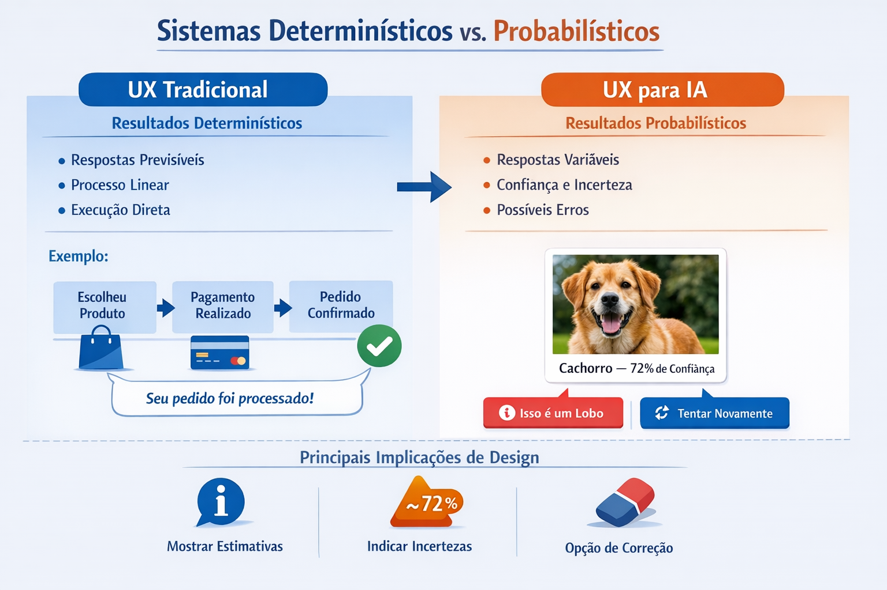
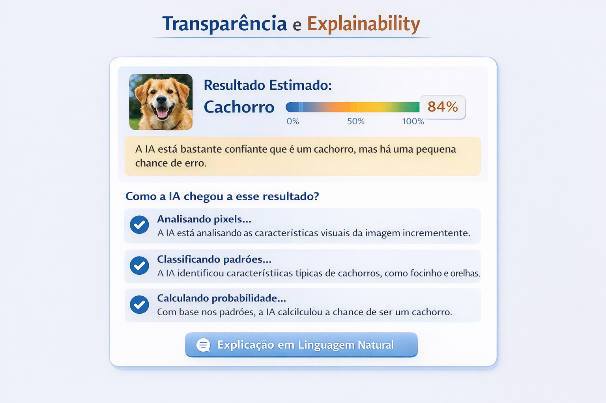
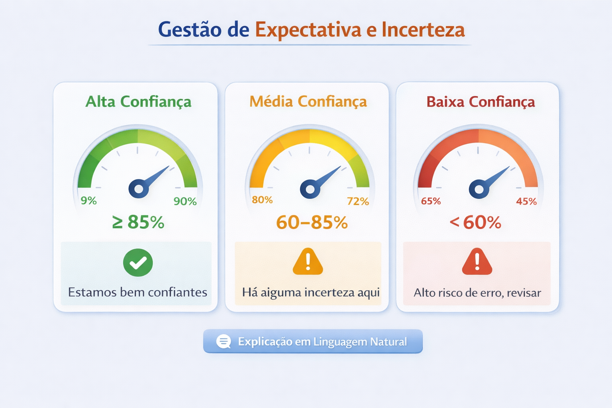
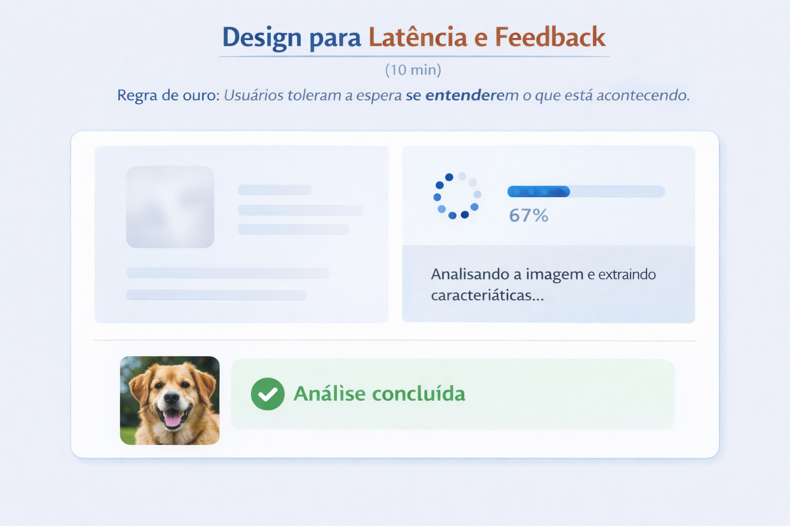
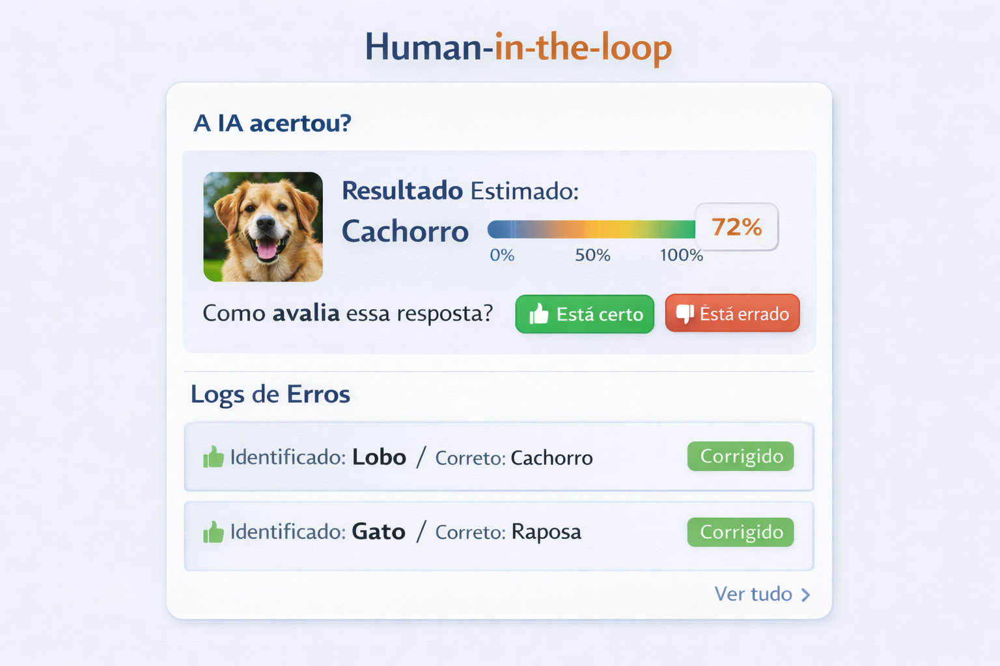
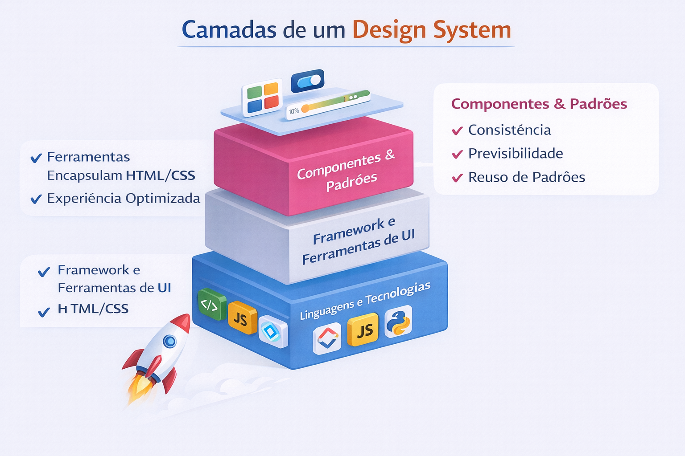
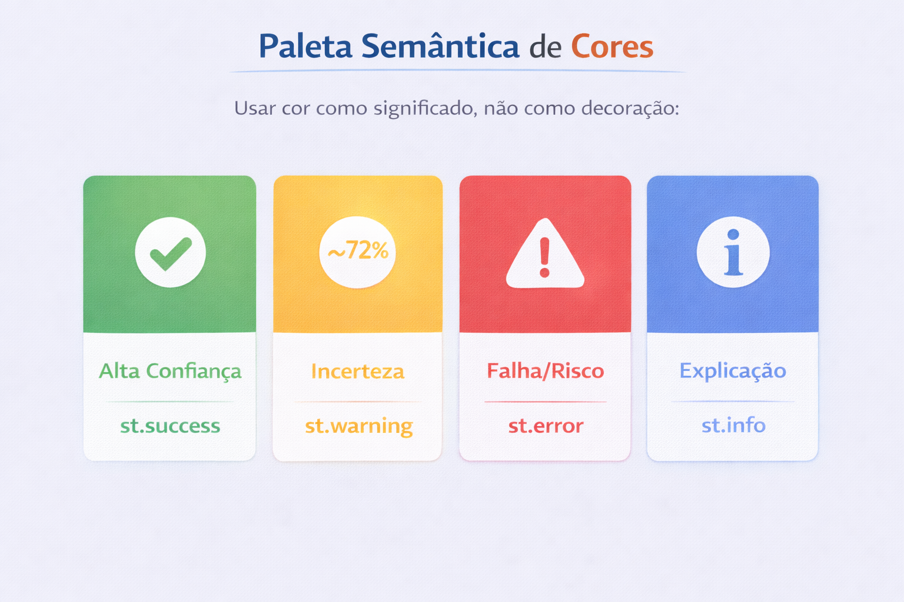
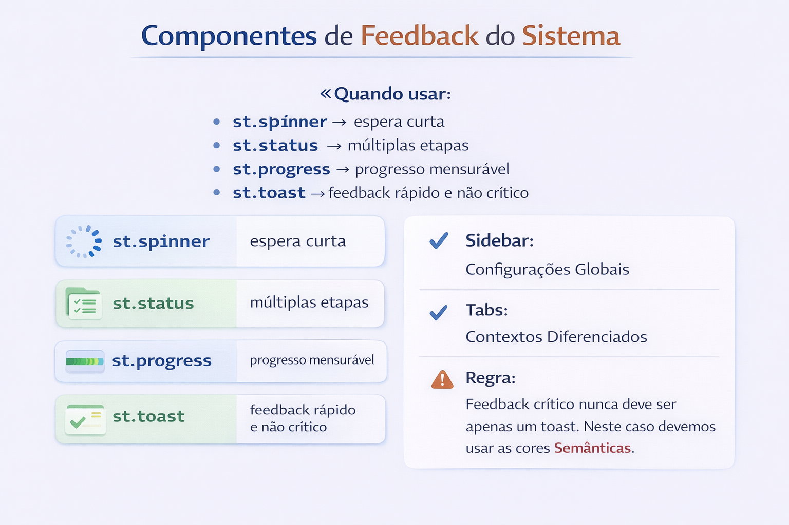

# Aula 2 — UX e Design System para IA

AI UX Design: Princípios de interface para sistemas inteligentes e probabilísticos

---

## Objetivo

Esta aula aprofunda como projetar interfaces para sistemas de IA que não apenas funcionam, mas comunicam corretamente incerteza, permitem supervisão humana e operam de forma confiável em produção. O foco deixa de ser “o modelo acertou?” e passa a ser “o usuário consegue entender, confiar e intervir no sistema?”.

A base conceitual parte principalmente de:
- Human Compatible — incerteza e cooperação humano-IA
- Interpretable Machine Learning — interpretabilidade e calibragem
- Designing Human-Centered AI — controle humano e confiabilidade
- Designing Machine Learning Systems — sistemas reais, latência e degradação

---

# 1. Fundamentos de UX para Sistemas de IA

## UX Tradicional vs UX para IA

Interfaces tradicionais operam sob previsibilidade: uma ação gera um resultado definido. Em um e-commerce, o pagamento aprovado confirma a compra. A relação entre ação e resposta é direta e estável.

Sistemas de IA não operam assim. Eles inferem. Eles estimam. Eles produzem respostas baseadas em padrões estatísticos aprendidos com dados históricos. Como argumenta Stuart Russell, um sistema inteligente adequado deve reconhecer que não possui certeza absoluta sobre o mundo. Logo, a interface também não pode agir como se tivesse.

Quando uma IA retorna “Cachorro — 72% de confiança”, o número não é decorativo. Ele representa incerteza epistemológica. A experiência do usuário precisa refletir isso.

**Implicações de design:**

* É necessário comunicar que o resultado é uma **estimativa** — não uma verdade absoluta.
* A interface precisa expor **confiança**, **incerteza** e **processo**.
* O erro é inevitável. A supervisão humana é estrutural, não opcional.
* Deve-se prever e mostrar **possibilidade de erro** e oferecer meios simples de correção.

**Exemplo Determinístico:**

> Um Ecommerce onde o usuário escolhe um produto, é redirecionado ao carrinho, efetua o pagamento, receba uma resposta de que o pedido foi processado.

**Exemplo Probabilístico:**

> Um classificador de imagens que retorna "Cachorro — 72% de confiança" deixa o usuário consciente que há chance de erro e reduz decisões erradas



---

# 2. Pilares de UX para Sistemas de IA 

## 2.1 Pilar 1 — Transparência e Explainability (Molnar;Shneiderman)

Os problemas em Interfaces de sistemas de IA giram em torno de interfaces do tipo caixa-preta, que entregam apenas um rótulo final sem contexto, geram desconfiança e impedem correções.

Molnar diferencia explicações globais (como o modelo funciona no geral) de explicações locais (por que esta decisão específica foi tomada). Para UX, isso é decisivo.

Quando pensamos em interface de sistemas de IA devemos primeiro perguntar:

> "Por que a IA chegou a esse resultado?"

A partir disso conseguimos pensar melhores práticas, princípios e elementos que possam responder à essa pergunta de forma satisfatória

**Princípios práticos:**

* Mostrar **o que** a IA está fazendo.
* Mostrar **quão confiante** ela está no resultado.
* Evitar respostas "mágicas" e preferir linguagem humana.

Transparência, portanto, não é apenas mostrar um número de confiança. É expor processo. Mesmo que o usuário não compreenda os detalhes matemáticos, ele precisa perceber que existe um caminho lógico entre entrada e saída.

**Em termos práticos:**

* Status passo a passo ("Analisando pixels…", "Classificando padrões…").
* Métricas de confiança.
* Labels claros como "Resultado estimado" e "Probabilidade".



**Exemplo no StreamLit:**

```python
# Exibir rótulo + confiança
st.subheader("Resultado")
st.write("Rótulo estimado: **Cachorro**")

confidence = 0.72
st.metric("Confiança", f"{confidence*100:.0f}%")
st.progress(int(confidence * 100))
```

---

## 2.2 Pilar 2 — Gestão de Expectativa e Incerteza (Russell; Molnar)

Sistemas avançados devem operar assumindo que suas crenças podem estar erradas. Essa lógica deve aparecer na interface.

**Erro comum:** Apresentar resultados como binários (certo/errado).
Como mencionado no começo, a interface em sistemas de IA trabalham com resultados probabilísticos e não determinísticos, portanto devemos evitar qualquer resposta simplemente falando se está certo ou errado, devemos apresentar nossa probabilidade de resposta. Essa resposta pode vir acompanhada de elementos visuais que permitam destacar o "número bom" ou o "número ruim", mas não cravar se o resultado está certo ou errado.

**Boas práticas:**

* Diferenciar faixas de confiança:

  * **Alta confiança:** ≥ 85%
  * **Média confiança:** 60–85%
  * **Baixa confiança:** < 60%
    
* Comunicar risco visual e textualmente, utilizando gráficos de gauge, termômetro, e etc, além de textos objetivos explicando o que o número quer dizer.
  
A responsabilidade não termina no número. A interface deve orientar comportamento.

Se a confiança for baixa:

- Sinalizar visualmente o risco.
- Recomendar revisão humana.
- Permitir correção manual.

* Nunca prometer mais do que o modelo pode entregar (*never overpromise*).
Isso é gestão de expectativa. Nunca prometer mais do que o modelo pode entregar. Um sistema que aparenta 100% de precisão gera uso imprudente.

A confiança do usuário não cresce quando o sistema parece perfeito. Ela cresce quando o sistema reconhece seus limites. (Molnar)
 


---

## 2.3 Pilar 3 — Design para Latência e Feedback (Chip Huyen)

Problemas reais de produção: latência, distribuição de dados que muda ao longo do tempo, degradação de performance.

A interface precisa lidar com essas realidades.
Esse feedback reduz ansiedade e aumenta percepção de profissionalismo.
Sistemas de IA operam em pipeline. A interface deve refletir esse pipeline.

**Regra de ouro:** Usuários toleram a espera se entenderem o que está acontecendo. Eles rejeitam silêncio.

**Técnicas comuns:**

* Skeleton loading | Spinners contextuais  `st.spinner`  
* Barras de progresso `st.progress`
* Mensagens intermediárias `st.status`
 
```python
with st.spinner("Analisando a imagem e extraindo características..."):
    result = run_model(image)

st.success("Análise concluída")
```



---

## 2.4. Pilar 4 — Human-in-the-loop (Shneiderman)

UX também é um mecanismo de coleta de dados com os usuários.
Sistemas confiáveis são aqueles que mantêm o humano no controle. Não como figura decorativa, mas como parte ativa do processo decisório.

É estruturar a experiência para permitir
* Confirmação de decisão
* Correção de erro
* Registro de discordância
* Ajuste de threshold

**Por quê:**

* Permite correção de erros.
* Gera dados para re-treinamento.
* Aumenta confiança do usuário.

**Exemplos:**

* 👍 / 👎
* Pergunta direta: "A IA acertou?"
* Logs de erro baseados em UI. Lista simples ou detalhada sobre os erros gerados pela IA a partir de determinadas entradas do usuário.



---

# 3. Anatomia de um Design System no Streamlit

## 3.1 O que é (e o que não é) um Design System

**Não é:**

* Apenas CSS, Javascript com animações e etc.

Lembre-se: Deixe o trabalho visual com o Designer. O importante no FrontEnd em interfaces de sistema de IA é usarmos ferramentas que encapsulam o HTML/CSS/Javascript tradicional, permitindo consigamos extrair a melhor experiência para nossos usuários e nós mesmos, utilizando o próprio phyton

**É:**

* Consistência
* Previsibilidade
* Reuso de padrões



---

## 3.2 Hierarquia Visual e Navegação 

**Boas decisões em Streamlit:**

* `st.sidebar`: Para definirmos configurações globais
* Área central do nosso "bloquinho": usamos para mostrar resultados e decisões
* Tabs: usamos para diferenciar contextos (como input, métricas, configurações), não etapas do fluxo. Essas etapas podemos pensar como input/output. Eles podem permanecer na mesma Tab, sendo trabalhos em linhas e colunas diferentes na mesma Tab.

**Regra prática:**

* Se muda o modelo → sidebar
* Se muda o resultado → área principal
 


---

## 3.3 Cores Semânticas

Usar cor como significado, não como decoração:

Quando a cor verde sempre significa alta confiança, o usuário aprende.
Quando amarelo sempre indica incerteza, o usuário internaliza.
Quando erro sempre aparece com o mesmo padrão visual, a previsibilidade reduz carga cognitiva.

* `st.success` → alta confiança
* `st.warning` → incerteza
* `st.error` → falha ou risco
* `st.info` → explicação
 


---

## 3.4 Componentes de Feedback do Sistema

**Quando usar:**

* `st.spinner` → espera curta
* `st.status` → múltiplas etapas
* `st.progress` → progresso mensurável
* `st.toast` → feedback rápido e não crítico

**Regra:** Feedback crítico nunca deve ser apenas um toast. Neste caso devemos usar as cores Semânticas

**Exemplo de código:**

```python
st.sidebar.header("Configurações")
model = st.sidebar.selectbox("Modelo", ["Base", "Avançado"])
threshold = st.sidebar.slider("Threshold", 0.0, 1.0, 0.75)
```



---

# 4. Prática — Do Funcional ao Profissional  

**Checklist de UX:**
Tudo o que vimos na parte teórica. Sempre que for fazer uma interface, copie esse checklist, cole na sua IDE e pense se cada tópico faz sentido para o que você está programando, assim você conseguirá passar por todos os tópicos importantes no desenvolvimento de interfaces para sistemas de IA.

* Empty State (O que o usuário vê ao abrir a interface antes de qualquer ação: orienta, reduz dúvida e mostra como começar)
* Loading State (Como a interface comunica que a IA está processando e o que está acontecendo durante a espera)
* Confidence UI (Como o grau de confiança, incerteza ou risco do resultado é apresentado de forma clara e acionável)
* Explainability / Transparência (Como a interface explica por que a IA chegou àquele resultado (processo, critérios ou sinais))
* Design para Latência (Como a interface lida com esperas longas, múltiplas etapas e percepção de tempo do usuário)
* Sidebar como painel de controle (Onde ficam configurações que alteram o comportamento do sistema)
* Feedback humano (Como o usuário pode confirmar, corrigir ou discordar da decisão da IA)

---

## 4.3 Refatoração Guiada

**Exemplo de estrutura:**

```python
# Configuração
# Entrada
# Processamento
# Saída
# Confiança
# Feedback
```

**Uso conceitual de `st.session_state`:** manter estado entre re-runs.

**Exemplo de Confidence UI:**

```python
st.metric("Confiança", f"{score*100:.0f}%")
st.progress(int(score * 100))
```

---

## 4.4 Ponto de Chegada

* Projetar UX pensando em incerteza
* Criar interfaces explicáveis
* Usar Streamlit de forma mais profissional

---
Rodando no Visual Code

```python
import streamlit as st
import random
import time
import numpy as np

# -------------------------------
# CONFIGURAÇÕES AUXILIARES PARA RODAR
# ------------------------------- 
if "history" not in st.session_state:
    st.session_state.history = []

if "last_result" not in st.session_state:
    st.session_state.last_result = None

if "feedback_log" not in st.session_state:
    st.session_state.feedback_log = []
 
def simulate_model(model_type):
    base_score = random.uniform(0.4, 0.95)

    if model_type == "Avançado":
        base_score += 0.05

    score = min(base_score, 0.99)
    label = "Cachorro" if score >= threshold else "Gato"

    explanation = {
        "Formato das orelhas": np.round(random.uniform(0.1, 0.4), 2),
        "Textura do pelo": np.round(random.uniform(0.1, 0.4), 2),
        "Formato do focinho": np.round(random.uniform(0.1, 0.4), 2),
    }

    return label, score, explanation


# -------------------------------
# CONFIGURAÇÃO DA PÁGINA
# -------------------------------
st.set_page_config(page_title="AI UX Demo", layout="wide")
 
# -------------------------------
# SIDEBAR — CONTROLE DO SISTEMA
# -------------------------------
st.sidebar.header("Configurações do Modelo")

model_type = st.sidebar.selectbox(
    "Modelo",
    ["Base", "Avançado"]
)

threshold = st.sidebar.slider(
    "Threshold de decisão",
    0.0, 1.0, 0.75
)

simulate_latency = st.sidebar.checkbox("Simular latência", True)

st.sidebar.markdown("---")
st.sidebar.markdown("### Sobre")
st.sidebar.info(
    "Este app simula comportamento probabilístico, "
    "explicabilidade e human-in-the-loop."
)

# -------------------------------
# 1 - Empty state
# -------------------------------
st.title("Classificador de Imagem (Simulado) - 1 - Empty state")

uploaded = st.file_uploader("Envie uma imagem", type=["png", "jpg", "jpeg"])

if not uploaded:
    st.info("Envie uma imagem para iniciar a análise.")
    st.stop()

# -------------------------------
# 2 - Loading State | Design para Latência - PROCESSAMENTO
# -------------------------------
if simulate_latency:
    with st.spinner("Extraindo características... 2 - Loading State"):
        time.sleep(1)
    with st.spinner("Classificando padrões... 2 - Loading State"):
        time.sleep(1)
    with st.spinner("Obtendo resultados... 3 - Design para Latência"):
        progress_bar = st.progress(0)
        status_text = st.empty() 
        total_steps = 100 
        for i in range(total_steps):
            time.sleep(0.03)  # latência maior aqui
            progress_bar.progress(i + 1)

        st.success("Resultados consolidados.")      


label, score, explanation = simulate_model(model_type)

st.session_state.last_result = {
    "label": label,
    "score": score,
    "explanation": explanation
}

confidence_percent = int(score * 100)

# ==========================================================
# TABS DE RESULTADOS
# ==========================================================
tab_predicao, tab_monitoramento = st.tabs(
    ["Predição & Validação Humana", "Monitoramento & Histórico"]
)
 
with tab_predicao:

    # -------------------------------
    # 3 - Confidence UI 
    # -------------------------------
    st.subheader("Resultado da Classificação - 3 - Confidence UI ")

    row1_col1, row1_col2 = st.columns([1, 2])

    with row1_col1:
        st.metric("Classe Prevista", label)
        st.metric("Confiança", f"{confidence_percent}%")
        st.progress(confidence_percent)

    with row1_col2:
        if score >= 0.85:
            st.success("Alta confiança na previsão.")
        elif score >= 0.60:
            st.warning("Confiança moderada. Revisão recomendada.")
        else:
            st.error("Baixa confiança. Revisão humana necessária.")

    st.markdown("---")

    # -------------------------------
    # 4 - EXPLICABILIDADE  
    # -------------------------------
    st.subheader("Explicabilidade Local - 4 - EXPLICABILIDADE")

    exp_col1, exp_col2 = st.columns(2)

    features = list(explanation.items())

    with exp_col1:
        for feature, weight in features[:2]:
            st.write(feature)
            st.progress(int(weight * 100))

    with exp_col2:
        for feature, weight in features[2:]:
            st.write(feature)
            st.progress(int(weight * 100))

    st.markdown("---")

    # -------------------------------
    # 5 - HUMAN IN THE LOOP  
    # -------------------------------
    st.subheader("Validação Humana - 5 - HUMAN IN THE LOOP")

    feedback_col1, feedback_col2 = st.columns(2)

    with feedback_col1:
        if st.button("IA acertou"):
            st.session_state.feedback_log.append({
                "result": label,
                "score": score,
                "correct": True
            })
            st.success("Feedback registrado.")

    with feedback_col2:
        if st.button("IA errou"):
            st.session_state.feedback_log.append({
                "result": label,
                "score": score,
                "correct": False
            })
            st.error("Feedback registrado.")


# ==========================================================
# TAB 2 — MONITORAMENTO & HISTÓRICO
# ==========================================================
with tab_monitoramento:

    st.subheader("Monitoramento do Sistema")

    total = len(st.session_state.feedback_log)

    if total > 0:
        correct = sum(1 for f in st.session_state.feedback_log if f["correct"])
        accuracy = correct / total

        monitor_col1, monitor_col2 = st.columns(2)

        with monitor_col1:
            st.metric("Feedbacks recebidos", total)

        with monitor_col2:
            st.metric("Acurácia percebida", f"{int(accuracy*100)}%")

        if accuracy < 0.7:
            st.warning("Possível degradação do modelo detectada.")
    else:
        st.info("Ainda não há feedback suficiente para monitoramento.")

    st.markdown("---")

    # -------------------------------
    # HISTÓRICO
    # -------------------------------
    st.subheader("Histórico de Decisões")

    st.session_state.history.append({
        "label": label,
        "score": score
    })

    history_cols = st.columns(2)

    recent = st.session_state.history[-6:]

    for i, item in enumerate(recent):
        with history_cols[i % 2]:
            st.write(f"{item['label']} — {int(item['score']*100)}%")
```
Rodando no Collab
```python
!pip install -q streamlit
!wget -q https://github.com/cloudflare/cloudflared/releases/latest/download/cloudflared-linux-amd64.deb
!dpkg -i cloudflared-linux-amd64.deb
```
```python
%%writefile app.py
import streamlit as st
import random
import time
import numpy as np

# -------------------------------
# CONFIGURAÇÕES AUXILIARES PARA RODAR
# ------------------------------- 
if "history" not in st.session_state:
    st.session_state.history = []

if "last_result" not in st.session_state:
    st.session_state.last_result = None

if "feedback_log" not in st.session_state:
    st.session_state.feedback_log = []
 
def simulate_model(model_type):
    base_score = random.uniform(0.4, 0.95)

    if model_type == "Avançado":
        base_score += 0.05

    score = min(base_score, 0.99)
    label = "Cachorro" if score >= threshold else "Gato"

    explanation = {
        "Formato das orelhas": np.round(random.uniform(0.1, 0.4), 2),
        "Textura do pelo": np.round(random.uniform(0.1, 0.4), 2),
        "Formato do focinho": np.round(random.uniform(0.1, 0.4), 2),
    }

    return label, score, explanation


# -------------------------------
# CONFIGURAÇÃO DA PÁGINA
# -------------------------------
st.set_page_config(page_title="AI UX Demo", layout="wide")
 
# -------------------------------
# SIDEBAR — CONTROLE DO SISTEMA
# -------------------------------
st.sidebar.header("Configurações do Modelo")

model_type = st.sidebar.selectbox(
    "Modelo",
    ["Base", "Avançado"]
)

threshold = st.sidebar.slider(
    "Threshold de decisão",
    0.0, 1.0, 0.75
)

simulate_latency = st.sidebar.checkbox("Simular latência", True)

st.sidebar.markdown("---")
st.sidebar.markdown("### Sobre")
st.sidebar.info(
    "Este app simula comportamento probabilístico, "
    "explicabilidade e human-in-the-loop."
)

# -------------------------------
# 1 - Empty state
# -------------------------------
st.title("Classificador de Imagem (Simulado) - 1 - Empty state")

uploaded = st.file_uploader("Envie uma imagem", type=["png", "jpg", "jpeg"])

if not uploaded:
    st.info("Envie uma imagem para iniciar a análise.")
    st.stop()

# -------------------------------
# 2 - Loading State | Design para Latência - PROCESSAMENTO
# -------------------------------
if simulate_latency:
    with st.spinner("Extraindo características... 2 - Loading State"):
        time.sleep(1)
    with st.spinner("Classificando padrões... 2 - Loading State"):
        time.sleep(1)
    with st.spinner("Obtendo resultados... 3 - Design para Latência"):
        progress_bar = st.progress(0)
        status_text = st.empty() 
        total_steps = 100 
        for i in range(total_steps):
            time.sleep(0.03)  # latência maior aqui
            progress_bar.progress(i + 1)

        st.success("Resultados consolidados.")      


label, score, explanation = simulate_model(model_type)

st.session_state.last_result = {
    "label": label,
    "score": score,
    "explanation": explanation
}

confidence_percent = int(score * 100)

# ==========================================================
# TABS DE RESULTADOS
# ==========================================================
tab_predicao, tab_monitoramento = st.tabs(
    ["Predição & Validação Humana", "Monitoramento & Histórico"]
)
 
with tab_predicao:

    # -------------------------------
    # 3 - Confidence UI 
    # -------------------------------
    st.subheader("Resultado da Classificação - 3 - Confidence UI ")

    row1_col1, row1_col2 = st.columns([1, 2])

    with row1_col1:
        st.metric("Classe Prevista", label)
        st.metric("Confiança", f"{confidence_percent}%")
        st.progress(confidence_percent)

    with row1_col2:
        if score >= 0.85:
            st.success("Alta confiança na previsão.")
        elif score >= 0.60:
            st.warning("Confiança moderada. Revisão recomendada.")
        else:
            st.error("Baixa confiança. Revisão humana necessária.")

    st.markdown("---")

    # -------------------------------
    # 4 - EXPLICABILIDADE  
    # -------------------------------
    st.subheader("Explicabilidade Local - 4 - EXPLICABILIDADE")

    exp_col1, exp_col2 = st.columns(2)

    features = list(explanation.items())

    with exp_col1:
        for feature, weight in features[:2]:
            st.write(feature)
            st.progress(int(weight * 100))

    with exp_col2:
        for feature, weight in features[2:]:
            st.write(feature)
            st.progress(int(weight * 100))

    st.markdown("---")

    # -------------------------------
    # 5 - HUMAN IN THE LOOP  
    # -------------------------------
    st.subheader("Validação Humana - 5 - HUMAN IN THE LOOP")

    feedback_col1, feedback_col2 = st.columns(2)

    with feedback_col1:
        if st.button("IA acertou"):
            st.session_state.feedback_log.append({
                "result": label,
                "score": score,
                "correct": True
            })
            st.success("Feedback registrado.")

    with feedback_col2:
        if st.button("IA errou"):
            st.session_state.feedback_log.append({
                "result": label,
                "score": score,
                "correct": False
            })
            st.error("Feedback registrado.")


# ==========================================================
# TAB 2 — MONITORAMENTO & HISTÓRICO
# ==========================================================
with tab_monitoramento:

    st.subheader("Monitoramento do Sistema")

    total = len(st.session_state.feedback_log)

    if total > 0:
        correct = sum(1 for f in st.session_state.feedback_log if f["correct"])
        accuracy = correct / total

        monitor_col1, monitor_col2 = st.columns(2)

        with monitor_col1:
            st.metric("Feedbacks recebidos", total)

        with monitor_col2:
            st.metric("Acurácia percebida", f"{int(accuracy*100)}%")

        if accuracy < 0.7:
            st.warning("Possível degradação do modelo detectada.")
    else:
        st.info("Ainda não há feedback suficiente para monitoramento.")

    st.markdown("---")

    # -------------------------------
    # HISTÓRICO
    # -------------------------------
    st.subheader("Histórico de Decisões")

    st.session_state.history.append({
        "label": label,
        "score": score
    })

    history_cols = st.columns(2)

    recent = st.session_state.history[-6:]

    for i, item in enumerate(recent):
        with history_cols[i % 2]:
            st.write(f"{item['label']} — {int(item['score']*100)}%")
```

```python
import subprocess
import threading
import time

def run_streamlit():
    subprocess.Popen(["streamlit", "run", "app.py", "--server.port", "8501"])

def run_tunnel():
    p = subprocess.Popen(
        ["cloudflared", "tunnel", "--url", "http://localhost:8501"],
        stdout=subprocess.PIPE,
        stderr=subprocess.STDOUT,
        text=True
    )
    
    for line in p.stdout:
        if "trycloudflare.com" in line:
            print("\n--- SEU APP ESTÁ RODANDO AQUI ---")
            print(line.strip())
            print("---------------------------------\n")
            break

threading.Thread(target=run_streamlit).start()
time.sleep(5)
run_tunnel()
```


---
# Referências
- Ben Shneiderman — Designing Human-Centered AI
- Christoph Molnar — Interpretable Machine Learning
- Stuart Russell — Human Compatible
- Chip Huyen — Designing Machine Learning Systems


