# 1. Visualização começa antes do gráfico

Um dos maiores erros ao construir visualizações é começar diretamente pelo gráfico. Em aplicações reais --- especialmente sistemas de IA --- o gráfico não é o ponto de partida, ele é consequência.

Antes de visualizar, é necessário **entender, validar e contextualizar os dados**.

Em um sistema de IA, o usuário frequentemente quer responder perguntas como:

-   Quantas linhas existem no dataset?
-   Existem valores nulos?
-   As colunas estão no formato esperado?
-   O modelo foi treinado com dados coerentes?

Se o usuário não confia nos dados, ele não confiará na visualização. Por isso, a etapa de exibição estruturada do dataset é parte central da experiência.

No Streamlit, essa etapa é feita principalmente com componentes de exibição de dados.

------------------------------------------------------------------------

# Exibição de dados: estrutura, inspeção e contexto

O Streamlit fornece duas formas principais de renderizar tabelas:

-   `st.dataframe()` → interativa\
-   `st.table()` → estática

Cada uma possui um propósito diferente dentro da aplicação.

------------------------------------------------------------------------

## `st.dataframe`

O `st.dataframe` é o componente padrão para exploração de dados.

Ele cria uma tabela interativa que permite:

-   Ordenação por coluna (clicando no cabeçalho)
-   Redimensionamento de colunas
-   Scroll virtual eficiente (para grandes datasets)
-   Pesquisa textual
-   Seleção de linhas (dependendo da versão/configuração)

Isso o torna ideal para análise exploratória e debugging.

``` python
import streamlit as st
import pandas as pd

# Importa um arquivo CSV do diretório do projeto
# O pandas lê o arquivo e transforma em um DataFrame
df = pd.read_csv("dados.csv")

# Exibe o DataFrame de forma interativa na aplicação
# O usuário poderá ordenar, navegar e inspecionar os dados
st.dataframe(df)
```
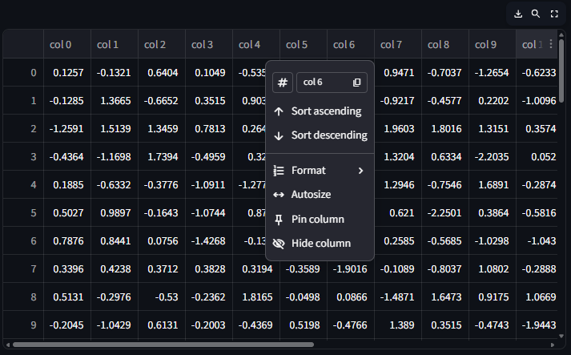

### O que está acontecendo tecnicamente?

1.  `pd.read_csv()` carrega os dados para memória.
2.  O objeto `df` é um DataFrame do pandas.
3.  `st.dataframe(df)` envia esse objeto para o frontend do Streamlit.
4.  O Streamlit converte os dados para um formato serializável e
    renderiza uma tabela interativa no navegador.

### Quando usar?

-   Durante exploração de dados
-   Em dashboards analíticos
-   Para permitir auditoria do dataset
-   Para validação de pré-processamento

Em projetos de IA, é extremamente comum usar `st.dataframe` logo após: 
- Upload de arquivo 
- Limpeza de dados 
- Aplicação de filtros 
- Resultado de inferência

------------------------------------------------------------------------

## `st.table`

Diferente do `dataframe`, o `st.table` gera uma tabela estática em HTML
puro.

Isso significa que: 
- Não há ordenação 
- Não há pesquisa 
- Não há redimensionamento 
- Não há scroll virtual avançado

Ela é renderizada como um bloco fixo na interface.

``` python
st.table(df)
```

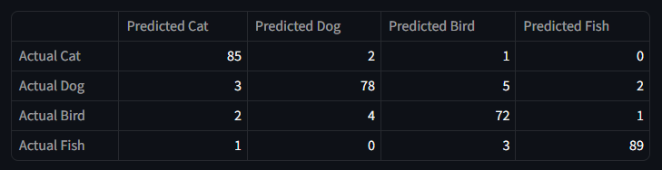

### O que está acontecendo aqui?

1.  `df.head()` cria uma nova visualização contendo apenas as primeiras 5 linhas.
2.  `st.table()` renderiza esse subconjunto como HTML estático.
3.  O usuário vê uma tabela fixa, sem interações.

### Quando usar?

-   Exibir um resumo final
-   Mostrar resultados consolidados
-   Apresentar rankings pequenos
-   Outputs formais (ex: top 10 clientes)

------------------------------------------------------------------------

# Diferença conceitual importante

A distinção entre `dataframe` e `table` não é apenas técnica --- é
conceitual.

  Componente       Objetivo principal
  ---------------- ----------------------
  `st.dataframe`   Exploração e análise
  `st.table`       Apresentação final

Em termos de experiência do usuário:

-   `dataframe` → ferramenta de investigação\
-   `table` → elemento de comunicação

------------------------------------------------------------------------

# Boas práticas em sistemas de IA

Antes de qualquer gráfico:

1.  Mostre pelo menos uma amostra do dataset.
2.  Mostre estatísticas descritivas (`df.describe()`).
3.  Permita que o usuário valide o conteúdo.
4.  Só depois gere a visualização.

``` python
# Mostra estatísticas descritivas do dataset
st.write(df.describe())
```
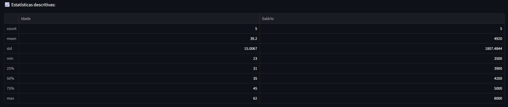

Isso aumenta: 
- Transparência 
- Confiabilidade 
- Credibilidade do modelo


------------------------------------------------------------------------

## Configuração avançada de colunas (`st.column_config`)

A API moderna permite transformar colunas em elementos visuais: 
- Barra de progresso 
- Links 
- Imagens 
- Colunas formatadas

Exemplo conceitual: 
- Uma coluna de score pode virar uma barra visual. 
- Uma coluna de URL pode virar link clicável.

Isso aproxima a tabela de um mini-dashboard embutido.

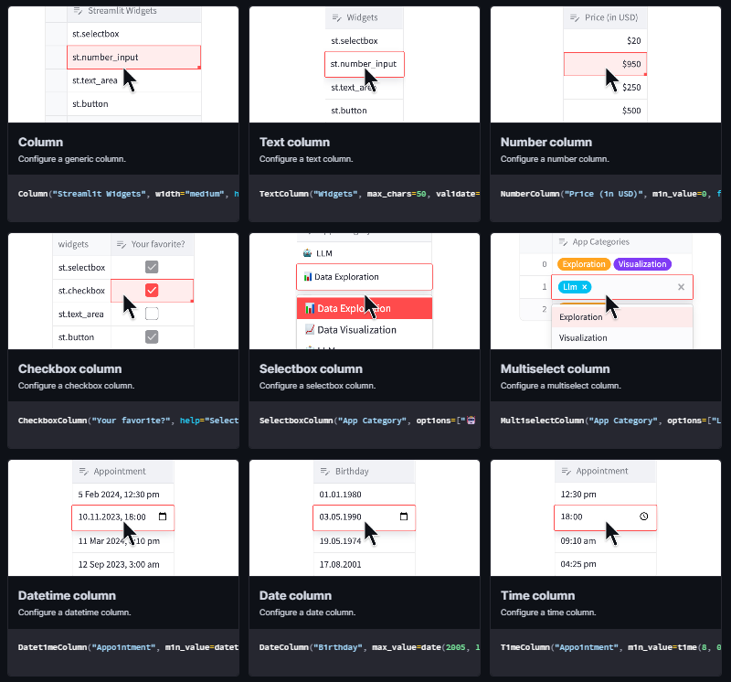
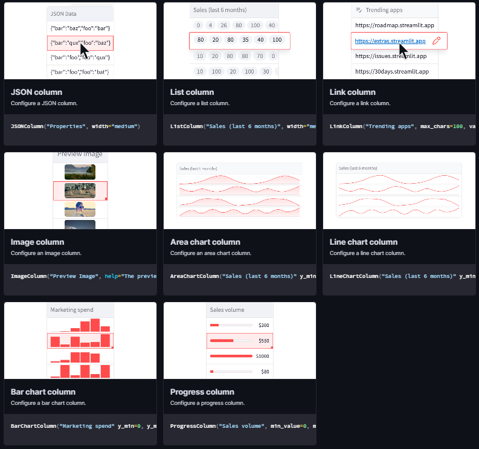
------------------------------------------------------------------------

### Exemplo 1 --- Transformando uma coluna numérica em barra de progresso

``` python
import streamlit as st
import pandas as pd

# Criando um DataFrame de exemplo
df = pd.DataFrame({
    "modelo": ["Modelo A", "Modelo B", "Modelo C"],
    "score": [0.82, 0.91, 0.76]
})

# Exibindo o DataFrame com configuração de coluna
st.dataframe(
    df,
    column_config={
        # Transforma a coluna "score" em uma barra de progresso visual
        "score": st.column_config.ProgressColumn(
            "Score do Modelo",  # Nome exibido no cabeçalho
            help="Valor de performance do modelo",
            min_value=0.0,
            max_value=1.0,
            format="%.2f"  # Formatação numérica
        )
    },
    hide_index=True  # Oculta o índice padrão do pandas
)
```

**O que está acontecendo:**\
- Criamos um DataFrame simples com nomes de modelos e seus respectivos scores.\
- Utilizamos `st.column_config.ProgressColumn` para transformar a coluna numérica em uma barra visual proporcional ao valor.\
- Definimos limites mínimo e máximo para normalizar a barra.\
- O índice foi ocultado para deixar a visualização mais limpa.

------------------------------------------------------------------------

### Exemplo 2 --- Transformando uma coluna de URL em link clicável

``` python
import streamlit as st
import pandas as pd

df = pd.DataFrame({
    "nome_modelo": ["Modelo A", "Modelo B"],
    "documentacao": [
        "https://exemplo.com/modeloA",
        "https://exemplo.com/modeloB"
    ]
})

st.dataframe(
    df,
    column_config={
        # Transforma a coluna em link clicável
        "documentacao": st.column_config.LinkColumn(
            "Documentação",
            help="Clique para acessar a documentação do modelo"
        )
    },
    hide_index=True
)
```

**O que está acontecendo:**\
- Criamos um DataFrame com URLs.\
- `LinkColumn` converte automaticamente o texto em hyperlink clicável.\
- O usuário pode navegar diretamente para a documentação sem sair da lógica do dashboard.

------------------------------------------------------------------------

### Exemplo 3 --- Exibindo imagens dentro da tabela

``` python
import streamlit as st
import pandas as pd

df = pd.DataFrame({
    "modelo": ["Modelo A", "Modelo B"],
    "logo": [
        "https://via.placeholder.com/50",
        "https://via.placeholder.com/50"
    ]
})

st.dataframe(
    df,
    column_config={
        # Renderiza a coluna como imagem
        "logo": st.column_config.ImageColumn(
            "Logo do Modelo"
        )
    },
    hide_index=True
)
```

**O que está acontecendo:**\
- URLs de imagem são renderizadas diretamente dentro da célula.\
- A tabela passa a funcionar como um componente visual rico, não apenas textual.

------------------------------------------------------------------------

### Exemplo 4 --- Formatando valores monetários

``` python
import streamlit as st
import pandas as pd

df = pd.DataFrame({
    "cliente": ["Empresa A", "Empresa B"],
    "receita": [150000.50, 320000.75]
})

st.dataframe(
    df,
    column_config={
        # Aplica formatação monetária
        "receita": st.column_config.NumberColumn(
            "Receita (R$)",
            format="R$ %.2f"
        )
    },
    hide_index=True
)
```

**O que está acontecendo:**\
- A coluna numérica recebe formatação personalizada.\
- O valor bruto continua numérico internamente, mas a exibição melhora a leitura.

------------------------------------------------------------------------

Com `st.column_config`, a tabela deixa de ser apenas um bloco de dados e passa a atuar como um componente visual estratégico.

Isso permite: - Transformar KPIs em barras visuais. - Criar navegação contextual. - Exibir imagens associadas a modelos. - Aplicar formatação profissional.

O resultado é um mini-dashboard embutido dentro da própria tabela, elevando o nível de apresentação e usabilidade da aplicação.

------------------------------------------------------------------------

## KPIs e indicadores: `st.metric`

Dashboards profissionais de IA não mostram apenas gráficos --- mostram
indicadores de performance.

``` python
st.metric(label="Acurácia do Modelo", value="92%", delta="1.2%")
st.metric(label="Tempo de Resposta", value="200ms", delta="-50ms")
```

Use para: 
- Acurácia 
- F1-score 
- Tempo médio de resposta 
- Total de previsões

Esse componente é essencial para conectar com a Aula 02 (Design System e
hierarquia visual).

------------------------------------------------------------------------

# 2. Gráficos Nativos do Streamlit

Os gráficos nativos do Streamlit representam a forma mais direta e produtiva de transformar dados em visualização dentro de uma aplicação. Eles foram projetados com foco em simplicidade, legibilidade e velocidade de desenvolvimento.

Internamente, esses gráficos utilizam o Altair como mecanismo de renderização, mas abstraem completamente a complexidade da gramática declarativa. Isso significa que o desenvolvedor não precisa definir manualmente escalas, eixos, marcas ou encodings visuais — o próprio Streamlit faz essa inferência automaticamente com base na estrutura do DataFrame fornecido.

O Altair é uma biblioteca baseada na chamada *gramática da visualização*. Em vez de desenhar gráficos passo a passo, o desenvolvedor descreve **o que os dados representam** (ex: eixo X, eixo Y, cor, tamanho) e a biblioteca decide **como renderizar isso visualmente**. O Streamlit aproveita essa arquitetura por baixo dos panos, mas entrega uma interface simplificada para quem está desenvolvendo a aplicação.

Essa integração traz duas vantagens importantes:

- Permite que os gráficos sejam declarativos e consistentes.
- Mantém a possibilidade de evoluir para Altair puro quando for necessário maior controle.

Essa característica é especialmente importante em três cenários:

- **Prototipação rápida**: quando o objetivo é validar uma hipótese, testar uma ideia de produto ou demonstrar rapidamente um insight.
- **MVPs (Minimum Viable Products)**: quando velocidade de entrega é mais importante do que customização avançada.
- **Aplicações internas e dashboards operacionais**: onde clareza e manutenção simples são prioridades.

---

## Como funciona a inferência automática

Ao receber um `DataFrame`, o Streamlit analisa:

- O tipo das colunas (numéricas, categóricas, datas)
- A posição das colunas
- A existência de índice temporal
- A quantidade de colunas numéricas

Com base nisso, ele decide automaticamente:

- Qual coluna será usada como eixo X
- Qual coluna será usada como eixo Y
- Se múltiplas séries devem ser exibidas
- Como organizar a legenda

Por exemplo:

- Se houver uma coluna de datas, ela tende a ser usada como eixo X.
- Se houver múltiplas colunas numéricas, elas podem virar múltiplas linhas no mesmo gráfico.
- Se apenas uma coluna numérica for fornecida, o índice do DataFrame pode virar o eixo X automaticamente.

Essa inteligência reduz drasticamente o código necessário para gerar visualizações funcionais.

---

## Por que isso é importante em sistemas de IA?

Em aplicações de IA, o foco muitas vezes não está na estética do gráfico, mas na velocidade de análise:

- Visualizar a perda do modelo por época.
- Acompanhar métricas de validação.
- Comparar previsões vs valores reais.
- Monitorar drift de dados.

Nesses casos, a simplicidade dos gráficos nativos permite que o desenvolvedor concentre energia na lógica do modelo, e não na engenharia da visualização.

Além disso, como o Streamlit utiliza Altair internamente, os gráficos já seguem boas práticas de visualização estatística, como escalas consistentes e mapeamento coerente entre tipos de dados e representações visuais.

---

## Trade-offs dos gráficos nativos

Embora extremamente produtivos, os gráficos nativos têm limitações:

- Menor controle sobre estilos específicos.
- Menor capacidade de customização avançada.
- Interatividade mais simples comparada a bibliotecas como Plotly.
- Menor controle fino sobre tooltips e camadas complexas.

Isso não é um defeito — é uma escolha de design. Eles são otimizados para velocidade e clareza, não para visualizações altamente customizadas.

Quando o nível de controle necessário ultrapassa o que os atalhos oferecem, é possível migrar para `st.altair_chart()` e trabalhar diretamente com o Altair, mantendo coerência tecnológica dentro do próprio ecossistema do Streamlit.

---

## Quando usar gráficos nativos

Use gráficos nativos quando:

- Você quer visualizar rapidamente um DataFrame.
- O layout precisa ser simples e limpo.
- A aplicação é voltada para uso interno.
- O gráfico não exige interações complexas.
- O objetivo é análise exploratória.

Evite quando:

- Precisar de múltiplas camadas sobrepostas complexas.
- Precisar de interações customizadas.
- Precisar de controle detalhado de estilos.
- Estiver construindo um dashboard público altamente refinado.

------------------------------------------------------------------------

## `st.line_chart`

Ideal para séries temporais.

``` python
st.line_chart(df, x="data", y="valor")
```

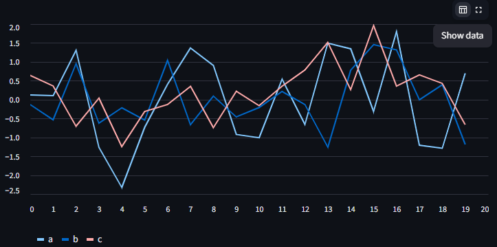

Use para: 
- Evolução de métricas 
- Perda de modelo ao longo das épocas 
- Receita ao longo do tempo

------------------------------------------------------------------------

## `st.area_chart`

Similar ao line chart, mas com preenchimento.

``` python
st.area_chart(df, x="data", y="valor")
```

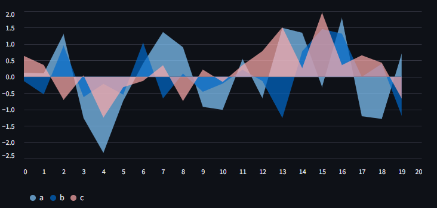

Útil quando: 
- Deseja transmitir volume acumulado 
- Mostrar participação proporcional

------------------------------------------------------------------------

## `st.bar_chart`

Comparação entre categorias.

``` python
st.bar_chart(df, x="categoria", y="quantidade")
```

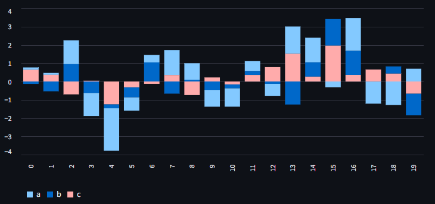

Boa prática: 
- Ordenar antes de plotar 
- Evitar categorias demais

------------------------------------------------------------------------

## `st.scatter_chart`

Muito importante para IA.

``` python
st.scatter_chart(df, x="feature1", y="feature2")
```

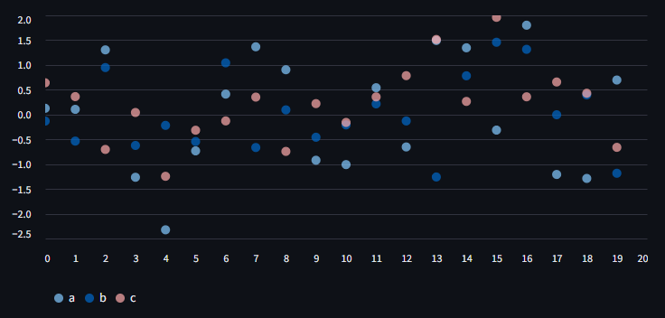

Aplicações: 
- Correlação entre variáveis 
- Separação de classes 
- Visualização de embeddings reduzidos (PCA/UMAP)

------------------------------------------------------------------------

## `st.map`

Se o DataFrame possuir colunas `lat` e `lon`, o Streamlit renderiza automaticamente um mapa.

``` python
st.map(df_geo)
```

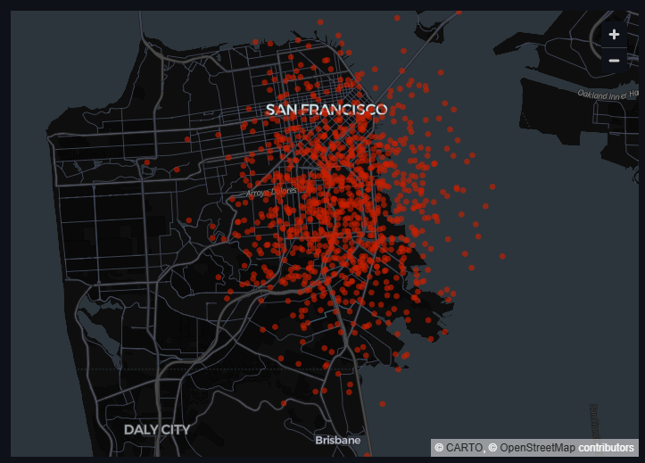

Ideal para: 
- Logística 
- Análise urbana 
- Distribuição geográfica de clientes

------------------------------------------------------------------------

# 3. Gráficos Avançados

Quando o projeto sai do MVP e vira produto, os gráficos nativos tendem a não ser suficientes. É aqui que entram as bibliotecas externas.

------------------------------------------------------------------------

## Plotly --- Interatividade completa

Quando a aplicação exige um nível maior de interatividade, controle visual e refinamento estético, o Plotly se torna a escolha natural. Em aplicações de IA --- principalmente dashboards analíticos e monitoramento de modelos --- ele é amplamente utilizado por oferecer recursos interativos nativos sem necessidade de implementação adicional.

O Streamlit integra o Plotly através de `st.plotly_chart`, permitindo renderizar qualquer figura criada com a biblioteca.

``` python
import plotly.express as px

# Carrega um dataset de exemplo nativo do Plotly
df = px.data.iris()

# Cria um gráfico de dispersão
# x e y definem os eixos
# color separa visualmente as espécies
fig = px.scatter(
    df,
    x="sepal_width",
    y="sepal_length",
    color="species"
)

# Renderiza o gráfico no Streamlit
# use_container_width=True faz o gráfico ocupar toda a largura disponível
st.plotly_chart(fig, use_container_width=True)
```
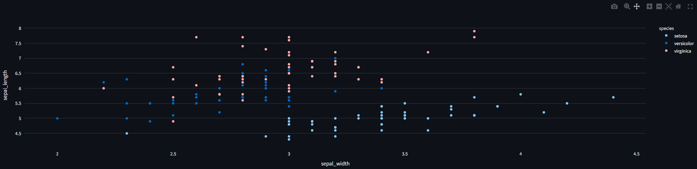


### O que esse código está fazendo?

1.  `px.data.iris()` fornece um dataset estruturado.
2.  `px.scatter()` cria uma figura Plotly baseada em expressões declarativas simples.
3.  A variável `fig` contém um objeto completo com layout, dados e interações.
4.  `st.plotly_chart()` envia esse objeto para o frontend, preservando toda a interatividade.

### Por que Plotly é tão utilizado em IA?

-   **Zoom nativo** com seleção por arraste.
-   **Hover inteligente** com tooltips automáticos.
-   **Legenda interativa** (clicar para ocultar séries).
-   **Exportação de imagem** embutida.
-   **Seleção de pontos** para análises posteriores.

Essa última característica é especialmente poderosa para dashboards reativos.

### Integração com eventos

``` python
event = st.plotly_chart(fig, on_select="rerun")
```

Aqui ocorre algo importante:

-   `on_select="rerun"` faz com que o app seja reexecutado quando o usuário seleciona pontos.
-   O objeto `event` passa a conter informações sobre os pontos selecionados.
-   Isso permite atualizar métricas, filtros ou outros gráficos dinamicamente.

Essa abordagem transforma um dashboard estático em um sistema analítico interativo.

------------------------------------------------------------------------

## Altair --- Gramática declarativa

Altair trabalha com o conceito de gramática da visualização. Em vez de definir manualmente cada aspecto visual, você declara como os dados devem ser mapeados para elementos gráficos.

``` python
import altair as alt

# Cria um gráfico declarativo
chart = alt.Chart(df).mark_circle().encode(
    x="feature1",   # Mapeia coluna para eixo X
    y="feature2",   # Mapeia coluna para eixo Y
    color="classe"  # Mapeia coluna categórica para cor
).interactive()     # Habilita zoom e pan

# Renderiza no Streamlit
st.altair_chart(chart, use_container_width=True)
```
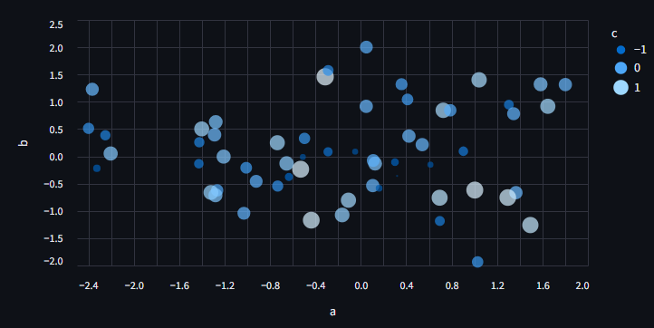

### O que está acontecendo aqui?

1.  `alt.Chart(df)` define a fonte de dados.
2.  `.mark_circle()` define o tipo de marca visual.
3.  `.encode()` declara como as colunas se transformam em eixos e
    atributos visuais.
4.  `.interactive()` adiciona interatividade básica.
5.  `st.altair_chart()` renderiza o objeto no app.

### Quando Altair é mais indicado?

-   Quando é necessário criar **múltiplas camadas** no mesmo gráfico.
-   Quando agregações (média, soma, contagem) devem ser feitas declarativamente.
-   Quando se deseja maior controle estatístico.
-   Quando o design precisa seguir padrões formais de visualização.

Altair é particularmente forte para visualizações analíticas e explicativas.

------------------------------------------------------------------------

## Pydeck --- Visualização geoespacial avançada

Pydeck é utilizado para renderização de mapas complexos baseados em WebGL. Ele permite visualizações tridimensionais e camadas sofisticadas.

``` python
import pydeck as pdk

# deck deve ser um objeto previamente configurado
st.pydeck_chart(deck)
```
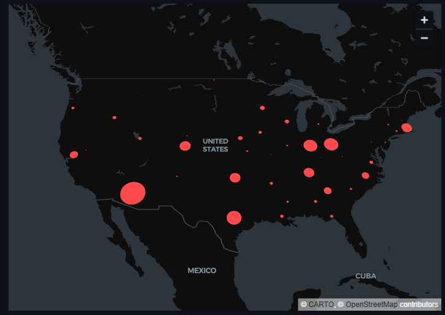

Diferentemente de `st.map`, que é simplificado, o Pydeck permite:

-   Mapas 3D com extrusão de altura.
-   Hexbin maps (agregações espaciais).
-   Arcos entre pontos geográficos.
-   Camadas múltiplas sobrepostas.

### Quando usar?

-   Análise urbana
-   Monitoramento logístico
-   Distribuição de sensores
-   Heatmaps de densidade

É especialmente útil em aplicações que envolvem geolocalização em larga escala.

------------------------------------------------------------------------

## Matplotlib

Apesar de não possuir interatividade nativa comparável ao Plotly, o Matplotlib continua sendo uma das bibliotecas mais utilizadas na comunidade científica e acadêmica.

No Streamlit, ele é renderizado via `st.pyplot`.

``` python
import matplotlib.pyplot as plt

# Cria explicitamente uma figura e um eixo
fig, ax = plt.subplots()

# Plota os dados
ax.plot(df["x"], df["y"])

# Renderiza a figura no Streamlit
st.pyplot(fig)
```
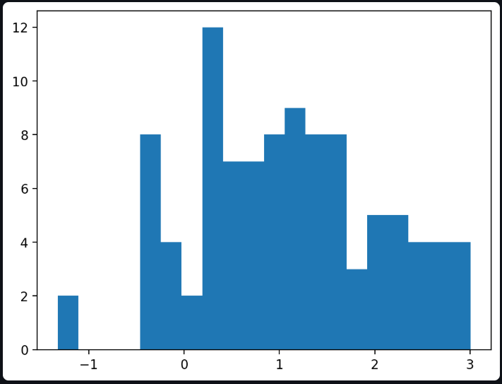

### Por que criar `fig, ax` explicitamente?

-   Evita problemas de concorrência.
-   Garante que a figura correta seja renderizada.
-   Permite múltiplos gráficos independentes na mesma aplicação.

### Quando Matplotlib faz sentido?

-   Visualizações científicas tradicionais.
-   Projetos acadêmicos.
-   Gráficos altamente customizados.
-   Quando já existe código legado em Matplotlib.

------------------------------------------------------------------------

-   Plotly → foco em interatividade e dashboards modernos.
-   Altair → foco em gramática declarativa e controle estatístico.
-   Pydeck → foco em mapas avançados.
-   Matplotlib → foco em tradição científica e customização manual.

A escolha da biblioteca deve refletir o nível de complexidade necessário e o tipo de interação que a aplicação exige.

------------------------------------------------------------------------

# 4. Interatividade + Estado 

Conectando com a Aula 03.

Gráficos devem reagir a inputs e ao mesmo tempo evitar que nosso modelo seja processado novamente.

``` python
coluna = st.selectbox("Escolha coluna", df.columns)

st.line_chart(df[coluna])

Filtro por intervalo:

min_val, max_val = df["valor"].min(), df["valor"].max()
intervalo = st.slider("Intervalo", min_val, max_val, (min_val, max_val))

df_filtrado = df[df["valor"].between(intervalo[0], intervalo[1])]
st.bar_chart(df_filtrado)

```
⸻

O que realmente está acontecendo aqui?

No Streamlit, toda interação dispara um rerun completo do script.
Ou seja:
	•	O usuário altera o selectbox
	•	O script reinicia do topo
	•	Todas as variáveis são recriadas
	•	Todos os blocos são executados novamente

O segredo não é “evitar o rerun” — porque ele sempre acontece —
e sim controlar o que é recalculado durante o rerun.

⸻

Interação entre componentes e gráficos

No exemplo:

coluna = st.selectbox("Escolha coluna", df.columns)
st.line_chart(df[coluna])

Fluxo real:
	1.	selectbox define um valor.
	2.	Esse valor passa a existir na variável coluna.
	3.	O gráfico usa essa variável como parâmetro.
	4.	Quando o usuário muda a seleção:
	•	O script reinicia.
	•	coluna recebe o novo valor.
	•	O gráfico é reconstruído com base nesse valor.

O gráfico não “escuta” o input diretamente.
Ele é reconstruído porque o script inteiro roda novamente.

⸻

Cuidados com processamento pesado

Imagine que antes do gráfico exista:

modelo = carregar_modelo_grande()
resultado = modelo.processar(df)

Agora qualquer mudança no slider:
	•	Recarrega o modelo
	•	Reprocessa tudo
	•	Atualiza o gráfico

⸻

Estratégias para controle de rerun

1. Cache de dados

Para evitar recarregar ou recalcular:

@st.cache_data
def carregar_dados():
    return df_grande

O cache impede que o dataset seja reconstruído a cada interação.

⸻

2. Cache de recursos pesados

Para modelos:

@st.cache_resource
def carregar_modelo():
    return ModeloPesado()

Diferença conceitual:
	•	cache_data → dados transformados
	•	cache_resource → objetos pesados (modelo, conexão, cliente API)

⸻

3. Separar processamento de visualização

Erro comum:

df_processado = modelo.processar(df)
st.line_chart(df_processado[coluna])

Melhor abordagem:
	1.	Processar uma vez.
	2.	Salvar resultado.
	3.	Aplicar apenas filtros leves na interação.

Exemplo:

@st.cache_data
def processar_base(df):
    return modelo.processar(df)

df_base = processar_base(df)

coluna = st.selectbox("Escolha coluna", df_base.columns)
st.line_chart(df_base[coluna])

Agora o rerun apenas troca a coluna —
não reexecuta o modelo.

⸻

Controle manual com session_state

Quando múltiplos componentes precisam compartilhar estado:

if "df_filtrado" not in st.session_state:
    st.session_state.df_filtrado = df

Atualização controlada:

if st.button("Aplicar filtro"):
    st.session_state.df_filtrado = df_filtrado

Isso evita que o filtro seja recalculado a cada pequena alteração.

⸻

Quando usar botão para evitar recalcular a cada ajuste

Sliders disparam rerun continuamente enquanto o usuário arrasta.

Se o cálculo for pesado, use botão:

intervalo = st.slider(...)
if st.button("Atualizar gráfico"):
    df_filtrado = df[df["valor"].between(intervalo[0], intervalo[1])]
    st.session_state.df_filtrado = df_filtrado

st.bar_chart(st.session_state.df_filtrado)

Agora:
	•	O slider muda
	•	O script roda
	•	Mas o filtro pesado só é aplicado quando o botão é clicado

Isso melhora muito a experiência em apps analíticos.

⸻

Interação entre múltiplos gráficos

Um padrão poderoso:
	•	Gráfico A define um filtro
	•	Gráfico B reage a esse filtro
	•	Métricas são atualizadas dinamicamente

Estrutura ideal:
	1.	Estado central (session_state)
	2.	Filtros atualizam estado
	3.	Todos os gráficos usam esse estado como fonte

Arquitetura mental:

Inputs → Atualizam estado → Estado alimenta visualizações

Não deixe cada gráfico recalcular sua própria versão dos dados.
Centralize.

⸻

Boas práticas finais
	•	Sempre pense: o que é recalculado a cada rerun?
	•	Separe processamento pesado de interação leve.
	•	Use cache agressivamente para IA.
	•	Use botão quando sliders forem custosos.
	•	Centralize estado quando múltiplos componentes interagem.

O Streamlit é simples porque tudo é rerun.

Aplicações maduras são performáticas porque você controla o que realmente muda durante esse rerun.

------------------------------------------------------------------------

# 5. Aplicação -- Dashboard de IA

No Collab


------------------------------------------------------------------------

# Diretrizes de UX para reforçar

Conectando com Aula 02:

-   Evitar excesso de gráficos
-   Manter hierarquia visual clara
-   Usar `use_container_width=True`
-   Separar áreas com `st.columns` ou `st.tabs`
-   Testar sempre o dado bruto junto do gráfico

------------------------------------------------------------------------

# Referências

Documentação de gráficos:\
https://docs.streamlit.io/develop/api-reference/charts

Documentação de exibição de dados:\
https://docs.streamlit.io/develop/api-reference/data

Galeria de exemplos:\
https://streamlit.io/gallery
