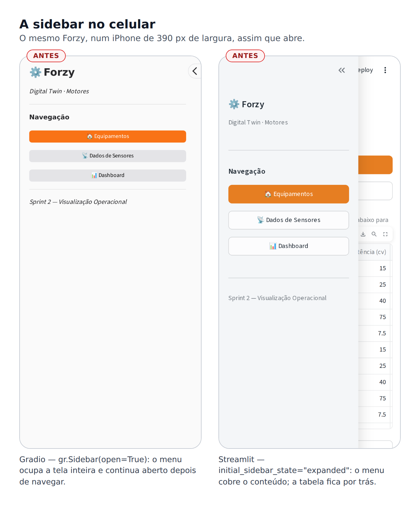
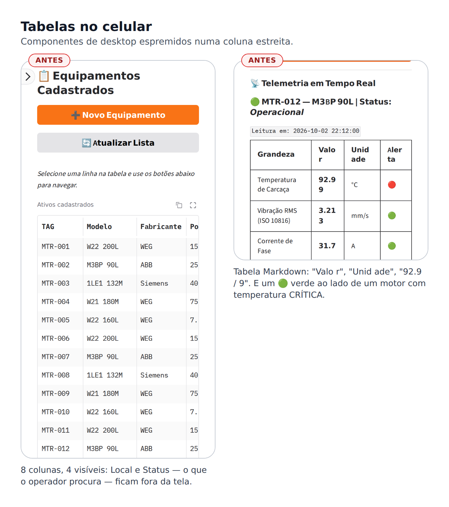
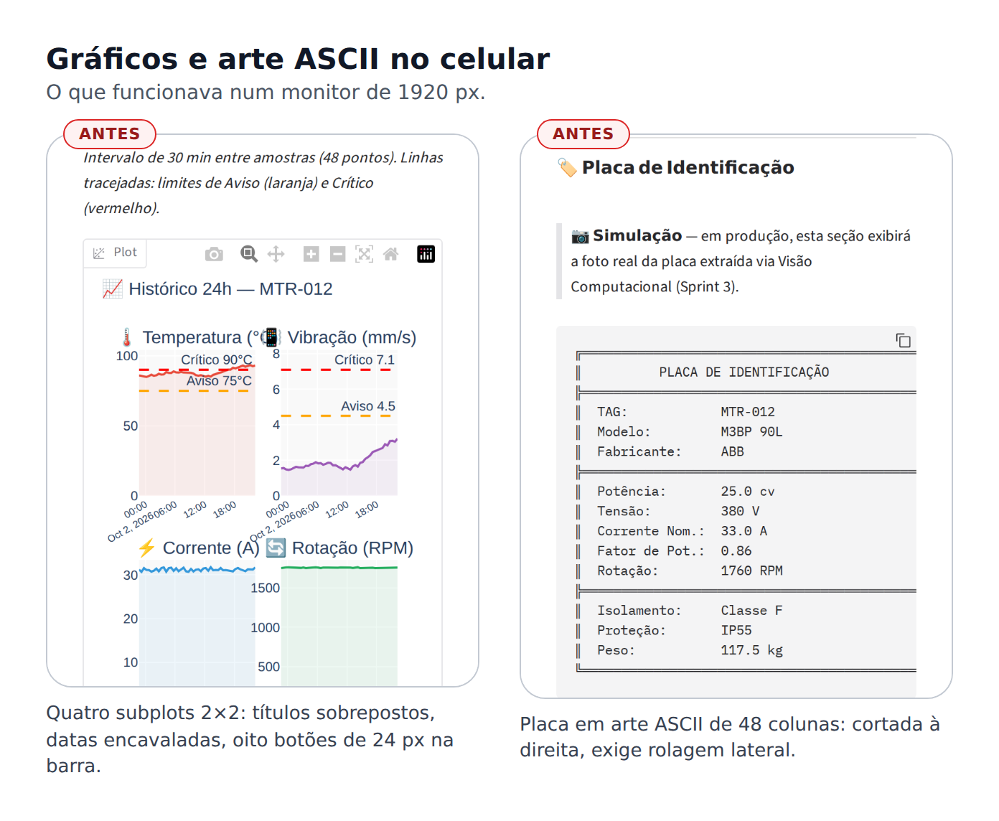
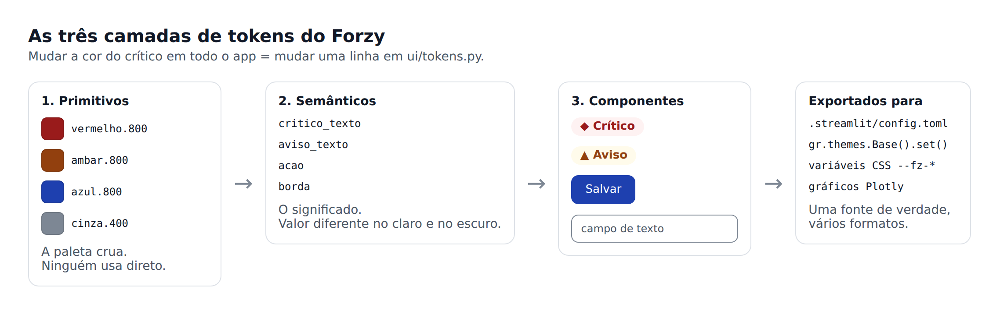
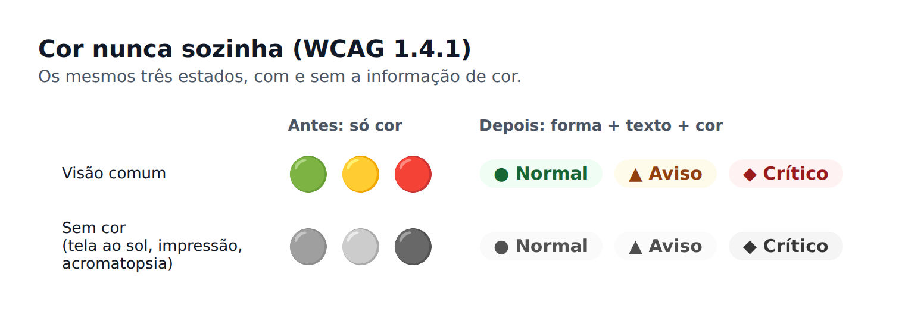
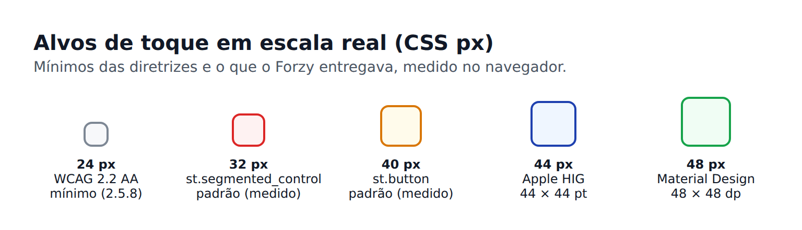
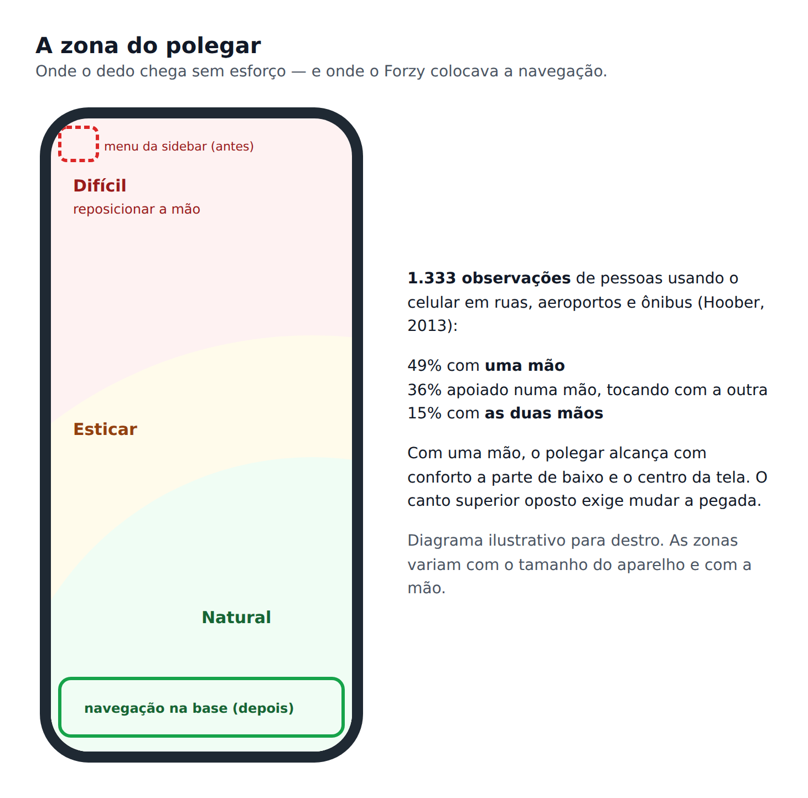

# Aula 21 — Design System para Mobile

Do monitor ao bolso: princípios, fundamentos e decisões para interfaces de IA usadas no celular

---

O Forzy está publicado. Qualquer pessoa com o link abre o app — e a maioria vai abrir pelo celular. Antes de transformar o app num PWA instalável na tela inicial, precisamos responder a uma pergunta incômoda: **o Forzy é bom de usar num celular?**

Esta aula é teórica. Ela não muda uma linha de código; ela constrói o vocabulário e os critérios para as decisões que a aula seguinte vai implementar. O fio condutor continua sendo o Forzy, e sempre que possível vamos amarrar cada princípio novo a algo que você já fez no curso.

A base conceitual parte principalmente de:

- **Luke Wroblewski — *Mobile First*** — projetar a partir da tela menor como método de priorização
- **Josh Clark — *Designing for Touch*** e a pesquisa de campo de **Steven Hoober** — como as pessoas realmente seguram e tocam o celular
- **Brad Frost — *Atomic Design*** — componentes como sistema, do átomo à página
- **Material Design 3 (Google)** e **Human Interface Guidelines (Apple)** — as diretrizes das duas plataformas
- **WCAG 2.2 (W3C)** — critérios de acessibilidade verificáveis
- **ANSI/ISA-101 — IHMs de alto desempenho** — como a indústria de processos desenha telas de supervisão
- **W3C Design Tokens Community Group — especificação 2025.10** — o formato padrão de tokens

> **Lembre-se do que a Aula 2 já estabeleceu:** design system não é CSS nem animação. É consistência, previsibilidade e reuso. Esta aula estende essa definição para um ambiente onde a tela é pequena, a entrada é o dedo, a rede falha e a atenção do usuário dura segundos.

---

# 1. O Diagnóstico: o Forzy num Celular

Antes de qualquer teoria, abra o Forzy publicado no seu celular — ou no navegador do computador, com as ferramentas de desenvolvedor no modo de dispositivo móvel (`F12` → ícone de celular). As capturas abaixo foram feitas exatamente assim, num viewport de iPhone de 390 px de largura.







Listando o que as imagens mostram, sem ainda propor solução:

| # | Problema observado | Princípio que ele viola | Seção |
|---|---|---|---|
| 1 | A sidebar aberta cobre a tela inteira; no Gradio, continua aberta depois de navegar | Navegação deve ser alcançável sem esconder o conteúdo | 7 |
| 2 | O menu fica no canto superior esquerdo, o ponto mais difícil para o polegar | Zona do polegar | 6.3 |
| 3 | Tabela de 8 colunas com 4 visíveis; Local e Status fora da tela | Conteúdo precisa se reorganizar, não ser cortado (reflow) | 8.1 |
| 4 | Tabela Markdown parte palavras e números: "Valo r", "92.9 / 9" | Formatação de conteúdo e legibilidade de números | 8.5 |
| 5 | 🟢🟡🔴 diferem **apenas** pela cor | Cor nunca sozinha | 5.2 |
| 6 | Um 🟢 verde no cabeçalho de um motor com temperatura **crítica** | Um símbolo, um significado | 5.2 |
| 7 | Quatro gráficos 2×2 com títulos sobrepostos e datas encavaladas | Um gráfico por vez, desenhado para o espaço disponível | 8.4 |
| 8 | Barra de ferramentas do Plotly com oito botões de 24 px | Alvos de toque mínimos | 6.1 |
| 9 | Placa de identificação em arte ASCII de 48 colunas, cortada à direita | Componentes que dependem de largura fixa não servem no celular | 8.1 |
| 10 | Títulos `h1`/`h2` padrão ocupando um quinto da tela | Escala tipográfica para tela pequena | 5.3 |
| 11 | Botão primário laranja com texto branco a **2,80:1** de contraste | Contraste mínimo 4,5:1 | 5.2 |

Nenhum desses problemas é um *bug*. O código faz exatamente o que foi escrito para fazer. O problema é que ele foi escrito pensando num monitor, num mouse, numa mesa de escritório e numa rede estável — e o celular não oferece nenhuma dessas quatro coisas.

O item 6 merece atenção especial, porque é o mais perigoso: o cabeçalho do painel mostrava `🟢 MTR-012 — Status: Operacional` logo acima de uma temperatura de 93 °C, acima do limite crítico. O verde vinha do **status operacional do cadastro** (o motor está em operação), enquanto a temperatura vinha da **severidade da leitura**. Dois conceitos diferentes usando a mesma linguagem visual. Para um operador que olha o celular por dois segundos, a mensagem que fica é "está verde, está tudo bem". Voltaremos a isso.

---

# 2. O que é um Design System — Agora com Mais Precisão

Na Aula 2 definimos design system por seus efeitos: consistência, previsibilidade e reuso. Para o celular precisamos de uma definição operacional, que diga **do que ele é feito**.

Um design system é um conjunto de decisões de interface **documentadas, reutilizáveis e mantidas como produto**, organizado em camadas:

| Camada | O que contém | No Forzy |
|---|---|---|
| **Princípios** | As prioridades que desempatam decisões | "Status primeiro", "normal é discreto, anormal é ruidoso" |
| **Fundamentos (tokens)** | Cor, tipografia, espaço, forma, movimento, iconografia | `ui/tokens.py` |
| **Componentes** | Peças de interface com anatomia, variantes e estados definidos | Selo de severidade, card de grandeza, resumo do motor |
| **Padrões** | Combinações recorrentes de componentes para resolver uma tarefa | Lista → detalhe → voltar; registro de ocorrência em folha |
| **Conteúdo** | Voz, tom, terminologia, formatação de números e datas | "93,0 °C", "Leitura das 22:12" |
| **Acessibilidade** | Critérios que todo componente cumpre | Contraste, alvo de toque, cor nunca sozinha |
| **Governança** | Quem decide, como muda, como se testa | Teste automático de contraste dos tokens |

Algumas confusões comuns:

- **Biblioteca de componentes não é design system.** Ela é uma camada dele. Uma biblioteca sem princípios produz telas consistentes no visual e incoerentes no comportamento.
- **Tema não é design system.** O `[theme]` do Streamlit e o `gr.themes` do Gradio são o **mecanismo de entrega** dos tokens, não o sistema. Trocar o tema troca as cores; não decide que "crítico" deve ter forma própria.
- **Guia de estilo não é design system.** Um PDF com a paleta da marca é estático; um design system é código vivo que as telas consomem.

O ponto central para nós: **num front-end de IA feito em Python, o design system é código Python.** Ele mora na camada `ui/` da arquitetura que você vem usando desde a Aula 6 — e é por isso que essa camada foi separada lá atrás.

---

# 3. Mobile Não É um Desktop Menor

A tentação é tratar o celular como um monitor estreito: encolher, empilhar, pronto. Isso resolve a largura e ignora todo o resto. O celular muda **seis** condições de uso ao mesmo tempo, e cada uma impõe uma exigência ao design system.

| Condição | Desktop | Celular | Exigência ao design system |
|---|---|---|---|
| **Tela** | 1280–1920 px de largura | 360–430 px (CSS) | Uma coluna, hierarquia brutal, nada de largura fixa |
| **Entrada** | Mouse: preciso, tem *hover* | Dedo: impreciso, sem *hover*, cobre o que toca | Alvos grandes, *affordance* visível, nada escondido no *hover* |
| **Postura** | Sentado, duas mãos | Em pé, andando, muitas vezes uma mão | Ações principais ao alcance do polegar |
| **Ambiente** | Escritório iluminado e silencioso | Sol, penumbra, ruído, movimento | Contraste alto, nunca depender de som ou de cor |
| **Rede** | Cabo ou Wi-Fi estável | 4G/5G variável, sombras de sinal | Estados de carregamento e falha explícitos, cache |
| **Atenção** | Sessões longas e focadas | Sessões de segundos, interrompidas | O essencial primeiro; retomar de onde parou |

## 3.1 O caso do Forzy: o chão de fábrica

Para o Forzy, essas condições são mais severas que a média. Pense em quem usa o app em campo: o técnico de manutenção que passa por uma linha de produção.

- **Uma mão ocupada.** A outra segura uma ferramenta, um corrimão, uma lanterna.
- **Luvas.** Toques menos precisos; muitas luvas nem funcionam em tela capacitiva, e o técnico tira uma delas só para tocar. Cada toque custa caro.
- **Luz extrema.** Pátio externo ao sol do meio-dia, ou casa de máquinas na penumbra. A tela compete com o ambiente.
- **Ruído.** Alarmes sonoros do app não serão ouvidos.
- **Rede metálica.** Galpões de estrutura metálica bloqueiam sinal; o celular alterna entre 4G fraco, Wi-Fi industrial e nada.
- **Pressa.** O técnico quer saber uma coisa: **este motor está bem?** — e quer saber em dois segundos.

Guarde essa persona. Todas as decisões desta aula serão testadas contra ela.

> **Correlação com o curso.** Na Aula 20 você viu a API hibernar e levar até 50 segundos para responder. No celular, num galpão, esse tempo se soma à rede ruim. O `acordar_api()` com o aviso "Acordando a API…" não é um detalhe de infraestrutura: é design de estado de carregamento — a seção 9 volta a ele.

---

# 4. Mobile First

## 4.1 A ideia

Em 2011, Luke Wroblewski propôs inverter a ordem do projeto: em vez de desenhar para o desktop e depois "adaptar" para o celular, **comece pela tela menor**. O argumento não é técnico, é de priorização. Uma tela de 360 px não comporta tudo, então obriga a decidir o que importa. Uma tela de 1920 px comporta tudo, então nada é decidido — e o resultado é o dashboard com quatro gráficos, uma tabela de oito colunas e uma placa ASCII que vimos acima.

Começar pelo celular gera um núcleo enxuto. Depois, **acrescentar** recursos para telas maiores (*progressive enhancement*) é fácil; **remover** recursos de uma tela grande para caber numa pequena (*graceful degradation*) é doloroso, porque cada remoção vira uma discussão.

## 4.2 Responsivo e adaptativo

Duas estratégias para servir telas diferentes:

- **Responsivo:** um único layout que se reorganiza de forma fluida conforme a largura disponível — colunas que empilham, cards que quebram linha, textos que se ajustam.
- **Adaptativo:** layouts distintos para faixas de largura, escolhidos por pontos de quebra (*breakpoints*).

O Material Design 3 organiza essas faixas em **classes de tamanho de janela**:

| Classe | Largura | Dispositivo típico | Navegação recomendada |
|---|---|---|---|
| Compacta | < 600 dp | Celular em retrato | Barra de navegação na base |
| Média | 600–839 dp | Tablet em retrato, celular dobrável aberto | Trilho de navegação lateral (*navigation rail*) |
| Expandida | 840–1199 dp | Tablet em paisagem | Trilho ou gaveta |
| Grande | 1200–1599 dp | Tablet grande, notebook | Gaveta permanente |
| Extragrande | ≥ 1600 dp | Monitor | Gaveta permanente |

Na web, 1 dp corresponde a 1 px de CSS — as faixas valem para o navegador do celular.

## 4.3 A restrição que muda tudo em Streamlit e Gradio

Aqui está o conceito mais importante desta seção para quem programa em Python:

> **O seu código Python roda no servidor e não sabe a largura da tela do usuário.**

Num app React, o JavaScript roda no navegador e pode perguntar a largura da janela a qualquer momento. No Streamlit e no Gradio, o `app.py` roda no servidor (no Render, desde a Aula 20). Quando ele decide "mostrar uma tabela", não faz ideia se do outro lado há um monitor de 27 polegadas ou um celular de 6.

Consequências práticas:

1. **Você não escreve `if celular: ... else: ...` em Python.** Até daria para adivinhar pelo cabeçalho `User-Agent`, mas é frágil (tablets, celulares em modo desktop, janelas redimensionadas) e é uma prática desaconselhada.
2. **A responsividade vem de dois lugares:**
   - **componentes que se reorganizam sozinhos** — o `st.columns` empilha as colunas abaixo de cerca de 640 px; o `gr.Row` quebra linha quando os filhos não cabem no `min_width`; uma grade com largura mínima por card distribui 2 por linha no celular e 5 no monitor;
   - **CSS com *media queries***, que roda no navegador e sabe exatamente a largura.
3. **Logo, a estratégia natural é mobile first de verdade:** desenhar um único layout de coluna única que funcione no celular e **continue aceitável** no desktop, e usar CSS apenas para os ajustes que só fazem sentido numa faixa (navegação na base só no celular, por exemplo).

O `layout="centered"` do `st.set_page_config` é, literalmente, essa decisão numa palavra: uma coluna de leitura no centro da tela, confortável no celular e legível no monitor.

---

# 5. Fundamentos: os Tokens do Design System

## 5.1 Design tokens

Um **design token** é uma decisão de design com nome: "a cor do texto de alarme crítico é `#991B1B`", "o espaçamento médio é 12 px", "o alvo de toque mínimo é 48 px". Em vez de escrever `#991B1B` em quinze arquivos, as telas pedem `critico_texto`, e o valor vive num lugar só.

O termo surgiu no time do Salesforce Lightning em 2014. Em **outubro de 2025**, o *Design Tokens Community Group* do W3C publicou a primeira versão estável da especificação de formato (2025.10), já implementada por Figma, Penpot, Sketch, Style Dictionary e Tokens Studio, entre outras ferramentas. O objetivo declarado é ter "uma única fonte de verdade que funcione em todo lugar, do design ao código de produção".

No formato padrão, um token é um objeto JSON com `$type` e `$value`, e tokens podem referenciar outros entre chaves:

```json
{
  "cor": {
    "vermelho": {
      "800": {
        "$type": "color",
        "$value": { "colorSpace": "srgb", "components": [0.6, 0.106, 0.106], "hex": "#991B1B" }
      }
    }
  },
  "severidade": {
    "critico": {
      "texto": { "$type": "color", "$value": "{cor.vermelho.800}" }
    }
  },
  "toque": {
    "alvo-minimo": { "$type": "dimension", "$value": { "value": 48, "unit": "px" } }
  }
}
```

Repare na estrutura em camadas: `severidade.critico.texto` não é uma cor, é uma **referência** a uma cor. Isso é o que permite mudar o tema sem tocar nos componentes.

### As três camadas



| Camada | Pergunta que responde | Exemplo | Quem usa |
|---|---|---|---|
| **Primitivos** | Que valores existem? | `vermelho.800 = #991B1B` | Só o próprio arquivo de tokens |
| **Semânticos** | O que esse valor **significa**? | `critico_texto → vermelho.800` | Os componentes |
| **De componente** | Que decisão específica este componente toma? | `alvo_minimo = 48 px` | Um componente ou família |

A regra de ouro dos nomes: **nomeie pelo propósito, nunca pela aparência.** `vermelho_escuro` descreve uma cor; `critico_texto` descreve um papel. Se um dia a norma da empresa mudar o crítico para magenta, `vermelho_escuro = magenta` vira uma mentira; `critico_texto = magenta` continua verdadeiro.

### Você já usou tokens sem chamar por esse nome

- O `.streamlit/config.toml` com `primaryColor` e `backgroundColor` da Aula 2 **é** um arquivo de tokens. Nas versões atuais do Streamlit ele tem cores semânticas (`redColor`, `redBackgroundColor`, `redTextColor`…), tipografia (`baseFontSize`, `headingFontSizes`), raios (`baseRadius`) e variantes `[theme.light]` e `[theme.dark]`.
- O tema do Gradio tem **mais de 300 variáveis**, todas com variante escura (sufixo `_dark`): `button_primary_background_fill`, `input_border_color`, `body_text_size`…

A diferença é de onde vem a fonte de verdade. Na Aula 22, os tokens vão morar num arquivo Python (`ui/tokens.py`) que **gera** o `config.toml` do Streamlit e o tema do Gradio. Uma fonte, vários formatos.

## 5.2 Cor

### Cor semântica, revisitada

A Aula 2 estabeleceu: cor é significado, não decoração. `st.success` sempre significa alta confiança; `st.warning`, incerteza; `st.error`, risco. No celular, essa regra fica mais rígida, por três motivos.

**1. Um símbolo, um significado.** Cada cor com significado só pode ter **um** significado em todo o app. O Forzy tinha duas colisões:

- **Status operacional × severidade da leitura.** "Operacional" (cadastro) e "Normal" (leitura) usavam o mesmo 🟢. Um motor operacional com temperatura crítica exibia verde e vermelho ao mesmo tempo. Resolução: dois conceitos, duas linguagens visuais. A severidade da leitura fica com o semáforo; o status operacional ganha uma linguagem **neutra** — azul, violeta e cinza, com ícone próprio — que não se confunde com alarme.
- **Ação × aviso.** O botão primário do Gradio é laranja por padrão. Laranja é também a cor do aviso. Num app de alarmes, o botão "Salvar" disputava atenção com um alarme âmbar. Resolução: a cor de ação vira azul.

**2. Normal é discreto; anormal é ruidoso.** A norma **ANSI/ISA-101**, que orienta interfaces de supervisão na indústria de processos, sintetiza décadas de aprendizado de salas de controle: telas cheias de cor treinam o operador a ignorar cor. A filosofia de "IHM de alto desempenho" reserva a cor saturada para o que exige atenção e mantém o estado normal em tons discretos. Um dashboard onde 18 de 20 indicadores estão verdes não comunica "está tudo bem"; comunica ruído, e esconde os dois que não estão.

**3. Cor nunca sozinha.** O critério **1.4.1 do WCAG** exige que a cor não seja o único meio de transmitir informação. No celular isso deixa de ser só acessibilidade:



Os círculos 🟢🟡🔴 diferem **apenas** por cor. Quem tem daltonismo (cerca de 8% dos homens têm alguma forma de deficiência na percepção de cores), quem lê a tela sob o sol forte, quem imprime um relatório em preto e branco — todos perdem a informação. A solução são **três canais redundantes**: forma (● ▲ ◆), texto ("Normal", "Aviso", "Crítico") e cor. Qualquer um deles sozinho já basta.

### Contraste

O WCAG define razões mínimas de contraste entre o texto e o fundo:

| Critério | Exigência | Aplica-se a |
|---|---|---|
| **1.4.3** (AA) | 4,5:1 | Texto normal |
| **1.4.3** (AA) | 3:1 | Texto grande (≥ 24 px, ou ≥ 18,66 px em negrito) |
| **1.4.6** (AAA) | 7:1 | Texto normal, nível reforçado |
| **1.4.11** (AA) | 3:1 | Limites de componentes (borda de campo, contorno de botão) e partes de gráficos |

A razão vai de 1:1 (mesma cor) a 21:1 (preto sobre branco) e é calculada a partir da luminância relativa das duas cores — uma conta simples, que a Aula 22 transforma num **teste automatizado** dos tokens.

Dois números medidos no Forzy original:

- **Texto branco sobre o laranja padrão do Gradio (`#F97316`): 2,80:1.** Reprovado no 1.4.3.
- **Bordas cinza-claro decorativas sobre branco: cerca de 1,3:1.** Aceitável para uma divisória decorativa, **reprovado** se a borda é o que indica que ali existe um campo de digitação (1.4.11).

> **Ao sol, contraste mínimo não basta.** O reflexo da luz ambiente "lava" a tela e reduz o contraste efetivo. Para uso externo, mire acima do mínimo: o Forzy usa texto com mais de 7:1 e bordas de campo com mais de 3:1.

### Modo escuro

Modo escuro não é inverter as cores. Três cuidados:

- **Os tokens semânticos têm dois valores.** `critico_texto` é vermelho-escuro no modo claro e vermelho-claro no modo escuro; o nome não muda, o valor sim.
- **Cores saturadas vibram sobre fundo escuro.** Use tons mais claros e menos saturados para texto.
- **O contraste precisa ser verificado nos dois modos.** Uma cor de ação que funciona no claro pode reprovar no escuro — e, como veremos na Aula 22, o próprio framework pode impor uma cor de texto que o seu token não previu.

## 5.3 Tipografia

**Tamanho base de 16 px, no mínimo.** É o padrão dos navegadores e a menor medida confortável para leitura no celular. Há também um motivo técnico: o Safari no iOS **dá zoom automaticamente** quando o usuário toca num campo com fonte menor que 16 px, desalinhando a tela inteira.

**Escala compacta para títulos.** O `h1` padrão do Streamlit tem 2,75rem (44 px). Num celular de 390 px, "Equipamentos Cadastrados" quebra em duas linhas e ocupa um quinto da altura visível. Títulos de tela no celular funcionam bem entre 20 e 24 px.

**Números tabulares.** Em valores que mudam (telemetria), use algarismos de largura fixa (`font-variant-numeric: tabular-nums`): "93,0" e "11,1" ocupam a mesma largura, e o número não "pula" a cada atualização.

**Nunca bloqueie o zoom.** A meta tag `user-scalable=no` impede que o usuário amplie a tela e viola o critério **1.4.4** do WCAG (texto redimensionável até 200%). Use unidades relativas (`rem`) para que a preferência de tamanho de fonte do usuário seja respeitada.

**Fontes do sistema.** `system-ui` usa a fonte nativa de cada plataforma (San Francisco no iPhone, Roboto no Android): aparência nativa e **zero download**. Uma fonte baixada da internet é mais um recurso que pode atrasar a primeira tela numa rede ruim.

## 5.4 Espaço e grade

**Escala de espaçamento múltipla de 4.** O Material usa uma grade de 8 dp com meio-passo de 4 dp. O Forzy usa `4, 8, 12, 16, 24, 32`. Uma escala limitada impede o "um pouquinho mais" que, repetido em dez telas, produz dez espaçamentos diferentes.

**Proximidade agrupa (Gestalt).** Elementos próximos são percebidos como relacionados. No card de um motor, a TAG, o modelo e o local ficam juntos; os botões ficam separados por um respiro maior.

**Margens laterais são caras.** Cada pixel de margem é largura de conteúdo perdida. O Gradio usa 32 px de margem lateral por padrão: num celular de 390 px, são 64 px — **16% da largura** — antes de qualquer conteúdo. O Streamlit reserva 96 px de respiro no topo: 11% da altura de um iPhone.

## 5.5 Forma, elevação e iconografia

**Raios consistentes** comunicam família: todos os cards com o mesmo raio, todos os botões com outro.

**Bordas, não sombras, em uso externo.** Sombras sutis desaparecem ao sol; bordas com contraste de 3:1 continuam visíveis.

**Ícone com rótulo.** Um ícone sozinho é ambíguo (o que significa uma engrenagem? configurações? manutenção?). Na navegação e nas ações, use ícone **e** texto. O Streamlit aceita ícones do Material Symbols em botões, selos e textos com a sintaxe `:material/nome:`.

## 5.6 Movimento

Animação no celular tem um papel: **explicar mudanças de estado** — de onde a folha veio, para onde o card foi. Mantenha-a curta (100 a 300 ms) e respeite a preferência do sistema operacional por menos movimento (`prefers-reduced-motion`), que existe porque animações podem causar desconforto físico em algumas pessoas.

---

# 6. Interação por Toque

## 6.1 Alvos de toque

O dedo é muito menos preciso que o cursor, e cobre exatamente o que está tocando. Por isso todas as diretrizes definem um tamanho mínimo para o que é tocável:



| Referência | Mínimo |
|---|---|
| WCAG 2.2 — 2.5.8 *Target Size (Minimum)*, nível AA | 24 × 24 px (ou espaçamento equivalente) |
| WCAG 2.2 — 2.5.5 *Target Size (Enhanced)*, nível AAA | 44 × 44 px |
| Apple — Human Interface Guidelines | 44 × 44 pt |
| Google — Material Design | 48 × 48 dp |

Os 24 px do WCAG são um **piso legal**, não uma meta. Para o Forzy — luvas, pressa, uma mão — a referência é 48 px.

Medido no navegador, o Forzy com componentes padrão tinha botões de **40 px** e um controle segmentado de **32 px**. A barra de ferramentas do Plotly tinha botões de 24 px, colados uns nos outros.

Dois detalhes que costumam passar despercebidos:

- **O alvo é a área tocável, não o desenho.** Um ícone de 20 px pode ter uma área de toque de 48 px em volta.
- **Espaçamento entre alvos importa tanto quanto o tamanho.** Dois botões de 48 px colados geram toques errados; 8 px entre eles resolvem.

## 6.2 A Lei de Fitts

O tempo para atingir um alvo cresce com a distância e diminui com o tamanho do alvo. Paul Fitts formulou a relação em 1954, estudando movimentos de pilotos e operadores:

```
Tempo = a + b × log₂(Distância / Largura + 1)
```

Não é preciso decorar a fórmula, e sim as consequências:

- **Alvos frequentes devem ser grandes e próximos** de onde o dedo já está.
- **Ações relacionadas ficam juntas.** Os botões "Painel" e "Ficha" dentro do card do motor estão a centímetros do nome do motor que o usuário acabou de ler. Na versão original, ficavam abaixo de uma tabela de 20 linhas.
- **Bordas da tela são alvos "infinitos" em uma direção** — e é por isso que barras de navegação ficam coladas à borda inferior.

## 6.3 A zona do polegar

Steven Hoober observou 1.333 pessoas usando celulares em ruas, aeroportos, pontos de ônibus e cafés. Ao tocar a tela, **49%** usavam uma mão só, **36%** seguravam o aparelho numa mão e tocavam com a outra, e **15%** usavam as duas mãos. Ele também registrou que as pessoas **mudam de pegada o tempo todo**, às vezes a cada poucos segundos, conforme a tarefa.



Com uma mão, o polegar alcança com conforto a parte inferior e central da tela; o canto superior oposto exige reposicionar o aparelho. Consequências:

- **Navegação principal na base.** É exatamente o que Material ("navigation bar") e Apple ("tab bar") recomendam para 3 a 5 destinos de primeiro nível.
- **Ação primária embaixo ou no meio, não no topo.**
- **Ações destrutivas longe das frequentes** — um toque acidental em "Excluir" ao buscar "Salvar" é um erro caro.

O Forzy original colocava a navegação no lugar mais difícil possível: um ícone pequeno no canto superior esquerdo, que abria uma sidebar cobrindo a tela inteira.

## 6.4 Não existe *hover*

No desktop, passar o mouse revela informações (*tooltips*) e indica o que é clicável (o cursor vira uma mão). No celular, **nada disso existe**. Duas consequências:

- **Informação essencial não pode morar num *tooltip*.** O parâmetro `help=` dos widgets do Streamlit mostra um ícone de interrogação que, no celular, só funciona com um toque deliberado. Use-o para explicações complementares, nunca para algo que o usuário precisa saber para agir.
- **O que é tocável precisa parecer tocável o tempo todo** (*affordance*). Um botão secundário sem borda e sem fundo é só um texto solto. No tema Base do Gradio, a borda do botão herda a espessura da borda do campo, que é zero — e os botões "Novo" e "Atualizar" do Forzy viraram exatamente isso.

## 6.5 Gestos

Deslizar, puxar para atualizar, pressionar e segurar, pinçar para ampliar. Gestos economizam espaço, mas têm dois custos:

- **Descoberta.** Um gesto não tem desenho na tela; o usuário precisa saber que ele existe. Todo gesto precisa de uma alternativa visível.
- **Conflito.** O sistema operacional e o navegador já usam gestos (voltar deslizando da borda, rolar a página). Um componente que captura gestos compete com eles.

O exemplo clássico está no Forzy: **a armadilha de rolagem**. Um gráfico Plotly interativo captura o toque para fazer zoom e arrastar. No celular, o usuário tenta rolar a página, o dedo pousa no gráfico, e quem se move é o gráfico — a página fica presa. Num painel com quatro gráficos empilhados, rolar vira uma tarefa de precisão. A solução é travar os eixos do gráfico e desligar o arrastar: o dedo rola a página.

O WCAG 2.2 trata disso em dois critérios: **2.5.1** (toda função que usa gesto complexo precisa de alternativa com toque simples) e **2.5.7** (toda função de arrastar precisa de alternativa sem arrastar).

## 6.6 O teclado virtual

Quando um campo recebe foco, o teclado do celular ocupa entre 40% e 50% da tela. Digitar é a tarefa mais cara do celular — e de luva, ainda mais. O design system responde em três frentes:

- **O teclado certo para o dado.** O tipo do campo decide o teclado: `type="search"` mostra a tecla "Buscar"; `type="email"`, a arroba; `type="tel"`, o teclado numérico. O Streamlit passou a expor isso diretamente no `st.text_input(type=...)`.
- **Menos digitação.** Toda escolha que puder ser um toque deve ser um toque: as ocorrências mais comuns ("Ruído anormal", "Aquecimento", "Vazamento") viram opções de um toque, e o texto livre fica opcional.
- **Validação no campo, antes do envio.** "Use o formato MTR-000" aparecendo junto do campo, enquanto o teclado ainda está aberto, é muito melhor do que uma mensagem de erro depois de uma ida à API que hiberna.

---

# 7. Navegação e Arquitetura da Informação

## 7.1 Padrões de navegação

| Padrão | Quando usar | Custo |
|---|---|---|
| **Barra na base** (*navigation bar*, *tab bar*) | 3 a 5 destinos de primeiro nível, usados com frequência | Ocupa ~56–64 px de altura permanentemente |
| **Abas no topo** | Visões irmãs do mesmo conteúdo | Longe do polegar |
| **Trilho lateral** (*navigation rail*) | Telas médias (tablets) | Inviável em telas compactas |
| **Gaveta / "hambúrguer"** (*drawer*) | Muitos destinos, usados raramente | O que está escondido é esquecido |
| **Lista → detalhe** | Hierarquia: escolher um item e ver seus dados | Exige um "voltar" sempre visível |

O Forzy tem **três destinos de primeiro nível** — Motores, Painel e Sensores — usados o tempo todo. É o caso de manual para a barra na base. A sidebar, que é uma gaveta, esconde exatamente o que mais se usa.

> **Correlação com a Aula 2.** A regra "se muda o modelo → sidebar; se muda o resultado → área principal" foi pensada para o desktop, onde a sidebar fica sempre visível ao lado do conteúdo. No celular ela não sobrevive: a sidebar vira gaveta escondida. Configurações que mudam o comportamento vão para dentro do conteúdo, em seções recolhíveis, e a navegação vai para a base.

## 7.2 Profundidade rasa

Cada nível de navegação é uma tela a mais, um "voltar" a mais e uma chance a mais de o usuário se perder. Mantenha a hierarquia rasa: no Forzy, a ficha técnica é **filha** de Motores (lista → detalhe), não um quarto destino na barra. Enquanto ela está aberta, "Motores" continua destacado na navegação, como faz qualquer app nativo.

A seleção do motor também ilustra profundidade. Três seletores em cascata (Planta → Área → Equipamento) custam seis toques: abrir, escolher, abrir, escolher, abrir, escolher. Um seletor com busca ("07" já encontra o MTR-007) custa dois. A hierarquia física continua útil — mas como **filtro opcional**, não como caminho obrigatório.

## 7.3 A URL como estado: *deep links*

No desktop, raramente pensamos na URL de um app Streamlit. No celular, ela vira um recurso de primeira linha:

- **QR code no motor.** Uma etiqueta colada na carcaça do MTR-007 com o link `…/?pagina=painel&tag=MTR-007` leva o técnico direto ao painel daquele motor, sem navegar. É um padrão comum em manutenção industrial.
- **Compartilhar.** "Olha o 12" no grupo da manutenção, com o link direto.
- **Recarregar sem perder o lugar.** O navegador do celular descarta abas em segundo plano para economizar memória; quando o usuário volta, a página recarrega. Se o estado estiver só na memória, ele volta à tela inicial.

> **Segurança.** Parâmetros da URL são **entrada do usuário** — qualquer um pode digitar `?tag=../../etc` ou `?pagina=<script>`. Antes de usar, valide contra o que é esperado (uma página conhecida, uma TAG no formato `MTR-000`) e descarte o resto. É o mesmo princípio de nunca confiar em entrada externa que você aplicou na API com o Pydantic.

## 7.4 Revelação progressiva

Mostre primeiro o essencial; deixe o resto a um toque de distância. Os instrumentos:

| Instrumento | Quando usar | Streamlit | Gradio |
|---|---|---|---|
| Seção recolhível | Detalhe que poucos consultam | `st.expander` | `gr.Accordion` |
| Diálogo / folha | Tarefa curta e focada sobre o contexto | `@st.dialog` | coluna oculta + CSS |
| Abas internas | Visões alternativas do mesmo objeto | `st.segmented_control` | `gr.Radio` |
| Popover | Ação secundária pontual | `st.popover` | — |

No Forzy: a placa de identificação, consultada raramente, vai para uma seção recolhida; o histórico completo de 48 leituras também; o registro de ocorrência vira uma folha que sobe da base.

---

# 8. Conteúdo e Dados no Celular

## 8.1 Tabela vira card

Uma tabela é uma estrutura de **duas dimensões**: o leitor cruza linha e coluna. Num celular, só uma dimensão cabe. Há três saídas, em ordem de preferência:

1. **Card por item** — cada linha vira um bloco com os campos mais importantes em destaque e as ações dentro dele. É o padrão para listas de objetos (motores).
2. **Pares rótulo/valor** — cada célula vira uma linha "Potência ... 25,0 cv". É o padrão para a ficha de **um** objeto (ficha técnica, placa).
3. **Tabela com rolagem lateral** — aceitável apenas para dados **secundários** consultados por especialistas, e sempre com alternativa (baixar CSV). É o caso do histórico completo de leituras.

O critério **1.4.10 (Reflow)** do WCAG formaliza isso: o conteúdo deve ser apresentado sem rolagem em duas dimensões numa largura equivalente a 320 px de CSS.

A arte ASCII da placa (`╔═══╗`) é um caso extremo do mesmo problema: um componente que **depende de largura fixa**. Funciona num monitor; no celular, é cortado.

## 8.2 O status primeiro

O técnico abre o painel do motor com uma pergunta: **está tudo bem?** A tela deve responder antes de qualquer número. É a estrutura da pirâmide invertida do jornalismo, aplicada à interface:

1. **A conclusão** — severidade geral, com forma, texto e cor.
2. **O porquê, numa frase** — "Temperatura em 93,0 °C, acima do limite crítico de 90,0 °C."
3. **Os números** — as cinco grandezas.
4. **O detalhe** — gráfico, histórico, placa.

O item 2 é o pilar de **transparência** da Aula 2 condensado para o celular: em vez de um rótulo mágico, a interface diz **qual** grandeza disparou o alarme e **qual** limite foi ultrapassado.

> **Glanceability** — a capacidade de uma tela ser entendida numa olhada — é o critério que separa um dashboard de celular de um relatório encolhido. Teste: mostre a tela por dois segundos a alguém e pergunte "o motor está bem?". Se a pessoa precisar ler uma tabela para responder, a tela falhou.

## 8.3 Indicadores com tendência: *sparklines*

Edward Tufte definiu *sparklines* como "gráficos intensos, simples, do tamanho de uma palavra". Uma linha minúscula ao lado do valor atual mostra se a temperatura está **subindo**, estável ou caindo — a informação que uma leitura pontual esconde e que o gráfico 2×2 do Forzy mostrava ao custo de 500 px de altura.

O Streamlit passou a suportar isso nativamente: `st.metric(..., chart_data=serie, chart_type="line")`.

## 8.4 Gráficos no celular

- **Um gráfico por vez**, escolhido por toque. Quatro gráficos empilhados viram uma rolagem longa; quatro gráficos lado a lado não cabem.
- **Altura contida** (cerca de 250 px), para caber na tela junto com o título e o seletor.
- **Eixos travados e sem arrastar**: o dedo rola a página, não o gráfico (seção 6.5).
- **Sem barra de ferramentas**: oito botões de 24 px não servem para o toque.
- **Rótulos de tempo curtos**: "22:12", não "Oct 2, 2026 22:12:00".
- **Linhas de referência nas cores semânticas**: aviso em âmbar, crítico em vermelho — as mesmas do selo.
- **A grandeza mais grave abre selecionada.** O gráfico começa mostrando o que importa.

## 8.5 Conteúdo também é design system

Escolhas de texto são decisões tão sistemáticas quanto cores:

- **Números no padrão do usuário.** "93,0 °C" e "1.760 RPM", não "92.99" e "1760.0". Um operador brasileiro lê o primeiro de relance.
- **Unidade colada ao valor.** Evita que um número quebre longe da sua unidade.
- **Sem redundância.** "Leitura das 22:12" basta; a data completa repetida em cada card é ruído.
- **Botões com verbos.** "Registrar", "Salvar", "Atualizar" — o que acontece ao tocar.
- **Mensagens de erro acionáveis.** Não "Erro 401", mas "Chave de API inválida. Verifique a configuração." Não "Falha", mas "Não foi possível conectar à API. Tente novamente em alguns segundos."
- **Um idioma.** Um rótulo "(required)" em inglês dentro de um app em português é uma falha de consistência — e alguns componentes nativos fazem exatamente isso.

---

# 9. Estados e Feedback

Toda tela de dados existe em vários estados, e o design system define a aparência de cada um **antes** de qualquer tela ser construída:

| Estado | O que comunicar | No Forzy |
|---|---|---|
| **Vazio** | O que há aqui e como começar | "Nenhum motor encontrado com esse filtro." |
| **Carregando** | Que algo está acontecendo, e o quê | "Acordando a API…" |
| **Sucesso** | Que a ação funcionou, sem interromper | Aviso passageiro: "Ocorrência registrada às 22:14." |
| **Erro** | O que houve e o que fazer | "Não foi possível conectar à API. Tente novamente." |
| **Parcial** | Que parte dos dados falta | Grandeza sem limite: "Sem limite definido" |
| **Desatualizado** | Quão recente é o dado | "Leitura das 22:12" + botão Atualizar |

> **Correlação com a Aula 2:** "Usuários toleram a espera se entenderem o que está acontecendo. Eles rejeitam silêncio." E também: "Feedback crítico nunca deve ser apenas um toast." O aviso passageiro serve para o sucesso de uma ação; um erro ou um alarme precisa ficar na tela.

## 9.1 Desempenho percebido

No celular, desempenho **é** experiência. O Google mede a experiência real de carregamento com as *Core Web Vitals*:

| Métrica | O que mede | Bom |
|---|---|---|
| **LCP** — *Largest Contentful Paint* | Quando o maior elemento visível aparece | ≤ 2,5 s |
| **INP** — *Interaction to Next Paint* | Quanto a página demora a reagir a um toque | ≤ 200 ms |
| **CLS** — *Cumulative Layout Shift* | Quanto o layout "pula" enquanto carrega | ≤ 0,1 |

O INP substituiu o antigo FID em março de 2024, justamente porque mede todas as interações, não só a primeira.

Para o Forzy, as alavancas são as que você já conhece:

- **Cache** (`@st.cache_data`, Aula 20): sem ele, cada toque refaz todas as chamadas da tela, porque o Streamlit reexecuta o script inteiro.
- **Evitar N+1**: montar um seletor com 20 motores chamando a API uma vez por opção é 20 requisições; uma chamada que traz todos é uma.
- **Despertar explícito** da API hibernada, com mensagem.
- **Nada de recursos externos desnecessários**: fontes baixadas, telemetria do framework para servidores de terceiros.

## 9.2 Rede intermitente

No galpão, a conexão cai no meio de uma ação. O design system precisa de uma resposta padrão:

- **Toda chamada tem tempo limite** e mensagem própria quando estoura.
- **Falha não apaga a tela.** O último dado bom continua visível, marcado com o horário.
- **Escritas não se perdem em silêncio.** Se o registro de ocorrência falhar, o texto digitado continua no campo.

O suporte offline de verdade — guardar a ocorrência e enviar quando a rede voltar — é assunto do PWA, na Aula 23.

---

# 10. Os Pilares de UX para IA, no Celular

Os quatro pilares da Aula 2 continuam valendo. O que muda é a forma de cumpri-los em 390 px:

| Pilar (Aula 2) | No desktop | No celular |
|---|---|---|
| **Transparência e explicabilidade** | Painel com barras de importância de cada atributo | Uma frase que explica a conclusão; o detalhe a um toque (revelação progressiva) |
| **Gestão de incerteza** | Métrica + barra de progresso + faixas de confiança | Faixas com **forma + texto + cor**; a pior faixa promovida ao topo |
| **Latência e feedback** | Spinners e `st.status` com várias etapas | Estados explícitos e curtos; despertar da API; cache; a tela nunca fica em branco |
| **Human-in-the-loop** | Formulário com campos, 👍/👎 | Um toque: opções pré-definidas, botões de 48 px, texto livre opcional, folha que não tira o usuário do contexto |

O último pilar é o que mais muda. No desktop, pedir feedback é barato: o usuário tem teclado, mouse e tempo. No celular, de luva, cada campo a mais reduz a chance de o feedback chegar. E sem feedback, os dados para melhorar o modelo — o motivo de existir o *human-in-the-loop* — simplesmente não existem.

---

# 11. Acessibilidade como Requisito

Acessibilidade não é uma camada que se aplica no fim. No celular, quase todo critério do WCAG coincide com uma boa prática de usabilidade para **todos** os usuários. Os critérios mais relevantes para esta aula:

| Critério WCAG 2.2 | Nível | Em uma frase | Onde aparece nesta aula |
|---|---|---|---|
| 1.3.4 Orientação | AA | Funcionar em retrato e paisagem | 4 |
| 1.4.1 Uso de cor | A | Cor nunca é o único meio | 5.2 |
| 1.4.3 Contraste mínimo | AA | 4,5:1 para texto | 5.2 |
| 1.4.4 Redimensionar texto | AA | Zoom até 200% sem perda | 5.3 |
| 1.4.10 Reflow | AA | Sem rolagem em duas dimensões a 320 px | 8.1 |
| 1.4.11 Contraste não textual | AA | 3:1 para limites de componentes | 5.2 |
| 2.5.1 Gestos de ponteiro | A | Alternativa a gestos complexos | 6.5 |
| 2.5.7 Movimentos de arrastar | AA | Alternativa a arrastar | 6.5 |
| 2.5.8 Tamanho do alvo (mínimo) | AA | 24 × 24 px | 6.1 |
| 3.3.1 Identificação de erro | A | O erro é descrito em texto | 6.6 e 8.5 |

Mais três cuidados que não dependem de critério numerado:

- **Leitores de tela.** TalkBack (Android) e VoiceOver (iOS) leem a página em voz alta. Ícones decorativos devem ser ocultados do leitor; selos devem ter texto; cards devem ter um rótulo que resuma o conteúdo ("Temperatura: 93,0 °C").
- **Papéis de acessibilidade são contratos estáveis.** Um botão com `role="tab"` continua sendo uma aba em qualquer versão do framework, ao contrário de uma classe CSS interna. A Aula 22 usa isso a seu favor.
- **Contexto industrial.** Não dependa de som (ruído) nem de gestos finos (luva, vibração do veículo).

---

# 12. Componentes

## 12.1 Atomic Design

Brad Frost propôs organizar componentes por níveis de composição, emprestando a metáfora da química:

| Nível | Definição | No Forzy |
|---|---|---|
| **Átomos** | A menor unidade com significado | Selo de severidade, selo de status operacional |
| **Moléculas** | Átomos combinados para uma função | Card de grandeza (selo + valor + tendência); par rótulo/valor |
| **Organismos** | Seções completas de interface | Resumo do motor; card de equipamento com ações; grade de grandezas |
| **Templates** | O esqueleto de uma tela, sem dados reais | "Tela de detalhe": resumo → ações → grade → gráfico → seção recolhida |
| **Páginas** | O template com dados reais | Painel do MTR-012 |

A metáfora ajuda a decidir **onde** cada coisa mora no código: átomos e moléculas na camada `ui/`; organismos também em `ui/`, quando reutilizáveis; templates e páginas nas `features/`, que **orquestram** componentes e não desenham nada por conta própria.

## 12.2 O contrato de um componente

O erro mais comum ao "criar componentes" é fazer funções que recebem cores e ícones como parâmetro:

```python
# Errado: a página decide a aparência; o "componente" só repassa
def selo(texto, cor, icone): ...
selo("Crítico", "red", "error")    # numa tela
selo("Critico", "#c00", "warning") # em outra — e a consistência acabou
```

Um componente de design system recebe **dados** e decide sozinho a aparência, consultando os tokens:

```python
# Certo: a página informa o significado; o componente decide a forma
def selo_severidade(chave: str): ...
selo_severidade("critico")         # igual em todas as telas, sempre
```

Essa é a mesma separação que guiou a arquitetura do curso desde a Aula 6, agora aplicada à aparência: a **API** decide que a leitura é crítica (regra de negócio, Aula 15); a **pipeline** organiza os dados; o **componente** decide como "crítico" se parece. Nenhuma camada invade a outra.

## 12.3 Especificando um componente

Antes de programar um componente, descreva-o. Exemplo para o átomo mais importante do Forzy:

**Selo de severidade**

- **Propósito:** comunicar a severidade de uma leitura de sensor.
- **Dados de entrada:** `normal`, `aviso`, `critico` ou ausente.
- **Anatomia:** forma (● ▲ ◆ ○) + rótulo + fundo colorido de baixa saturação.
- **Variantes:** Normal, Aviso, Crítico, Sem dado.
- **Regras:**
  - nunca é usado para status operacional, que tem selo próprio;
  - nunca aparece sem rótulo;
  - o contraste entre rótulo e fundo é de no mínimo 4,5:1 nos modos claro e escuro.
- **Acessibilidade:** a forma é decorativa para leitores de tela; o rótulo é o conteúdo.
- **Não fazer:** substituir por um círculo colorido; usar a cor da severidade em botões.

Escrever isso antes evita a maior parte das inconsistências — e vira a documentação do componente.

---

# 13. Governança: o Design System como Produto

Um design system que ninguém mantém se degrada em semanas: alguém precisa de "um vermelho um pouco diferente" para uma tela, e a fonte de verdade deixa de ser verdade. Práticas mínimas:

- **Fonte única.** As cores existem num lugar; todo o resto as importa. Uma cor escrita à mão numa tela é um defeito.
- **Testes automatizados.** O contraste dos pares de cor pode e deve ser verificado por código, a cada mudança, como qualquer outro teste.
- **Gerar em vez de copiar.** O `config.toml` do Streamlit e o tema do Gradio são **gerados** a partir dos tokens, nunca editados à mão.
- **Teste o que a tela renderiza, não só o que o token promete.** Um token pode estar correto e o framework ignorá-lo. A Aula 22 mostra um caso real disso: o teste de contraste aprovava o tema escuro, e a tela reprovava.
- **Dependências de framework isoladas.** Toda regra de CSS que depende de nomes internos do Streamlit ou do Gradio fica num arquivo só, comentada como frágil — é a primeira coisa a quebrar numa atualização.

---

# 14. A Especificação do Forzy Mobile

Tudo o que vimos converge em decisões concretas. Esta é a especificação que a Aula 22 implementa, nas versões Streamlit e Gradio.

## 14.1 Persona e tarefas

**Quem:** técnico de manutenção em campo, celular numa mão, possivelmente de luva, sob luz e rede ruins.

**Tarefas, em ordem de prioridade:**

1. **Saber se um motor está bem** — em menos de 5 segundos a partir do QR code ou da lista.
2. **Registrar uma ocorrência** — em menos de 30 segundos, com o mínimo de digitação.
3. **Consultar a ficha técnica** de um motor.
4. **Cadastrar ou editar um motor** — tarefa ocasional, aceitável no celular, mais confortável no desktop.

## 14.2 Princípios

1. **O status primeiro.** A conclusão antes dos números.
2. **Normal é discreto, anormal é ruidoso.** Cor saturada só para o que exige atenção.
3. **Forma, texto e cor.** Nenhuma informação depende só de cor.
4. **Um toque vale mais que um campo.** Escolher em vez de digitar.
5. **Nunca em branco.** Todo estado tem mensagem.

## 14.3 Decisões

| Problema (seção 1) | Decisão | Onde fica na Aula 22 |
|---|---|---|
| Sidebar cobre a tela | Barra de navegação com 3 destinos; na base no celular | `ui/navegacao.py`, `ui/estilo.py` |
| Menu longe do polegar | Navegação na base, alvos de 48 px | CSS: classe compacta |
| Tabela de 8 colunas | Card por motor com ações dentro | `ui/componentes.py` |
| Tabela Markdown quebrada | Pares rótulo/valor | `pipelines/*` devolvem estruturas, não Markdown |
| 🟢🟡🔴 só por cor | Selo com forma + texto + cor | `ui/tokens.py` (`SEVERIDADE`) |
| Verde ao lado do crítico | Status operacional com linguagem neutra própria | `ui/tokens.py` (`STATUS_OPERACIONAL`) |
| Gráficos 2×2 | Um gráfico por vez, eixos travados, sem barra | `pipelines/dashboard_pipeline.py` |
| Placa ASCII | Pares rótulo/valor numa seção recolhida | `pipelines/dashboard_pipeline.py` |
| Títulos enormes | Escala compacta (1,5 / 1,25 / 1,125 rem) | Tokens → `config.toml` |
| Laranja a 2,8:1 | Ação em azul, contraste verificado por teste | `ui/tokens.py` |
| — | Deep link `?pagina=...&tag=...` validado | `state/app_state.py` |
| — | Registro de ocorrência em um toque | `features/ocorrencia/` |

## 14.4 Esqueleto das telas

```
PAINEL DO MOTOR                      MOTORES (lista)
┌───────────────────────────┐        ┌───────────────────────────┐
│ ⚙ Forzy                   │        │ ⚙ Forzy                   │
│ [Filtrar planta/área   ▸] │        │ [🔍 TAG, modelo ou local ]│
│ [Motor: MTR-012       ▾]  │        │ (Operacional)(Manutenção) │
│┃MTR-012       ◆ Crítico  │        │ 20 motores        [+ Novo]│
│┃Temperatura em 93,0 °C,   │        │┌─────────────────────────┐│
│┃acima do limite crítico.  │        ││ MTR-001   ⏻ Operacional ││
│┃Leitura das 22:12         │        ││ W22 200L · WEG          ││
│[Registrar ocorrência][⟳] │        ││ [ Painel ]  [ Ficha ]   ││
│ ┌──────────┐┌──────────┐ │        │└─────────────────────────┘│
│ │◆ Crítico ││● Normal  │ │        │┌─────────────────────────┐│
│ │Temp.     ││Vibração  │ │        ││ MTR-002   ...           ││
│ │93,0 °C   ││3,21 mm/s │ │        │                           │
│ │╱╲_╱‾     ││_╱‾╲_     │ │        │                           │
│ └──────────┘└──────────┘ │        │                           │
│ (Temp)(Vibr)(Corr)...    │        │                           │
│ [ gráfico de 1 grandeza ]│        │                           │
│ [Placa de identificação▸]│        │                           │
├───────────────────────────┤        ├───────────────────────────┤
│ Motores │ Painel │Sensores│        │ Motores │ Painel │Sensores│
└───────────────────────────┘        └───────────────────────────┘
```

---

# 15. Checklist de Design Mobile

Copie para a sua IDE e percorra a cada tela nova, como fizemos com o checklist da Aula 2.

**Estrutura**

- [ ] A tela funciona numa coluna de 360 px, sem rolagem lateral
- [ ] O conteúdo mais importante aparece sem rolar (status primeiro)
- [ ] A navegação principal está sempre visível e ao alcance do polegar
- [ ] Toda tela de detalhe tem um "voltar" visível
- [ ] O estado da tela sobrevive a um recarregamento (URL)

**Toque**

- [ ] Todo alvo tocável tem pelo menos 48 × 48 px
- [ ] Alvos vizinhos têm espaço entre si
- [ ] Nada essencial depende de *hover*
- [ ] Todo botão parece um botão (borda ou fundo)
- [ ] Gráficos não capturam a rolagem da página

**Cor e texto**

- [ ] Texto com contraste ≥ 4,5:1; bordas de campo ≥ 3:1 — nos modos claro e escuro
- [ ] Nenhuma informação depende só de cor
- [ ] Cada cor com significado tem um significado só
- [ ] Texto base ≥ 16 px; títulos em escala compacta
- [ ] O zoom do usuário não está bloqueado

**Conteúdo e dados**

- [ ] Nenhuma tabela larga em conteúdo principal (cards ou pares rótulo/valor)
- [ ] Números no padrão brasileiro, com unidade
- [ ] Um gráfico por vez, com altura contida
- [ ] Mensagens de erro dizem o que fazer

**Entrada**

- [ ] O teclado certo para cada campo
- [ ] Escolhas comuns são toques, não digitação
- [ ] Validação no campo, antes de enviar

**Estados**

- [ ] Vazio, carregando, sucesso, erro e parcial definidos
- [ ] A primeira tela não depende de uma API acordada para não ficar em branco
- [ ] Sucesso usa aviso passageiro; erro e alarme ficam na tela

---

# 16. Exercícios

**1. Auditoria.** Escolha uma tela do seu próprio projeto de Sprint. Abra-a no modo de dispositivo móvel do navegador (390 × 844) e preencha a tabela da seção 1: problema observado, princípio violado, seção desta aula. Encontre pelo menos cinco problemas.

**2. Medição.** Nas ferramentas de desenvolvedor, inspecione os três botões mais usados da sua tela e anote a altura de cada um. Quantos atingem 48 px? Quantos atingem os 24 px do WCAG?

**3. Duas linguagens.** Liste todos os lugares do seu projeto onde verde, amarelo ou vermelho aparecem. Para cada um, escreva o que a cor significa ali. Existe alguma cor com mais de um significado?

**4. O teste dos dois segundos.** Mostre o painel de um motor em estado crítico a um colega por dois segundos e esconda a tela. Pergunte: "o motor está bem? por quê?". Repita com a tela redesenhada na Aula 22 e compare.

**5. Especificação.** Escreva a especificação (seção 12.3) do componente "card de equipamento": propósito, dados de entrada, anatomia, variantes, regras, acessibilidade, o que não fazer.

**6. Tokens em JSON.** Escreva, no formato da especificação 2025.10, os tokens de severidade do Forzy (primitivos e semânticos, modo claro). Use referências entre chaves para que os semânticos apontem para os primitivos.

---

# Referências

- Luke Wroblewski — *Mobile First*. A Book Apart, 2011.
- Josh Clark — *Designing for Touch*. A Book Apart, 2015.
- Brad Frost — *Atomic Design*, 2016. [atomicdesign.bradfrost.com](https://atomicdesign.bradfrost.com/)
- Steven Hoober — [How Do Users Really Hold Mobile Devices?](https://www.uxmatters.com/mt/archives/2013/02/how-do-users-really-hold-mobile-devices.php) UXmatters, 2013.
- Edward Tufte — *Beautiful Evidence*. Graphics Press, 2006 (capítulo sobre *sparklines*).
- Paul M. Fitts — *The information capacity of the human motor system in controlling the amplitude of movement*. Journal of Experimental Psychology, 1954.
- Bill Hollifield, Dana Oliver, Ian Nimmo, Eddie Habibi — *The High Performance HMI Handbook*. PAS, 2008.
- ANSI/ISA-101.01 — *Human Machine Interfaces for Process Automation Systems*.
- [Material Design 3 — Layout e classes de tamanho de janela](https://m3.material.io/foundations/layout/applying-layout)
- [Android — Use window size classes](https://developer.android.com/develop/adaptive-apps/guides/use-window-size-classes)
- [Apple — Human Interface Guidelines](https://developer.apple.com/design/human-interface-guidelines/)
- [W3C — WCAG 2.2](https://www.w3.org/TR/WCAG22/)
- [W3C Design Tokens Community Group — especificação 2025.10](https://www.designtokens.org/tr/2025.10/format/)
- [W3C — Anúncio da primeira versão estável da especificação de tokens](https://www.w3.org/community/design-tokens/2025/10/28/design-tokens-specification-reaches-first-stable-version/)
- [web.dev — Core Web Vitals](https://web.dev/articles/vitals)
- Ben Shneiderman — *Designing Human-Centered AI* (base da Aula 2)
- Christoph Molnar — *Interpretable Machine Learning* (base da Aula 2)
