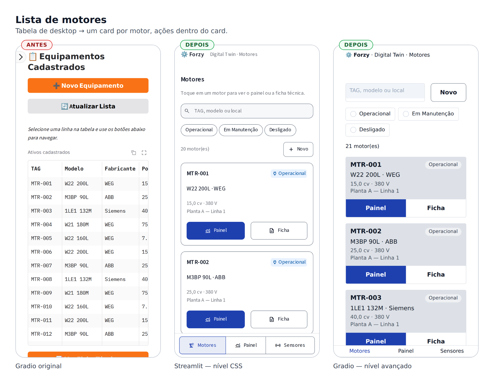
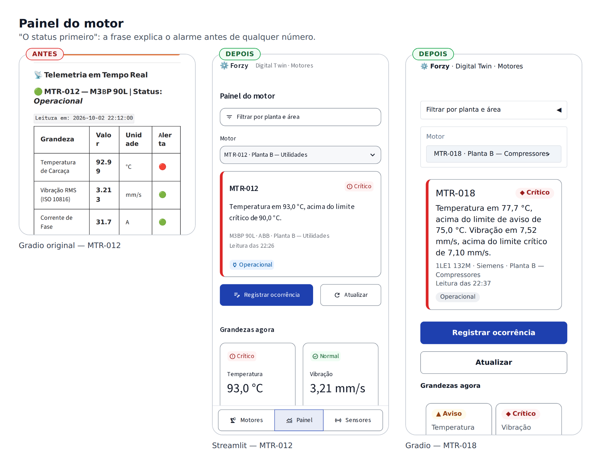
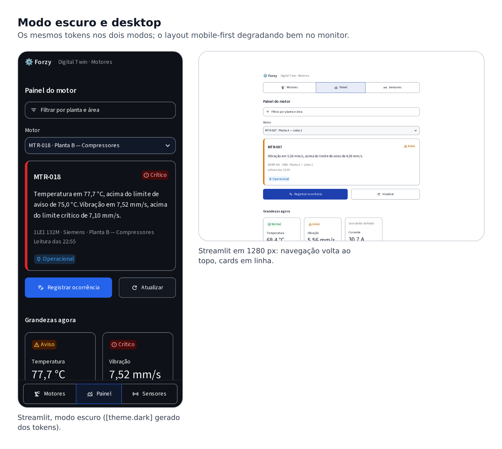
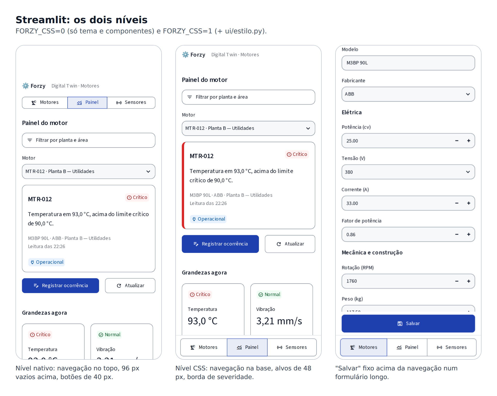
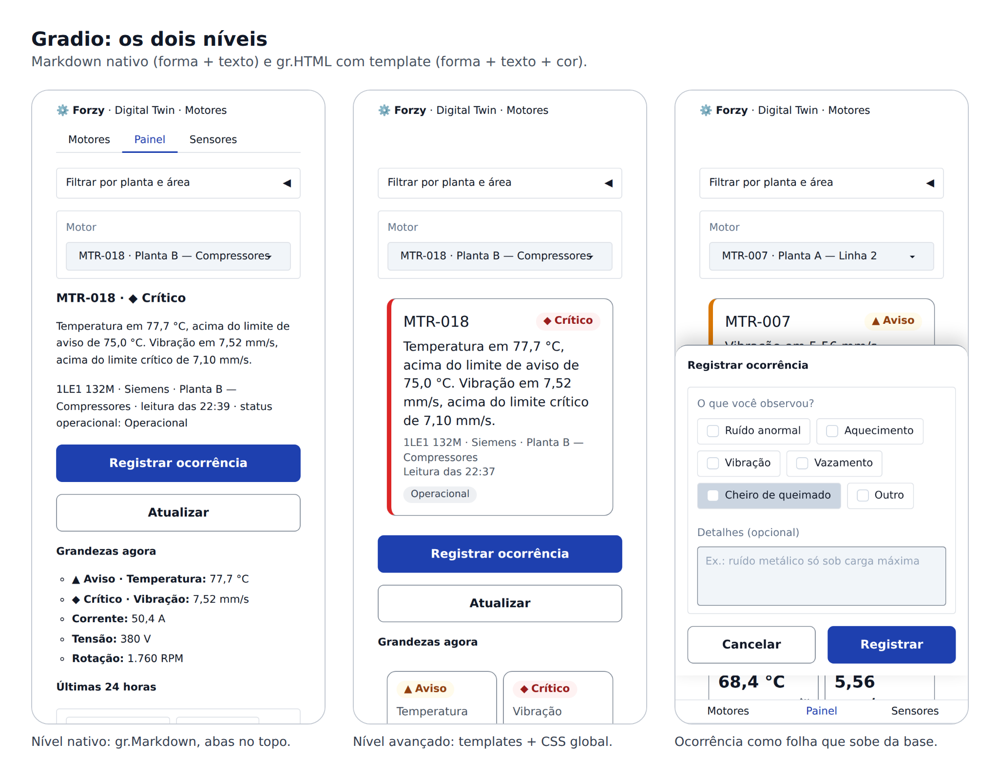

# Aula 22 — Design System Mobile na Prática

Implementando a especificação da Aula 21 no Forzy, em Streamlit e em Gradio, do componente nativo ao CSS

---

Na Aula 21 terminamos com uma especificação: persona, tarefas, cinco princípios e uma tabela de decisões (seção 14). Nesta aula essa especificação vira código. Vamos reconstruir o front-end do Forzy duas vezes:

- **`forzy-streamlit-mobile/`** — a versão Streamlit que você publicou no Streamlit Community Cloud na Aula 20, agora mobile-first.
- **`forzy-gradio-mobile/`** — a versão Gradio das Aulas 11 a 19, agora mobile-first e publicável no Render.

Cada versão é construída em **dois níveis**, e essa separação é o eixo da aula:

| Nível | O que usa | O que entrega | Quando basta |
|---|---|---|---|
| **1. Nativo** | Só parâmetros e componentes do framework: tema, containers, widgets, Markdown | App usável no celular, com tokens, componentes e navegação corretos | Na maioria dos projetos de Sprint |
| **2. Avançado** | Markdown com diretivas, templates HTML e uma folha de CSS gerada dos tokens | Alvos de 48 px, navegação na base da tela, cards com tendência, folha que sobe da base | Quando o nível 1 esbarra num limite que o framework não expõe |

Os dois níveis convivem no mesmo código. Uma variável de ambiente liga e desliga o nível 2:

```bash
FORZY_CSS=1   # padrão: nível nativo + nível avançado
FORZY_CSS=0   # só o nível nativo — útil para comparar e para depurar
```

> **A regra que atravessa a aula:** chegue ao nível 2 só depois de esgotar o nível 1. Todo CSS que você escreve sobre um framework é código que pode quebrar na próxima versão dele. Por isso, cada regra de CSS desta aula responde a uma medição ("o botão mede 40 px; o mínimo é 48") e se prende a um **gancho público** do framework, nunca a um nome interno.

Ao final, os dois apps vão estar assim:





---

# 0. Preparação

## 0.1 Versões

| Pacote | Versão usada | Por que importa |
|---|---|---|
| `streamlit` | 1.65.0 | `st.container(horizontal=..., wrap=...)`, `st.metric(chart_data=...)`, `st.badge`, `st.space`, cores semânticas no `[theme]` e `text_input(validate=...)` são recentes |
| `gradio` | 6.28.0 | `gr.HTML(html_template=..., css_template=...)`, e tema/CSS passados ao `launch()` são do Gradio 6 |
| `plotly` | 7.1.0 | Usado pelas duas versões, com a mesma função de gráfico |
| `pandas` | 2.3.3 | Histórico e download em CSV |

Fixe as versões no `requirements.txt`. Boa parte desta aula usa parâmetros que **não existiam** há um ano; com uma versão antiga, o código falha logo no primeiro `st.container(horizontal=True)`.

## 0.2 Rodando localmente

A API do Forzy (Aulas 17 a 20) precisa estar respondendo — localmente com `uvicorn` ou com o `docker run` da Aula 19, ou a URL do Render da Aula 20.

```bash
# Streamlit
cd forzy-streamlit-mobile
pip install -r requirements.txt
cp .env.example .env                       # API_URL e API_KEY, como na Aula 20
python -m ui.tokens > .streamlit/config.toml
streamlit run app.py                       # http://localhost:8501

# Gradio
cd forzy-gradio-mobile
pip install -r requirements.txt
cp .env.example .env
python app.py                              # http://localhost:7860
```

Para ver só o nível nativo:

```bash
# Linux/macOS
FORZY_CSS=0 streamlit run app.py
# Windows (PowerShell)
$env:FORZY_CSS="0"; streamlit run app.py
```

Para testar como celular: `F12` → ícone de dispositivo móvel → iPhone 12/13/14 (390 × 844). Mantenha essa visão aberta durante a aula inteira; é nela que cada decisão é conferida.

## 0.3 O mapa das mudanças

Compare a árvore de antes com a de agora:

```text
ANTES (Aula 20)                       AGORA (Aula 22)
app.py                                app.py
ui/sidebar.py          ── sai ──▶     ui/tokens.py        ← NOVO: única fonte de verdade visual
                                      ui/componentes.py   ← NOVO: design system em código
                                      ui/navegacao.py     ← substitui sidebar.py (Streamlit)
                                      ui/estilo.py        ← nível 2, Streamlit
                                      ui/tema.py          ← tokens → tema do Gradio + CSS
state/app_state.py                    state/app_state.py  ← + deep link pela URL
features/*/page.py                    features/*/page.py  ← reescritas: só orquestram
                                      features/ocorrencia/ ← NOVA feature (human-in-the-loop)
pipelines/*.py                        pipelines/*.py      ← devolvem ESTRUTURAS, não tabelas
                                      pipelines/formatacao.py ← NOVO: números, unidades, limites
providers/api_provider.py             providers/api_provider.py
                                      testes/             ← NOVO: a tela também é testada
```

A arquitetura em camadas que construímos nas Aulas 11 a 17 (*providers* → *pipelines* → *features*, com *state* compartilhado) **não muda**. O que muda é que a camada `ui/` deixa de ser "a sidebar" e vira o design system.

---

# 1. A Arquitetura de um Design System em Código

## 1.1 Quem pode chamar quem

```text
            ┌──────────────────────────────────────────────┐
            │ ui/tokens.py      (cores, espaço, tipo, toque) │
            └───────────────┬──────────────────────────────┘
                            │ só os componentes e o tema leem tokens
            ┌───────────────▼──────────────┐   ┌─────────────────────┐
            │ ui/componentes.py            │   │ ui/estilo.py · tema │
            │ selo, card, resumo, pares... │   │ (nível 2: CSS)      │
            └───────────────┬──────────────┘   └─────────────────────┘
                            │ recebem DADOS, decidem a FORMA
            ┌───────────────▼──────────────┐
            │ features/*/page.py           │  orquestram: qual componente,
            │ (telas)                      │  em que ordem, com que dados
            └───────────────┬──────────────┘
                            │ pedem dados prontos
            ┌───────────────▼──────────────┐
            │ pipelines/*.py               │  estruturas: listas, dicts, pares
            └───────────────┬──────────────┘
            ┌───────────────▼──────────────┐
            │ providers/api_provider.py    │  única porta para a API
            └──────────────────────────────┘
```

Quatro regras sustentam esse desenho. Elas são o design system funcionando como **contrato**, e não como gosto:

1. **Só `ui/` conhece cor.** Nenhuma página escreve `color="red"`, `#DC2626` ou 🔴. Uma página diz `selo_severidade("critico")`; o componente decide que crítico é ◆ + "Crítico" + vermelho.
2. **Pipelines devolvem estruturas.** Nunca Markdown, nunca DataFrame para exibição, nunca HTML. Quem decide se um dado vira tabela, card ou lista é o componente — e no celular a resposta quase nunca é "tabela".
3. **Páginas só orquestram.** Uma página escolhe componentes, define a ordem de leitura e liga eventos. Se você está escrevendo CSS ou formatando número dentro de `features/`, o código está na camada errada.
4. **Tokens são a única fonte.** O tema do Streamlit, o tema do Gradio e as duas folhas de CSS são **gerados** a partir de `ui/tokens.py`. Ninguém edita o `config.toml` à mão.

## 1.2 A prova de que funciona

Se as regras forem seguidas, as camadas de baixo não dependem do framework. E de fato:

```bash
cmp forzy-streamlit-mobile/ui/tokens.py           forzy-gradio-mobile/ui/tokens.py
cmp forzy-streamlit-mobile/pipelines/formatacao.py forzy-gradio-mobile/pipelines/formatacao.py
cmp forzy-streamlit-mobile/pipelines/cadastro_pipeline.py  forzy-gradio-mobile/pipelines/cadastro_pipeline.py
cmp forzy-streamlit-mobile/pipelines/sensor_pipeline.py    forzy-gradio-mobile/pipelines/sensor_pipeline.py
cmp forzy-streamlit-mobile/pipelines/dashboard_pipeline.py forzy-gradio-mobile/pipelines/dashboard_pipeline.py
# nenhuma saída: os arquivos são idênticos
```

**Cinco arquivos idênticos nas duas versões.** O provider também expõe as mesmas funções com os mesmos nomes (só a implementação do cache muda). Isso é o que a Aula 2 chamava de reuso, agora medido: trocar de framework custou reescrever `ui/` e `features/`, e nada abaixo disso.

> **Correlação com a Aula 13 (pipelines):** lá a pipeline era o lugar onde o dado bruto da API virava dado útil. Aqui damos um passo a mais: "útil" quer dizer **útil para qualquer forma de exibição**, e não "já formatado como tabela Markdown para o Gradio".

---

# 2. Passo 1 — Os Tokens (`ui/tokens.py`)

Este é o primeiro arquivo a ser escrito e o último a ser lido por qualquer tela. Ele implementa as três camadas da Aula 21 (seção 5.1).

## 2.1 Primitivos

```python
PRIMITIVOS = {
    "branco": "#FFFFFF",
    "cinza": {
        50: "#F7F8FA", 100: "#EEF0F3", 200: "#DDE1E7", 400: "#7D8794",
        600: "#4B5563", 700: "#374151", 800: "#1F2933", 900: "#111827", 950: "#0E1117",
    },
    "azul": {300: "#93C5FD", 600: "#2563EB", 800: "#1E40AF", 950: "#172554"},
    "verde": {50: "#F0FDF4", 300: "#86EFAC", 600: "#16A34A", 800: "#166534", 950: "#052E16"},
    "ambar": {50: "#FFFBEB", 300: "#FCD34D", 600: "#D97706", 800: "#92400E", 950: "#451A03"},
    "vermelho": {50: "#FEF2F2", 300: "#FCA5A5", 600: "#DC2626", 800: "#991B1B", 950: "#450A0A"},
}
```

A paleta crua. A regra é que **nenhum arquivo fora de `tokens.py` usa um primitivo**. Se amanhã o vermelho 800 mudar, só os semânticos que apontam para ele mudam junto.

## 2.2 Semânticos — o mesmo vocabulário nos dois modos

```python
SEMANTICOS = {
    "claro": {
        "fundo": PRIMITIVOS["branco"],
        "superficie": _c[50],
        "borda": _c[400],          # 3:1 contra o fundo: limites de controle visíveis ao sol
        "borda_suave": _c[200],    # divisórias decorativas, não identificam controles
        "texto": _c[900],
        "texto_suave": _c[600],
        "acao": _az[800],
        "texto_sobre_acao": PRIMITIVOS["branco"],
        "normal_texto": _vd[800], "normal_fundo": _vd[50], "normal_destaque": _vd[600],
        "aviso_texto": _am[800], "aviso_fundo": _am[50], "aviso_destaque": _am[600],
        "critico_texto": _vm[800], "critico_fundo": _vm[50], "critico_destaque": _vm[600],
        "neutro_texto": _c[700], "neutro_fundo": _c[100], "neutro_destaque": _c[400],
    },
    "escuro": {
        "fundo": _c[950],
        # ... mesmas chaves, outros valores
        "acao": _az[600],
        # ...
    },
}
```

Repare em três decisões, todas vindas da Aula 21:

- **Cada severidade é uma tríade** `texto / fundo / destaque`. O selo usa texto sobre fundo (contraste ≥ 4,5:1); a borda lateral do resumo usa o destaque. Um único "vermelho" não serviria aos dois usos.
- **Existem duas bordas.** `borda` (cinza 400, 3,64:1) identifica controles — WCAG 1.4.11 exige 3:1 para o limite de um campo. `borda_suave` é decorativa e pode ser clara.
- **A ação é azul.** O laranja padrão do Gradio dava 2,80:1 com texto branco (item 11 do diagnóstico) e, pior, competia com o âmbar do aviso. A ISA-101 manda reservar cor saturada para o anormal.

## 2.3 Severidade e status: duas linguagens

```python
SEVERIDADE = {
    "normal":   {"rotulo": "Normal",  "simbolo": "●", "icone": ":material/check_circle:", "cor_nativa": "green",  "peso": 0},
    "aviso":    {"rotulo": "Aviso",   "simbolo": "▲", "icone": ":material/warning:",      "cor_nativa": "orange", "peso": 1},
    "critico":  {"rotulo": "Crítico", "simbolo": "◆", "icone": ":material/error:",        "cor_nativa": "red",    "peso": 2},
    "sem_dado": {"rotulo": "Sem dado", "simbolo": "○", "icone": ":material/help:",        "cor_nativa": "gray",   "peso": -1},
}

STATUS_OPERACIONAL = {
    "Operacional":   {"icone": ":material/power:",              "cor_nativa": "blue"},
    "Em Manutenção": {"icone": ":material/build:",              "cor_nativa": "violet"},
    "Desligado":     {"icone": ":material/power_settings_new:", "cor_nativa": "gray"},
}
```

Este trecho resolve o problema mais perigoso do diagnóstico, o **🟢 verde ao lado de um motor crítico**. São dois dicionários porque são dois conceitos:

- `SEVERIDADE` descreve a **leitura** (o back-end classifica pela ISO 10816). Tem forma (● ▲ ◆ ○), ícone, rótulo e cor: quatro canais redundantes, cumprindo WCAG 1.4.1.
- `STATUS_OPERACIONAL` descreve o **cadastro**. Usa azul, violeta e cinza, que **não pertencem ao semáforo**. Um motor "Operacional" a 93 °C não exibe verde em lugar nenhum.

O campo `cor_nativa` é a ponte com o nível 1: é o nome de cor que `st.badge` e as diretivas de Markdown do Streamlit entendem. E o tema (seção 4.1) redefine exatamente essas cores nativas com os nossos tokens.

`peso` existe para uma função só:

```python
def pior_severidade(*chaves: str) -> str:
    """A severidade mais grave entre várias leituras — usada no status-resumo do motor."""
    validas = [c for c in chaves if c in SEVERIDADE and c != "sem_dado"]
    return max(validas, key=lambda c: SEVERIDADE[c]["peso"]) if validas else "sem_dado"
```

O resumo do motor mostra a **pior** severidade entre temperatura e vibração. É o princípio "o status primeiro": uma resposta, a mais importante.

## 2.4 Escalas e decisões de componente

```python
ESPACO = {"xs": 4, "sm": 8, "md": 12, "lg": 16, "xl": 24, "xxl": 32}   # grade de 4 px
RAIO = {"sm": 8, "md": 12, "lg": 16, "pilula": 999}
TIPO = {
    "base_px": 16,                                     # nunca menos: o iOS dá zoom em campos < 16 px
    "titulos_rem": ["1.5rem", "1.25rem", "1.125rem"],  # h1–h3 compactos para tela pequena
    "valor_metrica_rem": "1.75rem",
}
TOQUE = {"alvo_minimo_px": 48}                         # Material: 48 dp · Apple: 44 pt · WCAG AA: 24 px
BREAKPOINT = {"compacto_px": 600, "medio_px": 840}     # classes de janela do Material 3
```

`BREAKPOINT` merece uma observação. Na Aula 21 (seção 4.3) vimos que **o Python não sabe a largura da tela**: o script do Streamlit e as funções do Gradio rodam no servidor, que nunca vê o celular. Portanto esses números **só são usados no CSS** (nível 2). No nível 1, a responsividade vem de componentes que se reorganizam sozinhos — largura mínima com quebra de linha — e não de `if largura < 600` em Python.

## 2.5 O teste automatizado do design system

```python
def contraste(cor_a: str, cor_b: str) -> float:
    """Razão de contraste WCAG 2.x entre duas cores hexadecimais (1 a 21)."""
    def luminancia(hexa: str) -> float:
        hexa = hexa.lstrip("#")
        canais = [int(hexa[i:i + 2], 16) / 255 for i in (0, 2, 4)]
        lin = [c / 12.92 if c <= 0.03928 else ((c + 0.055) / 1.055) ** 2.4 for c in canais]
        return 0.2126 * lin[0] + 0.7152 * lin[1] + 0.0722 * lin[2]

    maior, menor = sorted((luminancia(cor_a), luminancia(cor_b)), reverse=True)
    return (maior + 0.05) / (menor + 0.05)


def verificar_contrastes() -> list[str]:
    """Pares de cor que o app realmente usa contra os mínimos do WCAG (4,5:1 texto, 3:1 limites)."""
    problemas = []
    for modo, t in SEMANTICOS.items():
        pares_texto = [("texto", "fundo"), ("texto_suave", "fundo"), ("texto_sobre_acao", "acao"),
                       ("normal_texto", "normal_fundo"), ("aviso_texto", "aviso_fundo"),
                       ("critico_texto", "critico_fundo"), ("neutro_texto", "neutro_fundo")]
        for frente, fundo in pares_texto:
            r = contraste(t[frente], t[fundo])
            if r < 4.5:
                problemas.append(f"[{modo}] texto {frente}/{fundo} = {r:.2f}:1 (mínimo 4,5)")
        for limite in ("borda", "acao", "critico_destaque"):
            r = contraste(t[limite], t["fundo"])
            if r < 3:
                problemas.append(f"[{modo}] limite {limite}/fundo = {r:.2f}:1 (mínimo 3)")
    return problemas
```

E o ponto de entrada do módulo **se recusa a gerar o tema** se algum par reprovar:

```python
if __name__ == "__main__":
    import sys

    falhas = verificar_contrastes()
    if falhas:
        print("Contraste reprovado:\n  " + "\n  ".join(falhas), file=sys.stderr)
        sys.exit(1)
    print(exportar_tema_streamlit())
```

Essa é a governança da Aula 21 (seção 13) em seis linhas: uma cor nova que reprova não chega à tela, porque o tema simplesmente não é gerado.

## 2.6 Lição: teste a tela, não só o token

Esta implementação passou por um erro que vale contar. A primeira versão do modo escuro usava `acao = azul 300` (`#93C5FD`). No papel, perfeito: azul claro sobre fundo escuro, 10:1. O teste de contraste passava, porque o token `texto_sobre_acao` do modo escuro era **cinza escuro**.

Só que o Streamlit **sempre escreve o texto do botão primário em branco**, independentemente do tema. Na tela, o botão "Registrar ocorrência" ficou branco sobre azul claro: **1,7:1**. O teste testava o token, e não a tela.

A correção tem duas partes:

```python
"escuro": {
    # O Streamlit sempre escreve o texto do botão primário em BRANCO. Um azul
    # claro (300) parecia ótimo no escuro, mas deixava "branco sobre azul
    # claro" com 1,7:1. O token precisa refletir o que o framework renderiza.
    "acao": _az[600],                         # 5,17:1 com branco
    "texto_sobre_acao": PRIMITIVOS["branco"],
```

1. O token passou a **descrever o que o framework faz** (`texto_sobre_acao` = branco) — e aí o teste reprovou o azul 300, como deveria.
2. A conferência final virou visual: abrir a tela em modo escuro e medir. É por isso que a seção 9 desta aula tem testes que rodam **num navegador**.



---

# 3. Passo 2 — As Pipelines: de Tabela para Estrutura

## 3.1 O antes

Na versão desktop, a pipeline do cadastro devolvia a ficha técnica já em Markdown:

```python
# ANTES — a pipeline decidia a forma de exibição
def ficha_tecnica(tag):
    ...
    return f"""
| Campo | Valor |
|---|---|
| Potência | {eq['potencia_cv']} cv |
| Rotação  | {eq['rotacao_rpm']} RPM |
"""
```

Num monitor, ótimo. Num celular de 360 px, a tabela Markdown parte palavras e números ("176 / 0.0", "Valo r"). E pior: **não há como consertar isso na tela**, porque a forma foi decidida embaixo, na pipeline.

## 3.2 O depois

```python
def ficha_tecnica(tag: str) -> dict | None:
    """
    Ficha técnica em seções de pares rótulo/valor.

    Antes era uma string Markdown com tabelas — que, numa tela de 360 px,
    quebrava números no meio ("176 / 0.0"). Pares rótulo/valor se adaptam a
    qualquer largura.
    """
    eq = eq_provider.buscar_por_tag(tag)
    if not eq:
        return None
    return {
        "tag": eq["tag"],
        "titulo": eq["modelo"],
        "status": eq["status"],
        "secoes": [
            ("Identificação", [
                ("Fabricante", eq["fabricante"]),
                ("Local", eq["local"] or "—"),
                ("Cadastrado em", eq["cadastrado_em"]),
            ]),
            ("Elétrica", [
                ("Potência", f"{numero(eq['potencia_cv'], 1)} cv"),
                ("Tensão", f"{eq['tensao_v']} V"),
                ("Corrente nominal", f"{numero(eq['corrente_nominal_a'], 1)} A"),
                ("Fator de potência", numero(eq["fator_potencia"], 2)),
            ]),
            # ...
        ],
    }
```

A pipeline agora devolve **o que** mostrar e em que **agrupamento**. O **como** fica com o componente `pares_rotulo_valor` (Streamlit) ou `PARES` (Gradio). A mesma estrutura serve também à placa de identificação, que antes era arte ASCII de 48 colunas.

## 3.3 Conteúdo também é design system (`pipelines/formatacao.py`)

```python
GRANDEZAS = {
    "temp_c":       {"nome": "Temperatura", "unidade": "°C",   "casas": 1, "chave_sev": "severidade_temp"},
    "vibracao_mms": {"nome": "Vibração",    "unidade": "mm/s", "casas": 2, "chave_sev": "severidade_vibracao"},
    "corrente_a":   {"nome": "Corrente",    "unidade": "A",    "casas": 1, "chave_sev": None},
    "tensao_v":     {"nome": "Tensão",      "unidade": "V",    "casas": 0, "chave_sev": None},
    "rotacao_rpm":  {"nome": "Rotação",     "unidade": "RPM",  "casas": 0, "chave_sev": None},
}


def numero(valor: float | int | None, casas: int = 1) -> str:
    """Formata no padrão brasileiro: vírgula decimal e ponto de milhar (1.760,5)."""
    if valor is None:
        return "—"
    texto = f"{valor:,.{casas}f}"
    return texto.replace(",", "§").replace(".", ",").replace("§", ".")
```

`92.99` e `93,0 °C` carregam o mesmo dado; só o segundo é lido de relance por um operador brasileiro. Centralizar nome, unidade e casas decimais garante que o card, o resumo, o gráfico e o CSV escrevam igual. A chave `chave_sev` diz qual campo da leitura traz a severidade daquela grandeza — `None` significa "sem limite definido", e o card mostra exatamente essa frase, em vez de inventar um verde.

> Por que não `locale.setlocale`? Porque ele altera o processo inteiro, e um servidor Gradio atende todos os usuários no mesmo processo. Uma função pura é previsível.

## 3.4 O painel na ordem de leitura do celular

```python
def painel(tag: str) -> dict | None:
    """Resumo + grandezas de um motor. None quando o motor não existe ou a API falhou."""
    eq = api_provider.buscar_por_tag(tag)
    if not eq:
        return None
    leitura = api_provider.leitura_atual(tag)
    grandezas = grandezas_atuais(tag)
    if not grandezas:
        return None

    sev_geral = pior_severidade(leitura["severidade_temp"], leitura["severidade_vibracao"])
    # A grandeza mais grave abre selecionada no gráfico de detalhe.
    destaque = max(("temp_c", "vibracao_mms"),
                   key=lambda c: {"critico": 2, "aviso": 1}.get(leitura[GRANDEZAS[c]["chave_sev"]], 0))

    return {
        "tag": eq["tag"],
        "titulo": f"{eq['modelo']} · {eq['fabricante']}",
        "local": eq["local"],
        "status_operacional": eq["status"],
        "severidade": sev_geral,
        "explicacao": _explicar(leitura),
        "hora": hora(leitura["timestamp"]),
        "grandezas": grandezas["itens"],
        "grandeza_destaque": destaque,
    }
```

Dois campos nasceram para o celular:

- **`explicacao`** — uma frase que justifica a cor: *"Temperatura em 93,0 °C, acima do limite crítico de 90,0 °C."* É o pilar de **transparência** da Aula 2 aplicado a uma tela de 2 segundos: o operador não precisa cruzar um número com um limite de cabeça.
- **`grandeza_destaque`** — o gráfico de detalhe abre na grandeza **mais grave**, não na primeira da lista. Um toque a menos para quem precisa investigar.

## 3.5 Um gráfico desenhado para o dedo

```python
def grafico_grandeza(tag: str, chave: str, modo_tema: str = "claro"):
    historico = api_provider.historico_simulado(tag)
    if not historico:
        return None

    t = cores(modo_tema)
    g = GRANDEZAS[chave]
    x = [h["timestamp"] for h in historico]
    y = [h[chave] for h in historico]

    fig = go.Figure(go.Scatter(
        x=x, y=y, mode="lines", line=dict(color=t["acao"], width=2.5),
        hovertemplate=f"%{{x|%H:%M}} · %{{y:.{g['casas']}f}} {g['unidade']}<extra></extra>",
    ))
    for nivel, cor in (("aviso", t["aviso_destaque"]), ("critico", t["critico_destaque"])):
        if chave in LIMITES:
            fig.add_hline(y=LIMITES[chave][nivel], line_dash="dash", line_color=cor, line_width=1.5,
                          annotation_text="Crítico" if nivel == "critico" else "Aviso",
                          annotation_position="top left", annotation_font_color=cor)

    fig.update_layout(
        template="plotly_white",   # fundo neutro: a cor fica para os limites e a série
        height=260, margin=dict(t=16, b=8, l=8, r=8), showlegend=False,
        dragmode=False, hovermode="x unified",
        yaxis_title=g["unidade"],
        modebar_remove=["zoom", "pan", "select", "lasso2d", "zoomIn", "zoomOut",
                        "autoScale", "resetScale", "toImage"],
    )
    fig.update_xaxes(fixedrange=True, tickformat="%H:%M", nticks=5)
    fig.update_yaxes(fixedrange=True)
    return fig
```

| Parâmetro | Problema da Aula 21 que resolve |
|---|---|
| Um gráfico, não quatro em 2×2 | Títulos sobrepostos, datas encavaladas (item 7) |
| `height=260` | O gráfico cabe na tela junto com o seletor de grandeza |
| `dragmode=False` + `fixedrange=True` | **Armadilha de rolagem**: o dedo rola a página, não o gráfico |
| `modebar_remove=[...]` | Oito botões de 24 px (item 8). O `gr.Plot` não permite esconder a barra, então ela é esvaziada na própria figura |
| `template="plotly_white"` | O tema padrão tinha fundo lilás; cor saturada só nos limites |
| Linhas de limite com rótulo de texto | Cor nunca sozinha: "Aviso" e "Crítico" escritos na linha |
| `nticks=5`, `tickformat="%H:%M"` | Eixo legível em 360 px; a data repetida era ruído |

A função recebe `modo_tema` porque as cores das linhas vêm dos tokens do modo atual. Ela fica na pipeline (e não em `ui/`) porque devolve um **objeto de dados do Plotly**, que os dois frameworks exibem sem alteração.

---

# 4. Parte A — Streamlit, Nível Nativo

## 4.1 O tema é um arquivo de tokens

O `[theme]` do Streamlit 1.65 é, na prática, uma lista de tokens semânticos. Por isso ele é **gerado**, nunca editado:

```python
def exportar_tema_streamlit() -> str:
    def bloco_cores(t: dict) -> list[str]:
        return [
            f'primaryColor = "{t["acao"]}"',
            f'backgroundColor = "{t["fundo"]}"',
            f'secondaryBackgroundColor = "{t["superficie"]}"',
            f'textColor = "{t["texto"]}"',
            f'borderColor = "{t["borda"]}"',
            f'greenColor = "{t["normal_destaque"]}"',
            f'greenBackgroundColor = "{t["normal_fundo"]}"',
            f'greenTextColor = "{t["normal_texto"]}"',
            f'orangeColor = "{t["aviso_destaque"]}"',
            # ... red, gray
        ]

    linhas = [
        "# Gerado por `python -m ui.tokens` — não edite à mão; edite ui/tokens.py.",
        "",
        "[client]",
        'toolbarMode = "minimal"',
        "",
        "[theme]",
        f"baseFontSize = {TIPO['base_px']}",
        f'baseRadius = "{RAIO["md"]}px"',
        f'buttonRadius = "{RAIO["sm"]}px"',
        f"headingFontSizes = {TIPO['titulos_rem']}".replace("'", '"'),
        f'metricValueFontSize = "{TIPO["valor_metrica_rem"]}"',
        "showWidgetBorder = true",
        "",
        "[theme.light]",
        *bloco_cores(SEMANTICOS["claro"]),
        "",
        "[theme.dark]",
        *bloco_cores(SEMANTICOS["escuro"]),
    ]
    return "\n".join(linhas)
```

```bash
python -m ui.tokens > .streamlit/config.toml
```

O que cada grupo de chaves resolve:

| Chave | Efeito | Item do diagnóstico |
|---|---|---|
| `primaryColor` | Botões primários, seleção ativa, foco | 11 (laranja a 2,8:1) |
| `greenColor`, `orangeColor`, `redColor`, `grayColor` + `...BackgroundColor` + `...TextColor` | As cores que `st.badge`, `st.success`, `st.warning`, `st.error` e as diretivas `:red[...]` usam | 5 e 6 |
| `borderColor` + `showWidgetBorder = true` | Todo campo com limite visível a 3:1 | — (sol, WCAG 1.4.11) |
| `headingFontSizes` | `h1`/`h2`/`h3` em 1,5 / 1,25 / 1,125 rem | 10 (títulos enormes) |
| `baseFontSize = 16` | Texto base de 16 px; abaixo disso o iOS dá zoom ao focar um campo | — |
| `[theme.light]` e `[theme.dark]` | Os dois modos vindos dos mesmos tokens; o usuário escolhe pelo sistema | — |
| `[client] toolbarMode = "minimal"` | Some o "Deploy" e o menu de desenvolvedor: ~90 px a mais de conteúdo | — |

O ponto mais poderoso é a linha das cores nativas. Ao redefinir `redColor` com `critico_destaque`, **todo componente nativo que fala "vermelho" passa a falar o vermelho do Forzy** — `st.badge(color="red")`, `st.error`, `:red-badge[...]`. É a camada semântica da Aula 21 funcionando dentro de um framework que você não controla.

## 4.2 A página: `layout="centered"` é mobile-first em uma palavra

```python
st.set_page_config(page_title="Forzy · Digital Twin", page_icon="⚙️",
                   layout="centered", initial_sidebar_state="collapsed")
```

A versão desktop usava `layout="wide"`. No celular, `wide` e `centered` dão o mesmo resultado (a tela inteira); no monitor, `centered` mantém **uma coluna de leitura** de largura confortável. Projetar para a coluna estreita e deixar o desktop herdar é a definição de mobile first (Aula 21, seção 4.1). A figura de desktop acima mostra o resultado: a mesma tela, numa coluna central, com os cards de grandeza enfileirados lado a lado.

## 4.3 Os componentes (`ui/componentes.py`)

O cabeçalho do arquivo é o contrato:

```python
# Cada função aqui é um componente: recebe DADOS (nunca cores ou ícones) e
# decide sozinha como desenhá-los, consultando ui/tokens.py. As páginas em
# features/ montam telas combinando estes componentes — e nunca chamam
# st.badge, st.metric ou st.container(border=True) diretamente para exibir
# um status. É isso que garante que "crítico" tenha a mesma cara em todo lugar.
#
# Hierarquia (Atomic Design):
#   átomos     selo_severidade, selo_status
#   moléculas  pares_rotulo_valor, cartao_grandeza, estado_vazio
#   organismos cartao_equipamento, resumo_motor, grade_grandezas
```

### Átomos: os selos

```python
def selo_severidade(chave: str | None) -> None:
    """Selo da severidade de uma LEITURA: ícone de forma própria + texto + cor."""
    s = severidade(chave)
    st.badge(s["rotulo"], icon=s["icone"], color=s["cor_nativa"])


def selo_status(status: str) -> None:
    """Selo do status OPERACIONAL do cadastro — deliberadamente sem verde, âmbar ou vermelho."""
    meta = STATUS_OPERACIONAL.get(status, {"icone": ":material/help:", "cor_nativa": "gray"})
    st.badge(status, icon=meta["icone"], color=meta["cor_nativa"])
```

`st.badge` é o componente nativo certo: pílula com ícone, texto e cor do tema. A página nunca o chama diretamente; ela chama `selo_severidade("critico")`. Se um dia o selo precisar mudar (um ícone, uma cor), muda aqui, em um lugar.

Observe também o fallback: uma severidade desconhecida vira `sem_dado` (○ "Sem dado", cinza). **Nunca** vira verde por omissão. Um dado ausente não é um dado bom.

### Moléculas: pares e grandezas

```python
def pares_rotulo_valor(pares: list[tuple[str, str]]) -> None:
    """Lista rótulo/valor em duas pontas da linha: se adapta a qualquer largura."""
    for rotulo, valor in pares:
        with st.container(horizontal=True, horizontal_alignment="distribute", gap="small"):
            st.caption(rotulo)
            st.markdown(f"**{valor}**")


def cartao_grandeza(item: dict, largura: int = 168) -> None:
    """
    Card de uma grandeza: valor grande, tendência em miniatura e severidade.

    A largura fixa faz a grade se reorganizar sozinha: dois cards por linha
    num celular, quatro ou cinco num monitor — sem nenhum breakpoint em Python.
    """
    with st.container(border=True, width=largura, key=f"grandeza_{item['chave']}"):
        if item["severidade"]:
            selo_severidade(item["severidade"])
        else:
            st.caption("Sem limite definido")
        st.metric(
            label=item["nome"],
            value=item["valor"],
            chart_data=item["serie"],
            chart_type="line",
            border=False,
        )
```

Três recursos recentes do Streamlit carregam este trecho:

- **`st.container(horizontal=True, horizontal_alignment="distribute")`** — rótulo numa ponta e valor na outra, sem `st.columns`. Ao contrário de colunas, um container horizontal não reserva largura fixa para cada filho.
- **`st.container(width=168)`** — um card com largura própria. Dentro de um container horizontal com `wrap=True`, essa largura **é** o breakpoint: o navegador decide quantos cabem por linha.
- **`st.metric(chart_data=..., chart_type="line")`** — a *sparkline* da Aula 21 (seção 8.3) é nativa: valor grande com a tendência das últimas 24 h embaixo.

### Organismos: card de equipamento, resumo e grade

```python
def cartao_equipamento(eq: dict) -> str | None:
    """Card de um equipamento na lista. Devolve a ação tocada: 'painel', 'ficha' ou None."""
    with st.container(border=True, key=f"equip_{eq['tag']}"):
        with st.container(horizontal=True, horizontal_alignment="distribute", vertical_alignment="center"):
            st.markdown(f"**{eq['tag']}**")
            selo_status(eq["status"])
        st.markdown(eq["titulo"])
        st.caption(f"{eq['detalhe']}  \n{eq['local']}")

        with st.container(horizontal=True, gap="small", key=f"acoes_{eq['tag']}"):
            if st.button("Painel", icon=":material/monitoring:", type="primary",
                         key=f"painel_{eq['tag']}", width="stretch"):
                return "painel"
            if st.button("Ficha", icon=":material/description:",
                         key=f"ficha_{eq['tag']}", width="stretch"):
                return "ficha"
    return None
```

Repare que **o componente não navega**: ele devolve qual ação foi tocada, e a página decide para onde ir. Um componente que chamasse `app_state.ir_para` estaria amarrado a uma tela específica e não poderia ser reutilizado.

As `key=` não são decoração. No Streamlit, todo container ou widget com `key="x"` recebe a classe CSS `st-key-x`. No nível 1 isso não tem efeito visível; no nível 2, é o **gancho público** que o CSS vai usar (seção 5.2). Por isso os botões de ação ficam num container chamado `acoes_...`.

```python
def resumo_motor(p: dict) -> None:
    """Cabeçalho "status primeiro" do painel: responde "o motor está bem?" antes de qualquer número."""
    with st.container(border=True, key=f"resumo_{p['severidade']}"):
        with st.container(horizontal=True, horizontal_alignment="distribute", vertical_alignment="center"):
            st.markdown(f"### {p['tag']}")
            selo_severidade(p["severidade"])
        st.markdown(p["explicacao"])
        st.caption(f"{p['titulo']} · {p['local']}  \nLeitura das {p['hora']}")
        selo_status(p["status_operacional"])


def grade_grandezas(itens: list[dict]) -> None:
    """Grade fluida de cards: quebra de linha automática conforme a largura da tela."""
    with st.container(horizontal=True, wrap=True, gap="small"):
        for item in itens:
            cartao_grandeza(item)
```

A chave `resumo_{severidade}` vira `st-key-resumo_critico`, que o nível 2 usa para pintar a borda lateral. O selo de status operacional aparece **no fim** do resumo, discreto: ele é contexto, não alarme.

### Estados

```python
def estado_vazio(mensagem: str, icone: str = ":material/info:") -> None:
    """Estado vazio: diz o que fazer, em vez de mostrar uma área em branco."""
    st.info(mensagem, icon=icone)


def estado_erro(mensagem: str) -> None:
    """Estado de erro: o que aconteceu e o que o usuário pode fazer."""
    st.error(mensagem, icon=":material/cloud_off:")
```

Componentes tão simples que parecem desnecessários. Eles existem para que **toda** tela diga "nenhum motor encontrado com esse filtro" do mesmo jeito, com o mesmo ícone — o princípio 5 da especificação, "nunca em branco".

## 4.4 Navegação (`ui/navegacao.py`)

A sidebar saiu. No celular ela era um menu escondido que, aberto, cobria a tela inteira (item 1 do diagnóstico). Com **três destinos de primeiro nível**, Material e Apple recomendam uma barra sempre visível:

```python
DESTINOS = {
    "equipamentos": ":material/precision_manufacturing: Motores",
    "dashboard": ":material/monitoring: Painel",
    "dados": ":material/sensors: Sensores",
}


def barra_navegacao() -> None:
    atual = app_state.pagina_atual()
    destacado = "equipamentos" if atual == "cadastro" else atual

    with st.container(key="nav_principal"):
        escolha = st.segmented_control(
            "Navegação",
            options=list(DESTINOS),
            format_func=DESTINOS.get,
            default=destacado,
            required=True,
            key=f"nav_{destacado}",
            label_visibility="collapsed",
            width="stretch",
        )
    if escolha and escolha != destacado:
        app_state.ir_para(escolha)
```

Quatro detalhes:

1. **`st.segmented_control`** é o componente nativo mais próximo de uma barra de navegação: opções sempre visíveis, uma selecionada, ícone + texto curto.
2. **`required=True`** impede o estado "nenhum destino selecionado", que um segundo toque no item ativo causaria.
3. **Cadastro é filho de Motores.** Enquanto a ficha está aberta, "Motores" continua destacado — como num app nativo, em que o detalhe pertence à aba da lista.
4. **`key=f"nav_{destacado}"`** — a chave muda junto com a página. Sem isso, quando a navegação acontece **por código** (tocar "Painel" num card), o controle manteria o valor antigo, porque um widget com a mesma chave lembra o último valor do usuário. Trocar a chave faz o controle renascer com o novo `default`.

No nível 1 a barra fica no topo. O nível 2 a leva para a base da tela — sem tocar neste arquivo.

## 4.5 Estado e deep link (`state/app_state.py`)

O caso de uso de campo da Aula 21 (seção 7.3): um **QR code colado no motor** abre o app direto no painel dele.

```text
https://forzy.streamlit.app/?pagina=dashboard&tag=MTR-007
```

```python
PAGINAS = ("equipamentos", "cadastro", "dados", "dashboard")


def inicializar() -> None:
    """
    Garante as chaves do estado e aplica o deep link na primeira execução.

    Valores vindos da URL são entrada do usuário: só são aceitos se forem uma
    página conhecida e uma TAG no formato esperado.
    """
    if "pagina" in st.session_state:
        return

    for chave, valor in _PADROES.items():
        st.session_state[chave] = valor

    pagina = st.query_params.get("pagina", "")
    tag = st.query_params.get("tag", "").strip().upper()

    if pagina in PAGINAS:
        st.session_state["pagina"] = pagina
    if tag.startswith("MTR-") and tag[4:].isdigit():
        st.session_state["tag_selecionada"] = tag
        if pagina == "cadastro":
            st.session_state["modo_cadastro"] = "edicao"


def ir_para(pagina: str, tag: str | None = None, modo: str | None = None) -> None:
    """Troca de página, atualiza a URL e reexecuta o script imediatamente."""
    st.session_state["pagina"] = pagina
    if tag is not None:
        st.session_state["tag_selecionada"] = tag
    if modo is not None:
        st.session_state["modo_cadastro"] = modo

    parametros = {"pagina": pagina, "tag": st.session_state["tag_selecionada"]}
    st.query_params.from_dict({k: v for k, v in parametros.items() if v})
    st.rerun()
```

O desenho tem uma regra simples: **a URL é lida uma vez, quando a sessão começa; depois disso, quem manda é o `session_state`**, e a URL só é escrita — para continuar compartilhável e para sobreviver a um F5.

**Segurança.** Um QR code pode ser trocado por outro; uma URL pode ser digitada à mão. Tudo o que vem de `st.query_params` é **entrada do usuário**: a página só é aceita se estiver numa lista fechada, e a TAG só se tiver o formato `MTR-` + dígitos. Uma URL como `?pagina=<script>&tag=../../etc` cai silenciosamente na lista de motores. O mesmo cuidado da Aula 17 com a API, agora no front.

> **Por que não `bind="query-params"`?** O Streamlit recente permite ligar um widget diretamente à URL. Testamos e descartamos para navegação, por três motivos: o parâmetro guarda o **rótulo formatado** (com ícone) e não a chave; a navegação por código é sobrescrita pelo valor do widget; e o botão "voltar" do navegador deixa o parâmetro vazio. Para navegação, o controle manual acima é mais previsível.

## 4.6 A orquestração das telas

### O roteador (`app.py`)

```python
PAGINAS = {
    "equipamentos": equipamentos_page.render,
    "cadastro": cadastro_page.render,
    "dados": sensores_page.render,
    "dashboard": dashboard_page.render,
}

if os.getenv("FORZY_CSS", "1") == "1":
    aplicar_estilo(st.context.theme.type or "light")

app_state.inicializar()

if not st.session_state.get("_api_acordada"):
    with st.spinner("Acordando a API… o plano gratuito hiberna após alguns minutos sem acesso."):
        api_provider.acordar_api()

aviso = st.session_state.pop("_aviso_global", None)
if aviso:
    st.toast(aviso, icon=":material/check_circle:")

barra_superior()
barra_navegacao()

PAGINAS[app_state.pagina_atual()]()
```

O `app.py` inteiro cabe na tela. Ele faz, em ordem: estilo (nível 2, se ligado) → estado (com deep link) → API acordada → aviso pendente → barra superior → navegação → **uma** página. Nenhuma lógica de tela mora aqui.

Dois padrões de estado merecem nome:

- **Estado de carregamento honesto.** O Render gratuito hiberna (Aula 20). O spinner diz **por que** está demorando — "o plano gratuito hiberna" —, e não apenas "carregando". É o pilar de transparência da Aula 2.
- **Aviso que sobrevive ao `st.rerun()`.** Ao salvar, a página grava `_aviso_global` e navega; a execução seguinte o mostra como `st.toast`. Sucesso usa aviso passageiro; **erro nunca vai para o toast**, fica na tela (Aula 21, seção 9).

### Lista de motores (`features/equipamentos/page.py`)

```python
def render() -> None:
    ui.titulo_tela("Motores", "Toque em um motor para ver o painel ou a ficha técnica.")

    # type="search": no celular, o teclado ganha a tecla "Buscar" no lugar de "Enter".
    busca = st.text_input(
        "Buscar", placeholder="TAG, modelo ou local", type="search",
        label_visibility="collapsed", key="busca_equipamentos",
    )
    status = st.pills(
        "Status", list(STATUS_OPERACIONAL), selection_mode="single",
        label_visibility="collapsed", key="filtro_status",
    )

    itens = pipeline.listar_equipamentos(busca, status)

    erro = api_provider.ultimo_erro()
    if erro:
        ui.estado_erro(f"{erro} Tente novamente em alguns segundos.")
        return
    if not itens:
        ui.estado_vazio("Nenhum motor encontrado com esse filtro.", ":material/search_off:")
        return

    with st.container(horizontal=True, horizontal_alignment="distribute", vertical_alignment="center"):
        st.caption(f"{len(itens)} motor(es)")
        if st.button("Novo", icon=":material/add:", key="novo_equipamento"):
            app_state.ir_para("cadastro", tag="", modo="novo")

    for eq in itens:
        acao = ui.cartao_equipamento(eq)
        if acao == "painel":
            app_state.ir_para("dashboard", tag=eq["tag"])
        elif acao == "ficha":
            app_state.ir_para("cadastro", tag=eq["tag"], modo="edicao")
```

| Antes | Depois | Princípio |
|---|---|---|
| Tabela de 8 colunas, 4 visíveis | Um card por motor | Reflow (WCAG 1.4.10) |
| Caixa de seleção de 20 px + botões abaixo da tabela | Botões dentro do card, largura total | Alvo de toque; proximidade da ação |
| Filtro por *selectbox* | `st.pills`: opções visíveis, um toque | "Um toque vale mais que um campo" |
| Campo de texto comum | `type="search"`: teclado com tecla "Buscar" | O teclado certo para cada campo |
| Lista vazia em branco | Estado vazio com ícone e frase | Nunca em branco |

Leia a página de cima para baixo: ela não tem uma cor, um número formatado ou uma linha de CSS. **Só orquestra.**

### Painel (`features/dashboard/page.py`)

A ordem do código é a ordem de leitura da especificação: escolher → resumo → ação → grandezas → detalhe → placa.

```python
def _escolher_motor() -> str | None:
    with st.expander("Filtrar por planta e área", icon=":material/filter_list:"):
        planta = st.pills("Planta", api_provider.listar_plantas(), key="filtro_planta")
        area = st.pills("Área", api_provider.listar_areas(planta) if planta else [],
                        key="filtro_area") if planta else None

    # ... monta a lista de tags conforme o filtro

    # Um único GET traz o local de todos os motores. Chamar buscar_localizacao()
    # dentro do format_func faria uma requisição POR OPÇÃO — o problema N+1.
    locais = {e["tag"]: e["local"] for e in api_provider.listar_todos()}

    atual = app_state.tag_selecionada()
    tag = st.selectbox(
        "Motor", tags, index=tags.index(atual) if atual in tags else 0,
        format_func=lambda t: f"{t} · {locais.get(t, '')}",
        key=f"motor_{atual}",
    )
    if tag != atual:
        st.session_state["tag_selecionada"] = tag
        st.query_params["tag"] = tag
    return tag
```

A versão desktop tinha três *selectboxes* em cascata (Planta → Área → Motor): três toques e três menus para chegar a um motor. Agora o caminho principal é **um** seletor com busca (digitar "07" encontra o MTR-007), e a hierarquia fica disponível como filtro recolhido, em pílulas.

**O problema N+1.** O rótulo de cada opção mostra o local do motor. A forma ingênua seria `format_func=lambda t: buscar_localizacao(t)`, que faz uma requisição **por opção**: 21 motores, 21 GETs a cada execução do script. Um único `listar_todos()` traz tudo, e o dicionário `locais` responde em memória. Num celular com 3G, essa diferença é a tela abrir em 1 ou em 15 segundos.

```python
def render() -> None:
    ui.titulo_tela("Painel do motor")
    tag = _escolher_motor()
    # ... estados de erro
    p = pipeline.painel(tag)

    ui.resumo_motor(p)

    with st.container(horizontal=True, gap="small", key="acoes_painel"):
        if st.button("Registrar ocorrência", icon=":material/edit_note:", type="primary", width="stretch"):
            dialogo_ocorrencia(tag)
        if st.button("Atualizar", icon=":material/refresh:", width="stretch"):
            api_provider.limpar_cache()
            st.rerun()

    ui.espaco("sm")
    st.markdown("**Grandezas agora**")
    ui.grade_grandezas(p["grandezas"])

    ui.espaco("sm")
    st.markdown("**Últimas 24 horas**")
    chave = st.segmented_control(
        "Grandeza", options=list(GRANDEZAS), format_func=lambda c: GRANDEZAS[c]["nome"],
        default=p["grandeza_destaque"], required=True, key=f"grandeza_{tag}",
        label_visibility="collapsed", width="stretch",
    )
    fig = pipeline.grafico_grandeza(tag, chave, st.context.theme.type or "light")
    if fig is None:
        ui.estado_vazio("Sem histórico para este motor.")
    else:
        st.plotly_chart(fig, width="stretch", config={"displayModeBar": False, "scrollZoom": False})

    with st.expander("Placa de identificação", icon=":material/badge:"):
        ui.pares_rotulo_valor(pipeline.placa(tag))
```

- A **ação principal** ("Registrar ocorrência") vem logo depois do resumo, ainda na primeira tela, ao alcance do polegar.
- O gráfico mostra **uma grandeza por vez**, escolhida num controle segmentado. `key=f"grandeza_{tag}"` faz o controle reabrir na grandeza mais grave ao trocar de motor.
- `st.context.theme.type` diz se o usuário está no modo claro ou escuro, e o gráfico usa os tokens do modo certo.
- A **placa** fica recolhida: revelação progressiva (Aula 21, seção 7.4). Quem precisa abre; quem não precisa não rola por ela.

### Ficha e cadastro (`features/cadastro/page.py`)

```python
def render() -> None:
    tag = app_state.tag_selecionada()
    modo = app_state.modo_cadastro()

    if st.button("Motores", icon=":material/arrow_back:", type="tertiary"):
        app_state.ir_para("equipamentos")

    ui.titulo_tela("Novo motor" if modo == "novo" else f"Motor {tag}")

    if modo == "novo" or not tag:
        _formulario(dict(_VAZIO))
        return

    visao = st.segmented_control("Visão", list(VISOES), format_func=VISOES.get, default="ficha",
                                 required=True, key=f"visao_{tag}", label_visibility="collapsed", width="stretch")
    if visao == "ficha":
        _ficha(tag)
    else:
        eq = pipeline.carregar_equipamento(tag) or {}
        _formulario({**_VAZIO, **eq})
```

- **"Voltar" visível** (`type="tertiary"`: aparência de link, área de botão). Toda tela de detalhe precisa de um, porque nem todo usuário sabe que o gesto de voltar do sistema existe.
- **Ficha e Editar** são duas visões do mesmo motor num controle segmentado — e não duas páginas. A ficha abre primeiro, porque consultar é mais frequente que editar (tarefa 3 × tarefa 4 da especificação).

O formulário:

```python
def _formulario(base: dict) -> None:
    with st.form("form_equipamento", border=False):
        st.markdown("**Identificação**")
        f_tag = st.text_input("TAG", value=base["tag"], placeholder="MTR-021",
                              validate=(r"^MTR-\d{3}$", "Use o formato MTR-000, por exemplo MTR-021."))
        f_modelo = st.text_input("Modelo", value=base["modelo"], placeholder="W22 160L")
        f_fabricante = st.selectbox("Fabricante", FABRICANTES, index=_indice(FABRICANTES, base["fabricante"]))

        st.markdown("**Elétrica**")
        c1, c2 = st.columns(2)
        f_potencia = c1.number_input("Potência (cv)", min_value=0.5, value=float(base["potencia_cv"] or 1), step=0.5)
        f_tensao = c2.selectbox("Tensão (V)", TENSOES, index=_indice(TENSOES, base["tensao_v"], 1))
        # ... demais seções

        with st.container(key="acoes_cadastro"):
            enviado = st.form_submit_button("Salvar", type="primary", icon=":material/save:", width="stretch")
```

| Decisão | Por quê |
|---|---|
| Uma coluna, em seções nomeadas | Formulário de duas colunas no celular vira um zigue-zague de leitura |
| `st.columns(2)` só para pares curtos | O Streamlit **empilha colunas sozinho** abaixo de ~640 px; no desktop, os pares ficam lado a lado |
| `validate=(regex, mensagem)` na TAG | O erro aparece **no campo**, antes de gastar uma requisição |
| `selectbox` para tensão, IP, isolamento | Valores de uma lista fechada: escolher, não digitar |
| Rótulos sempre visíveis, `placeholder` só como exemplo | Placeholder some ao digitar; rótulo não |
| Sem `required=True` | Ele acrescenta "(required)" **em inglês** ao rótulo; a validação fica no código |
| "Salvar" num container com `key` | Gancho para o nível 2 deixá-lo sempre visível |

### Ocorrência (`features/ocorrencia/dialogo.py`)

Uma feature nova, a tarefa 2 da especificação: registrar o que os sensores não captam — o **humano no circuito** da Aula 2.

```python
TIPOS_COMUNS = ["Ruído anormal", "Aquecimento", "Vibração", "Vazamento", "Cheiro de queimado", "Outro"]


@st.dialog("Registrar ocorrência", icon=":material/edit_note:")
def dialogo_ocorrencia(tag: str) -> None:
    """Formulário curto: tipo por toque, detalhe opcional, um botão grande."""
    st.caption(f"Motor **{tag}**")
    tipos = st.pills("O que você observou?", TIPOS_COMUNS, selection_mode="multi", key="oc_tipos")
    detalhe = st.text_area("Detalhes (opcional)", placeholder="Ex.: ruído metálico só sob carga máxima",
                           height=96, key="oc_detalhe")

    if st.button("Registrar", type="primary", icon=":material/check:", width="stretch"):
        if not tipos and not detalhe.strip():
            st.error("Escolha ao menos um tipo ou descreva a ocorrência.")
            return
        hora = datetime.now().strftime("%H:%M")
        st.session_state["_aviso_global"] = f"Ocorrência registrada para {tag} às {hora}."
        st.rerun()  # fecha o diálogo
```

- **`@st.dialog`**: a tarefa é curta e focada; o painel continua por trás. Trocar de página faria o operador perder o contexto do motor.
- **Pílulas de seleção múltipla**: de luva, digitar é a parte mais cara da tarefa. As ocorrências comuns custam um toque cada; o texto é opcional.
- **Validação mínima e honesta**: o registro precisa de *alguma* informação, seja um tipo ou um texto.

> **Exercício implícito:** o registro ainda não persiste (`# Em produção: POST /v1/ocorrencias`). Criar esse endpoint na API das Aulas 17–19 é o exercício 4 desta aula.

### Sensores (`features/sensores/page.py`)

A tela secundária reutiliza `grade_grandezas` — **os mesmos cards do painel**. Consistência: o operador aprende a ler um card uma vez. O histórico completo (48 leituras) fica num expander, com `st.dataframe` e `st.download_button` de largura total. Aqui uma tabela é aceitável, porque é **conteúdo sob demanda**, para quem quer conferir números, e não o conteúdo principal.

## 4.7 O resultado do nível 1



A imagem da esquerda é o nível nativo (`FORZY_CSS=0`). Tudo o que a especificação pedia sobre **conteúdo** já está lá: status primeiro, frase explicativa, selos com forma + texto + cor, cards com tendência, um gráfico por vez, ficha em pares. O que falta é **ergonomia física**: a navegação no topo, 96 px vazios antes do conteúdo, botões de 40 px e os itens da navegação com 32 px. Isso o Streamlit não expõe como parâmetro. É a vez do nível 2.

---

# 5. Parte B — Streamlit, Nível Avançado (Markdown e CSS)

## 5.1 Primeiro, medir

Não escreva CSS por intuição. Abra as ferramentas de desenvolvedor no modo celular e meça:

```javascript
// Cole no console do navegador (F12) com o app aberto:
[...document.querySelectorAll('button')]
  .filter(b => b.offsetParent)
  .map(b => `${Math.round(b.getBoundingClientRect().height)}px  ${b.innerText.trim().slice(0, 30)}`)
```

As medições que justificam cada regra deste nível:

| Medição no Streamlit 1.65 (nível 1) | Mínimo da especificação | Regra do nível 2 |
|---|---|---|
| Botão padrão: **40 px** de altura | 48 px | `min-height: 48px` nos containers de ação |
| Item do `segmented_control`: **32 px** | 48 px | `min-height: 48px` na navegação |
| Respiro no topo da página: **96 px** (11% da tela) | — | Padding reduzido no celular |
| Navegação no topo | Zona do polegar (base) | `position: fixed; bottom: 0` abaixo de 600 px |
| "Salvar" rola para fora da tela num formulário longo | Ação principal visível | `position: sticky` |

## 5.2 Ganchos públicos × seletores internos

Esta é a seção mais importante do nível 2. Existem duas maneiras de apontar CSS para um elemento do Streamlit:

```css
/* 1. GANCHO PÚBLICO — documentado: todo container/widget com key="x" ganha a classe st-key-x */
.st-key-nav_principal button { min-height: 48px; }

/* 2. SELETOR INTERNO — nome de implementação, sem garantia entre versões */
[data-testid="stMainBlockContainer"] { padding-top: 0.75rem; }
```

O primeiro é um **contrato**: você deu o nome (`key="nav_principal"`) e o Streamlit promete a classe. O segundo é um detalhe de implementação que o time do Streamlit usa para os próprios testes e pode renomear sem aviso.

A regra do Forzy: **ganchos públicos sempre que existirem; seletor interno só quando não houver alternativa, isolado e com comentário de aviso.** No `ui/estilo.py` inteiro há um único seletor interno.

| Gancho | De onde vem | Usado para |
|---|---|---|
| `.st-key-nav_principal` | `st.container(key="nav_principal")` | Navegação na base, alvos de 48 px |
| `[class*="st-key-acoes"]` | Todo container cujo nome começa com `acoes` | Alvos de 48 px **só** nas ações do app |
| `.st-key-resumo_critico` (e `_aviso`, `_normal`) | `key=f"resumo_{severidade}"` | Borda lateral de severidade |
| `.st-key-acoes_cadastro` | Container do botão Salvar | Salvar fixo |
| `[aria-checked="true"]` | Atributo de acessibilidade | Item ativo da navegação |

A convenção de nomes (`acoes_painel`, `acoes_cadastro`, `acoes_MTR-007`) é parte do design system: um prefixo que diz "isto é uma área de ação". O seletor `[class*="st-key-acoes"]` aplica o alvo de 48 px a todas elas **e a nada mais** — os botões de `+`/`-` dos campos numéricos, por exemplo, não são afetados.

## 5.3 A folha de estilo gerada (`ui/estilo.py`)

```python
def _css(modo: str) -> str:
    """Folha de estilo gerada a partir dos tokens — nenhuma cor escrita à mão."""
    t = cores(modo)
    compacto = BREAKPOINT["compacto_px"] - 1
    return f"""
<style>
:root {{
  --fz-fundo: {t['fundo']};
  --fz-texto: {t['texto']};
  --fz-borda-suave: {t['borda_suave']};
  --fz-normal: {t['normal_destaque']};
  --fz-aviso: {t['aviso_destaque']};
  --fz-critico: {t['critico_destaque']};
  --fz-alvo: {TOQUE['alvo_minimo_px']}px;
  --fz-nav: 64px;
}}
...
</style>
"""


def aplicar_estilo(modo: str = "light") -> None:
    """st.html com apenas <style> não cria elemento visível: aplica a folha sem ocupar espaço."""
    st.html(_css(modo))
```

O CSS é uma **f-string em Python**, alimentada pelos tokens. As cores viram variáveis CSS (`--fz-critico`), e o resto da folha só usa as variáveis. `aplicar_estilo` recebe o modo atual (`st.context.theme.type`), então a folha muda junto com o tema.

Repare nas chaves dobradas `{{ }}`: dentro de uma f-string, `{` abre uma expressão Python; para escrever a chave literal do CSS, dobra-se.

Agora, regra por regra.

### Alvos de toque

```css
/* 1. Alvos de toque: só nos NOSSOS containers de ação e na navegação */
.st-key-nav_principal button,
[class*="st-key-acoes"] button {
  min-height: var(--fz-alvo);
}
```

`min-height`, e não `height`: se o texto quebrar em duas linhas com fonte ampliada (WCAG 1.4.4), o botão cresce em vez de cortar o texto.

### Item ativo da navegação

```css
/* Destino ativo: o Streamlit usa a cor primária como cor de TEXTO aqui, e no
   modo escuro nenhum azul tem contraste 4,5:1 ao mesmo tempo contra o fundo
   escuro e contra o texto branco do botão. Texto padrão + peso maior resolve,
   e o peso vira um segundo sinal além da cor. */
.st-key-nav_principal [aria-checked="true"] {
  color: var(--fz-texto) !important;
  font-weight: 600;
}
```

Mais um caso de "teste a tela". A cor primária serve a dois usos no Streamlit — fundo do botão primário (com texto branco) e texto do item ativo (sobre o fundo escuro) — e, no modo escuro, nenhum azul satisfaz os dois a 4,5:1. A saída foi tirar a cor do segundo uso e dar ao item ativo um **peso** maior: forma, além de cor. O seletor `[aria-checked="true"]` é um atributo de **acessibilidade**, outro tipo de contrato estável: os leitores de tela dependem dele.

### Severidade na borda

```css
/* 4. Severidade reforçada por uma borda lateral (forma + cor, nunca só cor) */
.st-key-resumo_normal  { border-left: 6px solid var(--fz-normal)  !important; }
.st-key-resumo_aviso   { border-left: 6px solid var(--fz-aviso)   !important; }
.st-key-resumo_critico { border-left: 6px solid var(--fz-critico) !important; }
```

A borda é um **reforço**, não a informação. O resumo já diz "◆ Crítico" e explica o porquê em texto; a borda grossa faz a severidade ser percebida na visão periférica, antes da leitura — como numa IHM ISA-101.

### Classe compacta: navegação na base

```css
@media (max-width: 599px) {

  /* SELETOR INTERNO — pode mudar entre versões do Streamlit.
     O padrão é 96 px de respiro no topo: num celular, 11% da tela vazia. */
  [data-testid="stMainBlockContainer"] {
    padding-top: 0.75rem;
    padding-bottom: calc(var(--fz-nav) + 32px + env(safe-area-inset-bottom));
  }

  /* 2. Navegação na base, na zona do polegar */
  .st-key-nav_principal {
    position: fixed;
    left: 0; right: 0; bottom: 0;
    z-index: 1000;
    background: var(--fz-fundo);
    border-top: 1px solid var(--fz-borda-suave);
    padding: 8px 12px calc(8px + env(safe-area-inset-bottom));
  }
```

- **`max-width: 599px`** vem de `BREAKPOINT["compacto_px"] - 1`: a classe de janela compacta do Material 3. Acima disso (tablet, desktop), a navegação continua no topo, onde o mouse alcança sem esforço.
- **`padding-bottom` do conteúdo** reserva a altura da navegação fixa. Sem isso, o último card ficaria escondido atrás dela.
- **`env(safe-area-inset-bottom)`** é a altura da barra de gestos do iPhone e dos Androids sem botões. Ela só tem valor quando a página declara `viewport-fit=cover` na meta *viewport*; sem isso vale 0 e a regra é inofensiva. Na Aula 23, quando o app for instalado como PWA e abrir em tela cheia, essa margem passa a importar.

### "Salvar" sempre visível: `:has()`

```css
  /* 3. "Salvar" acompanha a rolagem do formulário, logo acima da navegação.
     O sticky vai no PAI do nosso container: o Streamlit embrulha cada bloco
     num wrapper do mesmo tamanho, e um elemento sticky só se move dentro do
     pai. O :has() mantém a âncora na nossa classe pública, sem citar nomes
     internos — mas ainda depende da estrutura existir. */
  div:has(> .st-key-acoes_cadastro) {
    position: sticky;
    bottom: calc(var(--fz-nav) + env(safe-area-inset-bottom));
    background: var(--fz-fundo);
    padding: 8px 0;
    z-index: 10;
  }
}
```

A primeira tentativa foi `.st-key-acoes_cadastro { position: sticky }`. Não funcionou, e o motivo é instrutivo: um elemento `sticky` só se desloca **dentro do seu pai**. O Streamlit envolve cada bloco num *wrapper* exatamente do mesmo tamanho; então o pai não tinha espaço para o filho "grudar".

A solução foi aplicar o `sticky` ao pai — mas sem citar o nome interno dele. `div:has(> .st-key-acoes_cadastro)` significa "a `div` que tem como filho direto o nosso container". A âncora continua sendo a classe pública. É um meio-termo honesto: não depende de nome interno, mas depende de a estrutura (um pai imediato) existir. O comentário diz isso.

### Menos movimento para quem pediu

```css
/* 5. Quem pediu ao sistema operacional menos animação, recebe menos animação */
@media (prefers-reduced-motion: reduce) {
  *, *::before, *::after { animation: none !important; transition: none !important; }
}
```

WCAG 2.3.3 e Aula 21, seção 5.6. O sistema operacional já sabe a preferência do usuário; o app só precisa respeitá-la.

## 5.4 O nível Markdown do Streamlit

Entre o componente nativo e o CSS existe um degrau intermediário que muita gente ignora: as **diretivas de Markdown** do Streamlit. Elas usam as mesmas cores semânticas do tema — portanto, os nossos tokens — sem uma linha de CSS:

```python
st.markdown(
    "**MTR-012** :red-badge[:material/error: Crítico]  \n"
    "Temperatura em **93,0 °C**, acima do limite crítico de 90,0 °C.  \n"
    ":small[M3BP 90L · ABB · Planta B — Utilidades · leitura das 22:26]"
)
st.markdown(":orange-badge[▲ Aviso] :green-badge[● Normal] :gray-badge[○ Sem dado] "
            ":blue-badge[:material/power: Operacional]")
```

| Diretiva | Resultado |
|---|---|
| `:red-badge[texto]` | Pílula com fundo e texto da cor semântica (`redBackgroundColor`/`redTextColor` do tema) |
| `:material/nome:` | Ícone Material dentro do texto ou do badge |
| `:small[texto]` | Texto secundário menor, como um `st.caption` em linha |
| `:red[texto]`, `:red-background[texto]` | Texto ou fundo na cor semântica |
| `:color[texto]{foreground="#991B1B" background="#FEF2F2"}` | Cor arbitrária — **evite**: foge dos tokens e do modo escuro |

Quando usar: quando um selo precisa aparecer **no meio de uma frase** ou numa linha de lista, onde um `st.badge` (que é um bloco) quebraria o fluxo. O `ui/componentes.py` tem um átomo que monta essa string a partir dos tokens — a página continua sem saber que crítico é vermelho:

```python
def texto_selo(chave: str | None) -> str:
    """
    Selo de severidade como diretiva de Markdown (:red-badge[...]), para usar
    DENTRO de uma frase ou linha de lista, onde st.badge (um bloco) quebraria
    o fluxo. As cores vêm do [theme], logo dos tokens.
    """
    s = severidade(chave)
    return f":{s['cor_nativa']}-badge[{s['simbolo']} {s['rotulo']}]"
```

**Segurança.** `st.markdown` escapa HTML por padrão: um nome de motor vindo da API com `<script>` aparece como texto. **Nunca** use `unsafe_allow_html=True` com dados da API. E, se um dado externo for interpolado dentro de uma diretiva, escape os colchetes, ou um `]` no nome do modelo fecharia o badge antes da hora.

## 5.5 O resultado do nível 2

Na figura da seção 4.7, as imagens do meio e da direita são o nível avançado: navegação na base, alvos de 48 px, borda de severidade no resumo e o "Salvar" fixo acima da navegação num formulário longo.

Desligue e ligue (`FORZY_CSS=0` / `1`) e compare. O nível 2 **não acrescenta informação** — tudo o que o operador precisa saber já estava no nível 1. Ele acrescenta **ergonomia**. Se uma atualização do Streamlit quebrar o CSS amanhã, o app continua correto, apenas menos confortável. Essa é a propriedade que justifica a separação em níveis.

---

# 6. Parte C — Gradio, Nível Nativo

O Gradio pensa a interface de outro jeito, e isso muda a implementação — não a especificação.

| | Streamlit | Gradio |
|---|---|---|
| Modelo de execução | O script **inteiro** roda de novo a cada interação | A interface é montada **uma vez**; eventos chamam funções que devolvem atualizações |
| Trocar de tela | `st.rerun()` desenhando outra página | Mudar `visible` de colunas ou `selected` de abas |
| Estado | `st.session_state` | `gr.State`, que vive **no servidor** |
| Componente "do design system" | Função que chama widgets | Saída criada uma vez + função que calcula o valor dela |

## 6.1 O tema do Gradio é um sistema de tokens

O tema do Gradio 6 tem **325 variáveis**, cada uma com uma variante `_dark`. É o maior arquivo de tokens que você vai encontrar num framework Python — e, como no Streamlit, ele é **alimentado pelos nossos tokens**:

```python
FONTE_SISTEMA = ["system-ui", "-apple-system", "Segoe UI", "Roboto", "sans-serif"]


def criar_tema() -> gr.themes.Base:
    """Tema Gradio gerado a partir dos tokens, nos modos claro e escuro."""
    c, e = cores("claro"), cores("escuro")
    return gr.themes.Base(
        neutral_hue="slate",
        radius_size=gr.themes.sizes.radius_md,
        font=FONTE_SISTEMA,
        font_mono=["ui-monospace", "Consolas", "monospace"],
    ).set(
        body_background_fill=c["fundo"], body_background_fill_dark=e["fundo"],
        body_text_color=c["texto"], body_text_color_dark=e["texto"],
        body_text_size="16px",                          # nunca menos: o iOS dá zoom em campos < 16 px
        input_border_color=c["borda"], input_border_color_dark=e["borda"],   # 3:1: campo visível ao sol
        input_border_width="1px",
        # No tema Base, a borda do botão herda a do campo, que é ZERO: o botão
        # secundário ficava sem contorno — texto solto que não parece tocável.
        button_border_width="1px",
        # A cor da AÇÃO é azul: o laranja padrão do Gradio (texto branco a 2,8:1)
        # reprovava no contraste e ainda disputava com o âmbar do AVISO.
        button_primary_background_fill=c["acao"], button_primary_background_fill_dark=e["acao"],
        button_primary_text_color=c["texto_sobre_acao"], button_primary_text_color_dark=e["texto_sobre_acao"],
        button_secondary_background_fill=c["fundo"], button_secondary_background_fill_dark=e["fundo"],
        button_secondary_text_color=c["texto"], button_secondary_text_color_dark=e["texto"],
        button_secondary_border_color=c["borda"], button_secondary_border_color_dark=e["borda"],
        button_large_padding="12px 20px",               # com texto de 16 px, chega a 48 px de altura
        button_large_text_size="16px",
        # ... demais variáveis
    )
```

Três lições deste trecho:

1. **Comece do `gr.themes.Base`**, não do `Default` ou `Soft`. O Base é neutro; os outros trazem decisões de cor que você teria de desfazer uma a uma.
2. **Fontes do sistema.** Nenhum download de fonte da internet: num galpão com sinal ruim, cada recurso externo é mais um ponto de atraso na primeira tela (Core Web Vitals, Aula 21, seção 9.1).
3. **Herança escondida.** No tema Base, `button_border_width` herda `input_border_width`, que é **zero**. O botão secundário aparecia como texto solto, sem contorno — e "todo botão parece um botão" é item do checklist. Só se descobre isso olhando a tela.

**`size="lg"` + `button_large_padding`** é o caminho nativo para os 48 px no Gradio: 16 px de texto + 2 × 12 px de padding + bordas ≈ 48 px. No Streamlit isso exigia CSS; aqui é tema.

No Gradio 6, **tema, CSS e cabeçalho vão no `launch()`**, e não mais no `gr.Blocks()`:

```python
app.launch(theme=criar_tema(), css=CSS_GLOBAL if AVANCADO else None, footer_links=[],
           server_name="0.0.0.0" if porta else None,
           server_port=int(porta) if porta else None)   # porta: ver seção 10
```

`footer_links=[]` remove o rodapé "Built with Gradio", que no celular ficava escondido atrás da navegação fixa.

## 6.2 A estrutura das telas (`app.py`)

```python
# analytics_enabled=False: sem telemetria para api.gradio.app. Numa rede
# industrial restrita, cada chamada externa bloqueada é atraso na abertura.
with gr.Blocks(title="Forzy · Digital Twin", analytics_enabled=False) as app:
    state = AppState()

    gr.Markdown("**⚙️ Forzy** · Digital Twin · Motores", elem_id="barra-superior")
    url_atual = gr.Textbox(visible=False)  # ponte servidor -> navegador para a URL

    with gr.Tabs(selected="motores", elem_id="nav") as nav:
        with gr.Tab("Motores", id="motores"):
            with gr.Column() as col_lista:
                lista = equipamentos_page.criar_pagina(state)
            with gr.Column(visible=False) as col_cadastro:
                cadastro = cadastro_page.criar_pagina(state)
        with gr.Tab("Painel", id="painel"):
            painel = dashboard_page.criar_pagina()
        with gr.Tab("Sensores", id="sensores"):
            sensores = sensores_page.criar_pagina()
```

- **`gr.Tabs` é a navegação.** Três destinos, sempre visíveis. O `elem_id="nav"` é o gancho para o nível 2 levá-la à base da tela.
- **Lista e cadastro são duas colunas dentro da aba Motores**, e só uma é visível por vez. É o padrão "lista → detalhe → voltar" de um app nativo, e é por isso que a aba Motores continua selecionada enquanto a ficha está aberta — o mesmo comportamento que o Streamlit obteve com `destacado`.
- **`analytics_enabled=False`.** Ao inspecionar a aba de rede, encontramos chamadas do Gradio para `api.gradio.app` e `huggingface.co` a cada abertura. Numa rede industrial que bloqueia domínios externos, cada uma é uma espera até o *timeout*.

## 6.3 Navegação por pedido e um único roteador

No Gradio, um botão de um card não pode "ir para o painel" sozinho: para isso, ele precisaria ter como saída a aba, as colunas, o seletor do painel, o seletor dos sensores... Cada página precisaria conhecer todas as outras. A solução é um **pedido de navegação**:

```python
DESTINOS = ("motores", "cadastro", "painel", "sensores")
_contador = itertools.count(1)


def pedido(destino: str, tag: str = "", modo: str = "") -> dict:
    """Monta um pedido de navegação. Destinos desconhecidos viram 'motores'."""
    return {"destino": destino if destino in DESTINOS else "motores",
            "tag": tag, "modo": modo, "n": next(_contador)}
```

A página só escreve o pedido em `state.navegar`:

```python
painel.click(lambda tag=eq["tag"]: pedido("painel", tag), outputs=state.navegar)
```

E **uma única função** no `app.py` sabe trocar de tela:

```python
ABA_DO_DESTINO = {"motores": "motores", "cadastro": "motores", "painel": "painel", "sensores": "sensores"}

def rotear(p: dict) -> list:
    destino, tag = p["destino"], p["tag"]
    saidas = [gr.Tabs(selected=ABA_DO_DESTINO[destino]),
              gr.Column(visible=destino != "cadastro"),
              gr.Column(visible=destino == "cadastro")]
    if destino == "cadastro":
        saidas += cadastro["abrir"](tag, p["modo"])
    else:
        saidas += [gr.skip()] * len(cadastro["saidas_abrir"])
    saidas.append(gr.Dropdown(value=tag) if destino == "painel" and tag else gr.skip())
    saidas.append(gr.Dropdown(value=tag) if destino == "sensores" and tag else gr.skip())
    saidas.append(urlencode({k: v for k, v in {"pagina": destino, "tag": tag}.items() if v}))
    return saidas

state.navegar.change(
    rotear, inputs=state.navegar,
    outputs=[nav, col_lista, col_cadastro, *cadastro["saidas_abrir"],
             painel["motor"], sensores["motor"], url_atual],
)
```

- **O contador `n`.** `.change()` só dispara quando o valor **muda**. Tocar duas vezes em "Painel" do mesmo motor produziria o mesmo dicionário, e o segundo toque seria ignorado. O contador garante que todo pedido seja um valor novo.
- **`gr.skip()`** diz "não mexa nesta saída". O roteador tem uma lista fixa de saídas, mas cada destino só atualiza as que lhe dizem respeito.
- **Trocar o `Dropdown` do painel dispara o `.change()` dele**, que carrega o motor. O roteador não precisa saber **como** o painel se preenche; só diz **qual** motor.

> **Correlação com a Aula 16 (estado):** lá, `state.pagina_atual.change()` mostrava a coluna certa. É o mesmo desenho, agora com um único ponto de decisão. Quando um bug de navegação aparecer, há um lugar só para procurar.

## 6.4 A URL: uma ponte entre servidor e navegador

Para o deep link e o F5 funcionarem, a URL precisa acompanhar a tela. Isso exige JavaScript no navegador — e aqui aparece uma pegadinha do Gradio:

```python
# Mantém a URL igual à tela, para F5 e compartilhamento. Roda no NAVEGADOR.
# Ele não enxerga o gr.State (que mora no servidor); por isso o roteador
# escreve a query string num componente oculto, e é dele que este JS lê.
JS_URL = """(q) => {
  history.replaceState(null, '', location.pathname + (q ? '?' + q : ''));
}"""

url_atual.change(fn=None, inputs=url_atual, js=JS_URL)
```

A primeira tentativa foi ligar o JS diretamente ao `state.navegar.change(..., js=...)`. O JS recebia `null`. **O `gr.State` vive no servidor** e nunca é enviado ao navegador. A solução foi uma ponte: o roteador escreve a query string num `gr.Textbox(visible=False)`, que **é** um componente do navegador, e o `.change()` dele roda o JS com `fn=None` (sem ir ao servidor).

A leitura do deep link acontece ao abrir a página:

```python
def ao_abrir(request: gr.Request):
    opcoes = dashboard_page.opcoes_motores()
    return (gr.Dropdown(choices=opcoes), gr.Dropdown(choices=opcoes),
            gr.Radio(choices=api_provider.listar_plantas()), 1,
            pedido_da_url(dict(request.query_params)))

app.load(ao_abrir, outputs=[painel["motor"], sensores["motor"], painel["planta"],
                            lista["recarregar"], state.navegar])
```

```python
def pedido_da_url(parametros: dict) -> dict:
    """
    Deep link: ?pagina=painel&tag=MTR-007 (o QR code colado no motor).

    Os valores vêm da URL, logo do usuário: só são aceitos se forem um
    destino conhecido e uma TAG no formato MTR-000.
    """
    destino = parametros.get("pagina", "motores")
    tag = str(parametros.get("tag", "")).strip().upper()
    tag = tag if re_tag(tag) else ""
    modo = "edicao" if destino == "cadastro" and tag else ""
    return pedido(destino, tag, modo)
```

O deep link vira **um pedido como outro qualquer** e passa pelo mesmo roteador. E a validação é a mesma do Streamlit: destino numa lista fechada, TAG no formato `MTR-000`.

`app.load` também preenche os seletores com dados frescos a cada abertura: a interface do Gradio é montada uma vez, quando o servidor sobe, e um motor cadastrado depois disso não apareceria de outro modo.

## 6.5 Componentes no Gradio: um contrato, duas formas

No Streamlit, um componente é uma função que **desenha**. No Gradio, a saída é criada uma vez e depois recebe **valores**. Por isso o componente do Forzy no Gradio tem duas metades:

```python
class Componente:
    """Um contrato de dados + duas maneiras de desenhá-lo."""

    def __init__(self, template: str, css: str, para_markdown, preparar=lambda d: d):
        self.template, self.css = template, css
        self.para_markdown, self.preparar = para_markdown, preparar

    def criar(self, value=None, **kwargs):
        """Cria a saída do componente: gr.HTML com template (avançado) ou gr.Markdown (nativo)."""
        if AVANCADO:
            return gr.HTML(value=value, html_template=self.template, css_template=self.css,
                           padding=False, container=False, apply_default_css=False, **kwargs)
        return gr.Markdown(value=value or "", **kwargs)

    def valor(self, dados):
        if dados is None:
            return None if AVANCADO else ""
        pronto = self.preparar(dados)
        return pronto if AVANCADO else self.para_markdown(pronto)
```

- **`criar()`** é chamado ao montar a tela: devolve a saída (um `gr.Markdown` no nível 1, um `gr.HTML` no nível 2).
- **`valor(dados)`** é chamado nos eventos: transforma os dados da pipeline no valor daquela saída.

A página **não sabe qual nível está ativo**:

```python
resumo = RESUMO.criar()                          # ao montar
...
return RESUMO.valor(p), CARDS_GRANDEZAS.valor(p["grandezas"]), ...   # no evento
```

É a mesma separação do Streamlit — página orquestra, componente decide a forma —, adaptada ao modelo de eventos.

### O nível 1: Markdown com forma e texto

```python
def _md(texto) -> str:
    """Escapa caracteres de Markdown em dados vindos da API."""
    return re.sub(r"([\\`*_{}\[\]()#+!|<>~])", r"\\\1", str(texto))


RESUMO = Componente(
    ...,
    preparar=_com_severidade,          # acrescenta símbolo e rótulo vindos dos tokens
    para_markdown=lambda d: (
        f"### {_md(d['tag'])} · {d.get('simbolo', '')} {d.get('rotulo', '')}\n\n"
        f"{_md(d['explicacao'])}\n\n"
        f"{_md(d['titulo'])} · {_md(d['local'])} · leitura das {d['hora']} · "
        f"status operacional: {_md(d['status_operacional'])}"
    ),
)
```

O `gr.Markdown` não tem selos coloridos, mas o design system não depende de cor: **forma e texto** já carregam o significado — `MTR-018 · ◆ Crítico`, `▲ Aviso · Temperatura: 77,7 °C`. Esta é a Aula 21 (seção 5.2) provada na prática: um app em preto e branco que continua comunicando severidade.

`_md()` escapa os caracteres especiais do Markdown em todo dado vindo da API. Um modelo chamado `W22_160L` não pode virar itálico, e um local com `[link](...)` não pode virar um link.

### As páginas no Gradio

**Lista de motores** — cards dinâmicos com `@gr.render`:

```python
@gr.render(inputs=[busca, status, recarregar])
def _cards(texto, filtro, _):
    itens = pipeline.listar_equipamentos(texto or "", filtro)
    if not itens:
        gr.Markdown("Nenhum motor encontrado com esse filtro.")
        return
    gr.Markdown(f"{len(itens)} motor(es)")
    for eq in itens:
        with gr.Group(elem_classes="fz-card"):
            EQUIPAMENTO.criar(value=EQUIPAMENTO.valor(eq), key=f"cab_{eq['tag']}")
            with gr.Row(elem_classes="fz-acoes"):
                painel = gr.Button("Painel", variant="primary", size="lg", min_width=120, key=f"p_{eq['tag']}")
                ficha = gr.Button("Ficha", size="lg", min_width=120, key=f"f_{eq['tag']}")
        # tag=eq["tag"] congela o valor do laço em cada função
        painel.click(lambda tag=eq["tag"]: pedido("painel", tag), outputs=state.navegar)
        ficha.click(lambda tag=eq["tag"]: pedido("cadastro", tag, "edicao"), outputs=state.navegar)
```

- **`@gr.render`** recria o bloco sempre que uma das entradas muda — é a forma do Gradio de ter uma lista de tamanho variável, com eventos próprios por item.
- **`key=`** em cada componente gerado permite ao Gradio reaproveitar o que já existe entre uma renderização e outra, em vez de destruir e recriar tudo a cada letra digitada na busca.
- **A armadilha do `lambda` no laço.** `lambda: pedido("painel", eq["tag"])` capturaria a **variável** `eq`, e todos os botões abririam o último motor da lista. `lambda tag=eq["tag"]: ...` congela o **valor** no momento da criação. É Python puro, e é o erro mais comum ao gerar botões em laço.
- **`recarregar`** é um `gr.State(0)` que o `app.load` muda para 1: força a lista a ser buscada de novo quando a página abre.

**Painel** — a mesma ordem de leitura do Streamlit, com componentes do Gradio:

```python
def criar_pagina() -> dict:
    with gr.Accordion("Filtrar por planta e área", open=False):
        planta = gr.Radio([], label="Planta")
        area = gr.Radio([], label="Área")

    motor = gr.Dropdown([], label="Motor", filterable=True, value=None)
    resumo = RESUMO.criar()

    with gr.Row(elem_classes="fz-acoes"):
        abrir_ocorrencia = gr.Button("Registrar ocorrência", variant="primary", size="lg", min_width=220)
        atualizar = gr.Button("Atualizar", size="lg", min_width=120)
    criar_secao(abrir_ocorrencia, motor)

    gr.Markdown("**Grandezas agora**")
    grandezas = CARDS_GRANDEZAS.criar()

    gr.Markdown("**Últimas 24 horas**")
    escolha = gr.Radio([(g["nome"], c) for c, g in GRANDEZAS.items()], show_label=False, value=None)
    grafico = gr.Plot(show_label=False)

    with gr.Accordion("Placa de identificação", open=False):
        placa = PARES.criar()
    ...
```

| Streamlit | Gradio | Papel |
|---|---|---|
| `st.expander` + `st.pills` | `gr.Accordion` + `gr.Radio` | Filtro recolhido, opções visíveis |
| `st.selectbox` com busca | `gr.Dropdown(filterable=True)` | Escolher o motor digitando parte da TAG |
| `st.segmented_control` | `gr.Radio` | Escolher a grandeza do gráfico |
| `st.plotly_chart(config=...)` | `gr.Plot` | A mesma figura da mesma pipeline |
| `st.container(horizontal=True)` | `gr.Row` com `min_width` | Botões lado a lado que empilham quando não cabem |

O `min_width=220` de "Registrar ocorrência" é responsividade nativa do Gradio: se a linha não comporta 220 + 120 px, os botões empilham — sem breakpoint, como os cards de largura fixa do Streamlit.

**Cadastro** — dentro da aba Motores. A função `abrir(tag, modo)` devolve **atualizações** para título, visão, colunas, ficha e todos os campos, e é chamada pelo roteador:

```python
def _salvar(*valores):
    dados = dict(zip(CAMPOS, valores))
    tag = (dados["tag"] or "").strip().upper()
    if not re_tag(tag):
        gr.Warning("Use o formato MTR-000 na TAG, por exemplo MTR-021.")
        return gr.skip()
    if not (dados["modelo"] or "").strip():
        gr.Warning("Informe o modelo do motor.")
        return gr.skip()
    sucesso, mensagem = pipeline.salvar_equipamento(**dados)
    if not sucesso:
        gr.Warning(mensagem)
        return gr.skip()
    api_provider.limpar_cache()
    gr.Info(mensagem, title="Salvo")
    return pedido("cadastro", tag, "edicao")
```

O Gradio não tem validação no campo como o `validate=` do Streamlit; a validação acontece no clique, com `gr.Warning` e `gr.skip()` (nada muda na tela além do aviso). Depois de salvar, a função devolve um **pedido**: a navegação continua passando pelo roteador, mesmo quando parte de um formulário.

Os campos usam `gr.Row` com `min_width=150` nos pares, o equivalente ao `st.columns(2)` que empilha: lado a lado no desktop, um embaixo do outro no celular.

**Ocorrência** — o Gradio não tem diálogo modal nativo. A seção é uma coluna escondida:

```python
def criar_secao(botao_abrir: gr.Button, entrada_tag: gr.components.Component) -> gr.Column:
    with gr.Column(visible=False, elem_classes="fz-folha") as folha:
        gr.Markdown("**Registrar ocorrência**")
        tipos = gr.CheckboxGroup(TIPOS_COMUNS, label="O que você observou?")
        detalhe = gr.Textbox(label="Detalhes (opcional)", lines=3,
                             placeholder="Ex.: ruído metálico só sob carga máxima")
        with gr.Row(elem_classes="fz-acoes"):
            cancelar = gr.Button("Cancelar", size="lg")
            registrar = gr.Button("Registrar", variant="primary", size="lg")
    ...
    botao_abrir.click(lambda: gr.Column(visible=True), outputs=folha)
```

No nível 1, ela aparece no fluxo da página, logo abaixo do botão que a abriu. No nível 2, `elem_classes="fz-folha"` a transforma numa **folha que sobe da base** (bottom sheet). O conteúdo é o mesmo do diálogo do Streamlit: tipos de um toque, texto opcional, cancelar e registrar com 48 px.

**Sensores** — os mesmos cards do painel e o histórico num `gr.Accordion`, com `gr.Dataframe` e `gr.DownloadButton`. O CSV é gravado num arquivo temporário, porque o `DownloadButton` do Gradio recebe um **caminho**, não bytes.

**Feedback.** `gr.Info` (sucesso, some sozinho) e `gr.Warning` (atenção) são o equivalente do `st.toast` e do `st.error`. Mantém-se a mesma regra: sucesso passageiro, problema visível.

---

# 7. Parte D — Gradio, Nível Avançado (Templates e CSS)



## 7.1 `gr.HTML` com template: componentes de verdade

O Gradio 6 trouxe ao `gr.HTML` dois parâmetros que mudam o que é possível fazer sem escrever um componente customizado em JavaScript:

- **`html_template`** — um template **Handlebars**, preenchido com o `value` do componente;
- **`css_template`** — CSS aplicado **só a esse componente** (escopado).

O valor deixa de ser uma string de HTML e passa a ser um **dicionário de dados**. Eis o resumo do motor:

```python
RESUMO = Componente(
    template="""
{{#if value}}
<section class="resumo sev-{{value.severidade}}" aria-label="Resumo do motor {{value.tag}}">
  <header>
    <h3>{{value.tag}}</h3>
    <span class="selo sev-{{value.severidade}}"><span aria-hidden="true">{{value.simbolo}}</span>{{value.rotulo}}</span>
  </header>
  <p class="explicacao">{{value.explicacao}}</p>
  <p class="meta">{{value.titulo}} · {{value.local}}<br>Leitura das {{value.hora}}</p>
  <span class="status">{{value.status_operacional}}</span>
</section>
{{/if}}""",
    css=_CSS_SELO + f"""
.resumo {{ border:1px solid var(--fz-borda); border-left-width:6px; border-radius:{RAIO['md']}px;
          padding:{ESPACO['lg']}px; display:flex; flex-direction:column; gap:{ESPACO['sm']}px; }}
.resumo.sev-normal  {{ border-left-color:var(--fz-normal-destaque); }}
.resumo.sev-aviso   {{ border-left-color:var(--fz-aviso-destaque); }}
.resumo.sev-critico {{ border-left-color:var(--fz-critico-destaque); }}
header {{ display:flex; justify-content:space-between; align-items:center; }}
...
""",
    preparar=_com_severidade,
    para_markdown=...,
)
```

Por que isso é melhor que montar uma string de HTML em Python:

1. **Segurança: o Handlebars escapa tudo.** `{{value.local}}` com o conteúdo `<script>alert(1)</script>` aparece como **texto**. Montar `f"<p>{local}</p>"` em Python seria uma injeção de HTML esperando para acontecer — o mesmo risco da Aula 17, do lado do navegador.
2. **Separação.** O Python manda **dados**; a forma mora no template. É exatamente o contrato "componente recebe dados, decide a forma".
3. **CSS escopado.** Um `header {}` no `css_template` só afeta o `header` deste componente. Sem isso, a regra vazaria para a página inteira.
4. **Semântica.** `<section aria-label>`, `<h3>`, `<header>`: um leitor de tela anuncia "Resumo do motor MTR-018, região". O símbolo ◆ tem `aria-hidden="true"`, porque o rótulo "Crítico" já diz tudo e o leitor não precisa anunciar "losango preto".

Os três parâmetros finais de `criar()` também importam:

```python
gr.HTML(..., padding=False, container=False, apply_default_css=False)
```

Sem eles, o Gradio envolve o HTML num bloco com borda, padding e estilos de prosa, e os cards perdem largura. Foi isso que, na primeira versão, deixava a grade de grandezas com **um card por linha** no celular.

## 7.2 Laços, SVG e listas semânticas

A grade de grandezas usa `{{#each}}` e desenha a *sparkline* em SVG puro:

```python
GRANDEZAS = Componente(
    template="""
{{#if value}}
<div class="grade">
  {{#each value.itens}}
  <article class="card" aria-label="{{this.nome}}: {{this.valor}}">
    {{#if this.severidade}}
      <span class="selo sev-{{this.severidade}}"><span aria-hidden="true">{{this.simbolo}}</span>{{this.rotulo}}</span>
    {{else}}
      <span class="sem">Sem limite definido</span>
    {{/if}}
    <div class="nome">{{this.nome}}</div>
    <div class="valor">{{this.valor}}</div>
    <svg viewBox="0 0 100 28" preserveAspectRatio="none" aria-hidden="true"><polyline points="{{this.pontos}}"/></svg>
  </article>
  {{/each}}
</div>
{{/if}}""",
    css=_CSS_SELO + f"""
/* Largura mínima + quebra automática: 2 por linha no celular, 4 ou 5 no monitor */
.grade {{ display:grid; grid-template-columns:repeat(auto-fill, minmax(132px, 1fr)); gap:{ESPACO['sm']}px; }}
.valor {{ font-size:1.375rem; font-weight:600; font-variant-numeric:tabular-nums; }}
svg {{ width:100%; height:28px; }}
polyline {{ fill:none; stroke:var(--fz-texto-suave); stroke-width:1.5; vector-effect:non-scaling-stroke; }}
""",
    preparar=lambda itens: {"itens": [{**_com_severidade(i), "pontos": _sparkline(i["serie"])} for i in itens]},
    para_markdown=...,
)
```

```python
def _sparkline(serie: list[float]) -> str:
    """Pontos de uma polyline SVG (caixa 100 x 28) para a tendência em miniatura."""
    if len(serie) < 2:
        return ""
    menor, maior = min(serie), max(serie)
    faixa = (maior - menor) or 1
    passo = 100 / (len(serie) - 1)
    return " ".join(f"{i * passo:.1f},{26 - (v - menor) / faixa * 24:.1f}" for i, v in enumerate(serie))
```

- **`repeat(auto-fill, minmax(132px, 1fr))`** é a versão CSS do `st.container(width=168)` + `wrap=True`: largura mínima por card, o navegador decide quantos cabem. Responsivo **sem media query**.
- **A sparkline não precisa de biblioteca.** 48 pontos normalizados numa caixa de 100 × 28 viram um atributo `points`. `vector-effect: non-scaling-stroke` mantém a linha com 1,5 px mesmo esticada. Zero JavaScript, zero requisição extra.
- **`font-variant-numeric: tabular-nums`** dá a todos os algarismos a mesma largura: valores que se atualizam não "dançam" na tela.
- A sparkline é **cinza**, não colorida. A tendência é contexto; cor saturada fica para o selo (ISA-101).

A ficha técnica e a placa usam a lista de definições do HTML, a estrutura semântica feita exatamente para pares rótulo/valor:

```python
PARES = Componente(
    template="""
{{#if value}}
  {{#each value.secoes}}
    {{#if this.titulo}}<h4>{{this.titulo}}</h4>{{/if}}
    <dl>{{#each this.pares}}<div><dt>{{this.r}}</dt><dd>{{this.v}}</dd></div>{{/each}}</dl>
  {{/each}}
{{/if}}""",
    css=_CSS_PARES,
    # aceita uma lista de pares (placa) ou a ficha completa com seções
    preparar=lambda d: {"secoes": [
        {"titulo": t, "pares": [{"r": r, "v": v} for r, v in ps]}
        for t, ps in (d["secoes"] if isinstance(d, dict) else [("", d)])
    ]},
    ...
)
```

Um componente, duas estruturas de entrada (a ficha com seções e a placa como lista simples): o `preparar` normaliza as duas para o mesmo formato antes do template.

## 7.3 O CSS global (`ui/tema.py`)

O que o tema e os templates não alcançam fica numa folha global, também gerada dos tokens.

### Tokens como variáveis CSS, nos dois modos

```python
def _variaveis_css() -> str:
    """Tokens como variáveis CSS, nos dois modos — usadas pelos templates."""
    def bloco(t: dict) -> str:
        return "".join(f"--fz-{k.replace('_', '-')}: {v};" for k, v in t.items())
    return f":root {{ {bloco(cores('claro'))} --fz-alvo: {TOQUE['alvo_minimo_px']}px; }}\n.dark {{ {bloco(cores('escuro'))} }}"
```

Todos os tokens semânticos viram variáveis (`--fz-critico-destaque`, `--fz-texto-suave`...). O Gradio coloca a classe `.dark` no documento no modo escuro; o bloco `.dark {}` redefine as mesmas variáveis. Os templates usam só `var(--fz-...)` e **mudam de modo sem nenhuma linha extra**.

### Ganchos do Gradio

```css
/* Alvos de toque: botões e abas com no mínimo 48 px */
#nav [role="tab"], .fz-acoes button { min-height: var(--fz-alvo); }

@media (max-width: 599px) {
  /* Navegação na base da tela, na zona do polegar.
     [role="tablist"] é um papel de ACESSIBILIDADE: um contrato bem mais
     estável que os nomes de classe internos do Gradio. */
  #nav [role="tablist"] {
    position: fixed; left: 0; right: 0; bottom: 0; z-index: 1000;
    display: flex; background: var(--fz-fundo);
    border-top: 1px solid var(--fz-borda-suave);
    padding: 6px 8px calc(6px + env(safe-area-inset-bottom));
  }
  #nav [role="tab"] { flex: 1; justify-content: center; }
```

| Gancho | Origem | Tipo |
|---|---|---|
| `#nav` | `gr.Tabs(elem_id="nav")` | Público: você deu o nome |
| `.fz-acoes`, `.fz-card`, `.fz-folha` | `elem_classes="..."` | Público |
| `[role="tablist"]`, `[role="tab"]` | Papéis ARIA que o Gradio precisa emitir para ser acessível | Estável: leitores de tela dependem dele |
| `.dark` | Classe do modo escuro | Documentado nos temas |
| `.gradio-container main.app` | Estrutura interna | **Interno** — isolado e comentado |

`elem_id` e `elem_classes` são o equivalente Gradio do `key` → `st-key-*` do Streamlit. Os papéis ARIA são um achado: para mover a barra de abas, em vez de procurar a classe interna que o Gradio usa para a lista de abas, usamos `[role="tablist"]`. Se o Gradio renomear suas classes, o papel ARIA continua lá — senão ele deixaria de ser acessível.

### A folha que sobe da base

```css
  /* Registro de ocorrência como "folha" que sobe da base (bottom sheet):
     a tarefa curta acontece sobre o contexto, sem trocar de tela. */
  .fz-folha {
    position: fixed; left: 0; right: 0; z-index: 1001;
    bottom: calc(64px + env(safe-area-inset-bottom));
    max-height: 75dvh; overflow-y: auto;
    background: var(--fz-fundo); border-top: 1px solid var(--fz-borda);
    border-radius: 16px 16px 0 0;
    box-shadow: 0 -8px 24px rgba(0, 0, 0, 0.18);
    padding: 16px;
  }
```

Uma coluna comum do Gradio virou um padrão de interface mobile — o *bottom sheet* do Material — com uma classe. `75dvh` usa a unidade de **viewport dinâmico**: no celular, `vh` não desconta a barra de endereço que aparece e some; `dvh` desconta. A folha nunca passa de três quartos da tela, e o motor continua visível por trás.

### O único seletor interno

```css
  .gradio-container { padding-bottom: calc(96px + env(safe-area-inset-bottom)) !important; }
  /* SELETOR INTERNO — pode mudar entre versões do Gradio.
     O padrão são 32 px de margem lateral: no celular, 16% da largura útil. */
  .gradio-container main.app { padding-left: 12px !important; padding-right: 12px !important; }
}
```

Os 32 px de margem de cada lado, somados ao padding dos blocos, deixavam 300 px úteis num celular de 390 px. Foi essa conta que empurrava a grade de grandezas para um card por linha. Não há parâmetro para isso no Gradio 6, então este é o seletor interno do projeto — isolado e com aviso.

## 7.4 O resultado

Na figura da seção 7, compare o nível nativo (Markdown, abas no topo) com o avançado (templates, navegação na base, folha de ocorrência). Como no Streamlit, **o nível 2 não acrescenta informação**: o nível 1 já dizia `MTR-018 · ◆ Crítico` com a frase explicativa. Ele acrescenta hierarquia visual, ergonomia e a tendência em miniatura.

---

# 8. Streamlit × Gradio: a Mesma Especificação, Dois Caminhos

| Decisão da especificação | Streamlit 1.65 | Gradio 6.28 |
|---|---|---|
| Tokens → tema | `config.toml` gerado: `[theme.light]`/`[theme.dark]` + cores semânticas | `gr.themes.Base().set(...)` com variantes `_dark` |
| Ação em azul, 48 px | `primaryColor` + CSS `min-height` | `button_primary_*` + `size="lg"` + `button_large_padding` (nativo) |
| Selo forma + texto + cor | `st.badge(icon=, color=)` ou `:red-badge[...]` | Markdown `◆ Crítico` (nível 1) ou template (nível 2) |
| Grandeza com tendência | `st.metric(chart_data=...)` | SVG `polyline` no template |
| Grade fluida | `st.container(horizontal=True, wrap=True)` + `width=` | CSS `grid` com `minmax()` |
| Pares rótulo/valor | Container horizontal distribuído | `<dl>` no template |
| Navegação | `st.segmented_control` + `st.rerun()` | `gr.Tabs` + pedido + roteador |
| Lista → detalhe | Página `cadastro` filha de `equipamentos` | Duas colunas na aba Motores |
| Cards com ações | Laço com `st.button(key=...)` | `@gr.render` com `key=` e `lambda tag=...` |
| Deep link | `st.query_params` lido uma vez | `gr.Request.query_params` em `app.load` |
| URL acompanha a tela | `st.query_params.from_dict` | Textbox oculto + `history.replaceState` |
| Tarefa curta sobre o contexto | `@st.dialog` | Coluna oculta + CSS de *bottom sheet* |
| Validação de campo | `text_input(validate=(regex, msg))` | `gr.Warning` no clique |
| Sucesso / erro | `st.toast` / `st.error` | `gr.Info` / `gr.Warning` |
| Gancho público de CSS | `key="x"` → `.st-key-x` | `elem_id`, `elem_classes`, papéis ARIA |
| Cache de leitura | `@st.cache_data(ttl=...)` | Decorador `_cache_ttl` próprio, com trava |

Nenhum framework é "melhor" nessa tabela. O Streamlit tem mais componentes nativos para dados (métrica com tendência, pílulas, diálogo, validação). O Gradio tem um tema mais profundo, alvos de toque nativos e, com `gr.HTML` templates, o caminho mais seguro para componentes visuais próprios.

---

# 9. Verificação: a Tela Também É Testada

A lição da seção 2.6 vira prática: além do teste de contraste dos tokens, cada versão tem testes que olham **a tela**.

## 9.1 Streamlit: `AppTest`, sem navegador

```python
from streamlit.testing.v1 import AppTest

def novo(**estado) -> AppTest:
    at = AppTest.from_file(APP, default_timeout=60)
    for chave, valor in estado.items():
        at.session_state[chave] = valor
    return at

# Cada página renderiza sem exceção
for pagina in ("equipamentos", "dashboard", "dados"):
    at = novo(pagina=pagina, tag_selecionada="MTR-007", modo_cadastro="novo").run()
    checar(f"página {pagina}", at)
```

```bash
python -m testes.teste_telas      # com a API respondendo em API_URL
```

O `AppTest` executa o script e permite inspecionar e acionar widgets. A suíte do Forzy cobre: as quatro páginas, deep link válido, deep link inválido caindo na lista, navegação pelo card, busca e gravação de cadastro.

## 9.2 Gradio: Playwright, num navegador de verdade e com tamanho de celular

```python
ctx = await nav.new_context(viewport={"width": 390, "height": 844}, is_mobile=True, has_touch=True)
...
# Alvos de toque (nível avançado): botões de ação e abas com >= 48 px
await pg.goto(URL + "/?pagina=painel&tag=MTR-007"); await pg.wait_for_timeout(6000)
alturas = await pg.evaluate("""() => [...document.querySelectorAll('.fz-acoes button, #nav [role=tab]')]
    .filter(b => b.offsetParent).map(b => Math.round(b.getBoundingClientRect().height))""")
checar("alvos de toque >= 48 px", bool(alturas) and min(alturas) >= 48, str(sorted(set(alturas))))
```

```bash
pip install playwright && playwright install chromium
URL_APP=http://localhost:7860 python -m testes.teste_fluxos
```

Este teste **mede a tela**: abre o painel num viewport de iPhone e confere a altura real de cada botão de ação e de cada aba. Se uma atualização do Gradio mudar o padding dos botões, o teste avisa antes do usuário. A suíte também cobre: card → painel com a URL atualizada, deep link para a ficha, deep link malicioso caindo na lista, TAG inválida recusada, cadastro válido gravado e nenhum erro de JavaScript na página.

## 9.3 O checklist da Aula 21

Os testes automatizam parte do checklist (seção 15 da Aula 21). O resto é inspeção, e vale fazê-la nas três larguras:

| Largura | Representa | O que conferir |
|---|---|---|
| 360 px | Android pequeno | Sem rolagem lateral; dois cards de grandeza por linha |
| 390 px | iPhone comum | Navegação na base; "Salvar" visível no formulário |
| 1280 px | Notebook | Navegação no topo; coluna central legível |

E nos dois modos, claro e escuro — o erro do botão a 1,7:1 só aparecia no escuro.

---

# 10. Publicando

Nada muda em relação à Aula 20:

- **Streamlit Community Cloud:** suba a pasta `forzy-streamlit-mobile/` para o GitHub **com o `.streamlit/config.toml` gerado** (ele é código, não segredo). Os segredos (`API_URL`, `API_KEY`) continuam em *Settings → Secrets*. Para publicar só o nível nativo, acrescente `FORZY_CSS = "0"` aos secrets.
- **Render (Gradio):** um *Web Service* nativo (sem Docker), como o da API na Aula 20:

  ```text
  Root Directory:   forzy-gradio-mobile
  Build Command:    pip install -r requirements.txt
  Start Command:    python app.py
  Variáveis:        API_URL, API_KEY  (e, se quiser, FORZY_CSS)
  ```

  O Render define a porta na variável `PORT` e exige que o servidor escute em `0.0.0.0`. O `app.py` já trata isso, sem prender nada no código:

  ```python
  porta = os.getenv("PORT")
  app.launch(theme=criar_tema(), css=CSS_GLOBAL if AVANCADO else None, footer_links=[],
             server_name="0.0.0.0" if porta else None,
             server_port=int(porta) if porta else None)
  ```

  Localmente, sem `PORT`, valem os padrões do Gradio (`127.0.0.1:7860`). É a mesma lição da Aula 20: a plataforma decide a porta, a aplicação obedece.

Depois de publicar, abra o link **no seu celular**. É a primeira vez que o Forzy é testado no dispositivo para o qual foi desenhado — e é o ponto de partida da Aula 23, em que ele vai para a tela inicial do celular como um app instalado.

---

# 11. Exercícios

**1. Um token, todo o app.** Mude `critico_destaque` em `ui/tokens.py` para outro vermelho. Rode `python -m ui.tokens`. O tema foi gerado? Se não, qual par de contraste reprovou? Regenere o `config.toml` e confira o selo, a borda do resumo e a linha de limite do gráfico, nas duas versões.

**2. Quatro severidades, um componente.** Acrescente ao back-end uma severidade `"manutencao_vencida"`. Quantos arquivos do front você precisa mudar para que ela apareça com forma, texto e cor próprios em todas as telas? (Resposta esperada: um.)

**3. Medição.** Com `FORZY_CSS=0`, meça no console a altura de todos os botões visíveis do painel, nas duas versões. Ligue o nível 2 e meça de novo. Monte uma tabela antes/depois.

**4. Ocorrência de verdade.** Crie na API das Aulas 17–19 o endpoint `POST /v1/ocorrencias` (TAG, tipos, detalhe, horário) com validação Pydantic e autenticação por chave. Ligue o diálogo do Streamlit e a seção do Gradio a ele pelo `api_provider`. Lembre: o provider é a única porta para a API.

**5. Limites da API.** `pipelines/formatacao.py` tem os limites ISO 10816 fixos no código. Crie `GET /v1/sensores/limites` e faça a pipeline buscá-los, com cache. Por que essa mudança não exige tocar em nenhuma página?

**6. Um componente novo, nos dois níveis.** Especifique (Aula 21, seção 12.3) e implemente o componente "linha do tempo de ocorrências" do motor: no Streamlit, com componentes nativos; no Gradio, com `Componente(template=..., css=..., para_markdown=...)`. Ele precisa funcionar com `FORZY_CSS=0`.

**7. Caça ao seletor interno.** Atualize o Streamlit ou o Gradio para a versão mais recente e rode os testes. Algo quebrou? Foi no seletor interno ou num gancho público? Registre o resultado — é a evidência concreta da seção 5.2.

---

# Referências

- [Streamlit — Theming](https://docs.streamlit.io/develop/concepts/configuration/theming) e [config.toml](https://docs.streamlit.io/develop/api-reference/configuration/config.toml)
- [Streamlit — st.container](https://docs.streamlit.io/develop/api-reference/layout/st.container) (`horizontal`, `wrap`, `width`, `key`)
- [Streamlit — st.metric](https://docs.streamlit.io/develop/api-reference/data/st.metric) (`chart_data`, `chart_type`)
- [Streamlit — st.badge](https://docs.streamlit.io/develop/api-reference/text/st.badge) e [st.markdown](https://docs.streamlit.io/develop/api-reference/text/st.markdown) (diretivas de cor e badge)
- [Streamlit — st.segmented_control](https://docs.streamlit.io/develop/api-reference/widgets/st.segmented_control), [st.pills](https://docs.streamlit.io/develop/api-reference/widgets/st.pills), [st.dialog](https://docs.streamlit.io/develop/api-reference/execution-flow/st.dialog)
- [Streamlit — st.query_params](https://docs.streamlit.io/develop/api-reference/caching-and-state/st.query_params)
- [Streamlit — App testing](https://docs.streamlit.io/develop/api-reference/app-testing)
- [Gradio — Theming guide](https://www.gradio.app/guides/theming-guide)
- [Gradio — Custom CSS and JS](https://www.gradio.app/guides/custom-CSS-and-JS)
- [Gradio — gr.HTML](https://www.gradio.app/docs/gradio/html) (`html_template`, `css_template`)
- [Gradio — Dynamic apps with render decorator](https://www.gradio.app/guides/dynamic-apps-with-render-decorator)
- [Gradio — State in Blocks](https://www.gradio.app/guides/state-in-blocks)
- [Plotly — Configuration options](https://plotly.com/python/configuration-options/)
- [MDN — :has()](https://developer.mozilla.org/docs/Web/CSS/:has), [env() / safe-area-inset](https://developer.mozilla.org/docs/Web/CSS/env), [unidades de viewport dinâmico](https://developer.mozilla.org/docs/Web/CSS/length#dynamic_viewport_units)
- [W3C — WCAG 2.2](https://www.w3.org/TR/WCAG22/) (1.4.1, 1.4.3, 1.4.10, 1.4.11, 2.3.3, 2.5.8)
- [Playwright para Python](https://playwright.dev/python/)
- Material Design 3 — [Navigation bar](https://m3.material.io/components/navigation-bar/overview) e [Bottom sheets](https://m3.material.io/components/bottom-sheets/overview)
